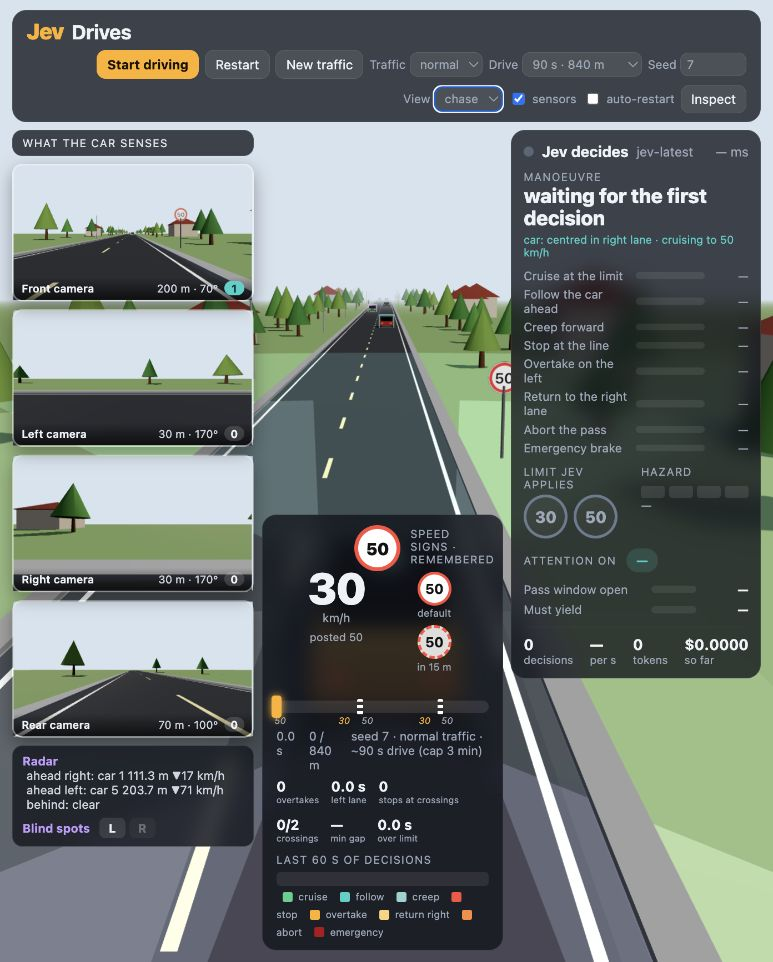

# TypeSafe experiments

Small, interactive experiments with **TypeSafe Jev**: from understanding a support message to making decisions for a car in a 3D world.

The aim is to make the inputs, model judgments and resulting behaviour visible—including hesitation and mistakes. These are experiments with real API calls, not polished benchmarks.

## Demo03 preview



The Fable implementation: four camera feeds, radar and blind-spot readings, remembered speed signs, and Jev's decision panel. Captured before starting a run; the decision values have not yet been populated.

## The demos

| Demo | What it explores | Local address |
| --- | --- | --- |
| [demo01 — Decision Lab](demo01/README.md) | A support message becomes six independent judgments: owning team, human request, refund request, urgency, frustration and reproduction steps. Ordinary code combines the answers into an inspectable routing preview. | [localhost:3001](http://localhost:3001) |
| [demo02 — Jev Driving Lab](demo02/README.md) | Jev chooses lane and target speed for a car on a two-way road. Random traffic, overtaking, oncoming cars, pedestrian crossings and remembered 30/50 km/h signs create changing situations. Four camera views, sensor overlays and a decision inspector show what is happening. Runs last 90, 120 or 180 seconds. | [localhost:3002](http://localhost:3002) |
| [demo03 — Fable implementation](demo03/) | A separate implementation of the same driving concept, being built with **Fable** to test another AI's interpretation of the brief. **Currently under development and being tested.** Its current runtime also calls TypeSafe Jev for driving decisions. | [localhost:3003](http://localhost:3003) |

[driving-simulation.md](driving-simulation.md) is the consolidated driving brief: the intended experience and corrections, without prescribing an identical interface or implementation.

In demo01, routing is a preview: no real support ticket is sent and no refund is issued. In the driving demos, the camera views are rendered for the audience; Jev receives structured simulated sensor observations rather than camera images. Simulation and vehicle mechanics run in code. The implementations are experiments, not real autonomous-driving systems.

## Run locally

You need Docker with Docker Compose (or a compatible Podman setup) and a TypeSafe API key. Node and application dependencies run inside containers; no host npm installation is needed.

From the repository root, create your local configuration without overwriting an existing one:

```sh
cp -n .env.example .env
```

Edit `.env` and set `TYPESAFE_API_KEY` to your own key. The existing alternative name `TYPESAFE_API` is also supported; `TYPESAFE_API_KEY` takes precedence. `TYPESAFE_MODEL` defaults to `jev-latest`.

Start whichever demo you want:

```sh
# Decision Lab
docker compose -f demo01/compose.yaml up -d --build

# Jev Driving Lab
docker compose -f demo02/compose.yaml up -d --build

# Fable implementation — work in progress
docker compose -f demo03/compose.yaml up -d --build
```

Open the matching localhost address from the table. The demos use separate Compose projects and ports, so they can run side by side. Stop one with, for example:

```sh
docker compose -f demo02/compose.yaml down
```

Evaluating messages or starting a driving run makes real, billable TypeSafe requests. Driving auto-restart continues making requests until paused or disabled.

## Inspect and test

The interfaces expose the questions, observations, answer distributions and request measurements. The driving demos also support session exports.

Run local application tests inside a container:

```sh
docker compose -f demo01/compose.yaml run --rm app npm test
docker compose -f demo02/compose.yaml run --rm app npm test
docker compose -f demo03/compose.yaml run --rm app npm test
```

Those tests exercise application logic with fixtures; they do not establish model quality. Live sample suites and probe scripts call the actual API separately. Demo03's behaviour and validation are still evolving.

Recorded observations are in [demo01/VERIFICATION.md](demo01/VERIFICATION.md), [demo02/VERIFICATION.md](demo02/VERIFICATION.md) and [demo02/artifacts/](demo02/artifacts/). The saved driving traces describe synthetic situations and retain unsuccessful decisions as well as successful ones. Results apply to their recorded versions, not every later change or random seed.

## Credentials and sharing

- `.env` and local variants are ignored by Git. [`.env.example`](.env.example) contains placeholders only.
- Compose injects credentials at runtime. The root `.env` is outside each demo's image build context, and credentials stay in the server-side API calls.
- The services bind to `127.0.0.1` for local use. Publishing the source does not turn them into authenticated public web services.
- Demo01 sends the message you submit to TypeSafe; use synthetic examples when sharing a recording or result. Driving exports contain simulated observations and model outputs.

The [TypeSafe skill](https://github.com/typesafe-ai/skills/blob/main/skills/typesafe-ai/SKILL.md) was used as session guidance; it is not installed or bundled in this repository.
