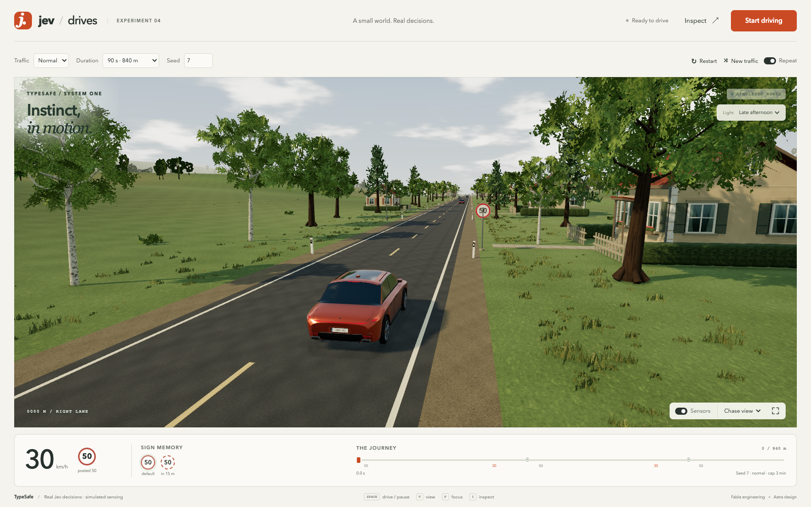

# Jev Drives — demo04, Astra edition

The driving system from **demo03, built by Fable**, with a new interface and 3D presentation by **GPT-6-Astra**. This edition preserves the simulation, sensing, memory, Jev questions, decision validation and vehicle execution from the original. Jev still makes the driving decisions through real TypeSafe API requests.



The second visual pass adds sculpted vehicles, animated pedestrians, dense trees, grass verges, detailed countryside buildings, textured asphalt, reflections and three lighting moods. See [the visual build notes](REALISM.md) and [measured verification](VERIFICATION.md).

## Run it

From this directory, with `TYPESAFE_API_KEY` (or `TYPESAFE_API`) in the parent `.env`:

```sh
docker compose up --build -d
```

Open **http://localhost:3004** and start the drive. Demo03 and demo04 use separate Compose projects and ports, so they can run side by side. Node 22 and the locked Three.js dependency run inside the container; nothing needs to be installed on the host. Credentials are supplied to the server at runtime and never sent to the browser or copied into the image.

```sh
DEMO04_PORT=3005 docker compose up -d       # optional different local port
docker compose run --rm app npm test       # inherited application tests
docker compose down
```

Driving uses the real, billable TypeSafe API. Repeat continues making requests until disabled or paused. Most API failures pause the run. The inherited app retries 409, 429 and 504 responses after four seconds while the previous manoeuvre remains in force; see [ARCHITECTURE.md](ARCHITECTURE.md) for inherited limitations.

## What is preserved

* `server.mjs`, `schema.mjs` and `questions.mjs`: the API proxy, strict situation schema, server-owned road rules and the same six Jev questions.
* `sim/`: the seeded road and traffic, camera/radar/blind-spot sensing, occlusion, sign and pedestrian memory, fused situation, overtake arithmetic, collision detection, metrics and vehicle dynamics.
* `tests/` and `tools/probe.mjs`: the original test suite and headless runner.

Only two Jev answers steer the car: **maneuver** selects one of eight actions, and **pace** selects 30 or 50 km/h. Hazard, attention, pass-window and must-yield judgments are shown to the audience. Code executes the chosen action, including smooth lane changes, following and stopping; it does not choose when to overtake, return, stop or resume. There is no substitute driver if Jev makes a mistake.

The camera feeds are rendered for the audience. Jev receives structured simulated observations, not images or the world's hidden object list. A decision more than two seconds old is rejected.

## Presentation and controls

The redesigned presentation combines a warm countryside scene, sculpted amber car, four-camera filmstrip, always-visible blind-spot indicators, speed-sign memory and Jev's judgments. The inspector retains the exact request state, full answer and probabilities, question definitions and session summary. Session export contains the latest 600 recorded decisions, matching demo03's retention limit. Side camera previews are cropped to 120°; the simulated side sensors retain their full 170° coverage.

The original controls remain: start/pause, restart the same seed, new traffic, light/normal/dense traffic, seed, drive length, chase/aerial/driver views, sensor overlays and auto-restart (labelled Repeat). Shortcuts are **Space** to start/pause, **R** to restart, **N** for new traffic, **V** for camera view, **O** for overlays and **I** for the inspector. **F** opens the larger focus view; **Light** switches clear morning, late afternoon and golden hour; **Escape** closes the inspector. A run ends at the finish, on a collision, or at twice the selected drive duration. Preferences are stored separately from demo03.

Run `node demo04/tools/check-parity.mjs` from the repository root to check the 18 protected files and the browser decision/frame loops against demo03. The adjacent source tree is required; this check does not make API calls.

## Verification and recorded evidence

The inherited tests cover deterministic worlds, traffic variety, sensor visibility and occlusion, memory, schema and response validation, API errors, smooth vehicle motion, stopping, following, collisions, overtakes, stale answers and scaled route lengths. They use fixtures and do not measure current Jev quality.

The real-API traces and historical findings are retained in [demo03's artifacts](../demo03/artifacts/) and [verification record](../demo03/VERIFICATION.md). They were recorded on **17 September 2026** across several source/prompt revisions. They describe the original runs, not new demo04 runs or a guarantee for every seed. Demo04's current checks are recorded separately in [VERIFICATION.md](VERIFICATION.md).

For a fresh headless run using the same simulation and executor as the browser:

```sh
mkdir -p artifacts
docker run --rm --env-file ../.env -v "$PWD/artifacts":/app/artifacts -u 0 typesafe-demo04-jev-drives-app \
  node tools/probe.mjs --seed 7 --traffic normal --seconds 150 --out artifacts/probe-seed7.json
```

The probe records every situation, answer, request latency and usage figure. Its inherited timing approximates API delay but caps each latency advancement at 250 ms, so it is not an exact browser-timing comparison. `--length` selects a longer road. Use an actual browser run to verify the complete interface and real-time loop.
