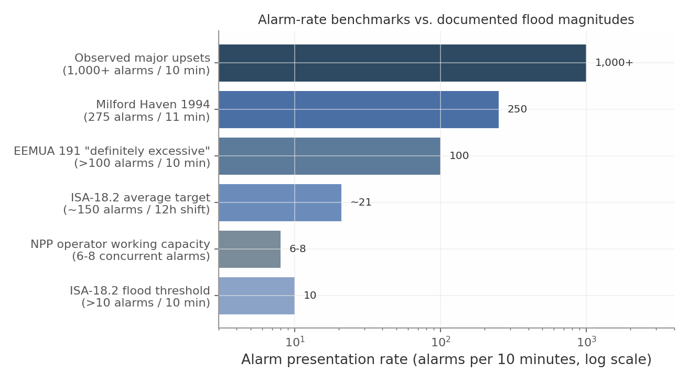

# The Judgment Layer: A Comprehensive Catalog of System One Typed-Judgment Model Usages Across Engineering, Physics, Mathematics, and the Chemical Industry
## Executive Summary
This report catalogs approximately 190 distinct usages of TypeSafe AI’s Jev, a “System One” typed-judgment model that consumes natural-language state and returns Choice, Noul, and Score primitives with calibrated probabilities at a vendor-reported 70–500 ms latency and \$0.042 per million input tokens [^1] [^2]. The usages span software and systems engineering (Chapter 3), industrial automation and asset-intensive operations (Chapter 4), physics (Chapter 5), mathematics (Chapter 6), and the chemical industry (Chapter 7), and were derived across thirteen independent research dimensions whose per-usage confidence ratings this report preserves. Aggregated at the pattern level, the catalog condenses into eleven high-confidence clusters — alert/alarm triage, semantic verdict layers above statistical detectors, review-by-exception QC, retrieval reranking, routing and cascade gating, confidence-gated escalation, free-text classification, standards-conformance checking, execution verification of autonomous loops, guardrail screening, and document-consistency verification — each independently evidenced in at least two domains.

The single most important finding is a convergence result. Five independent research communities — LLM-serving economics, databases, theorem proving, laboratory automation, and process operations — arrived without reference to each other at the same architecture: **generate expensively, judge cheaply**. An expensive resource (frontier LLM, automated theorem prover, SMT solver, what-if analysis, spectrograph hour, human expert) is invoked only for items a cheap typed judgment cannot settle, with published savings of up to 98% of inference cost at matched quality in the cascade literature [^3] [^4]. Structurally, this resolves into a **three-layer stack**: a deterministic or statistical pre-filter (rules, thresholds, PCA/T² detectors) produces signals; the judgment layer supplies the semantic adjudication those signals cannot — is it real, which class, who acts; and deterministic gates or humans retain every consequential action. Jev composes with classical ML rather than replacing it, and its confidence field functions as the exception router in review-by-exception workflows that regulators already accept [^5].

The economics cross a tipping point at Jev’s vendor-reported price: once a typed judgment costs under roughly \$0.001, the default operating mode flips from sampled review to universal adjudication — at Rubin Observatory scale, a multi-question verdict on all ten million nightly alerts computes to approximately \$600 per night [^6]. Adoption sequencing follows a baseline-type heuristic: where the incumbent is human attention or brittle rules, even modest accuracy wins on coverage and semantic robustness; where a trained per-task classifier is the incumbent, zero-shot competitiveness is unproven and head-to-head benchmarking is the gating experiment.

The report is equally explicit about limits, and this honesty is load-bearing. Every latency, price, and accuracy figure is vendor-published; no independent third-party evaluation of Jev was found. Calibration is guaranteed at group level only, not per answer, and the strongest deployments in the evidence base wrap the judge in external controls — conformal wrappers, mandatory audit sampling — rather than trusting raw outputs [^7]. The vendor’s 70–500 ms measured range means “sub-100 ms” claims hold only at the favorable end of the distribution, leaving in-path usages conditional on measured p50/p99 latency. The model is text-only, so the roughly 15–20% of usages adjacent to perception silently depend on an unscoped upstream encoder. A credible sub-10 ms roadmap would convert the entire marginal in-path tier — given-clause selection, per-node branching, inline gateways, HLT side-channels — into comfortable fits, roughly doubling the addressable usage count; it would not unlock nanosecond-to-microsecond trigger timescales, nor relax the advisory-only safety boundary that every industrial dimension of this research drew independently under IEC 61508/61511[^8].

## 1. The System One Paradigm: Typed Judgments as Software Primitives
The central finding of this chapter is that a structural gap has opened in production AI architecture: an enormous share of the “AI calls” in modern systems are not requests for text at all, but requests for **decisions** — route, gate, flag, rank, verify — that downstream code must consume deterministically. TypeSafe AI’s Jev, positioned by the vendor as the first “System One” model, is an attempt to industrialize that decision layer: “a System One model evaluates a state and returns typed answers and probabilities,” consuming natural-language input like an LLM but returning typed decisions rather than generated text [^9]. The founder’s framing is explicit about the software-engineering intent: “a frontier-intelligence function call: unstructured state in, typed probabilistic decisions out” . This chapter establishes what the model is (Section 1.1), what it is documented to cost and how fast it runs — with the vendor-attribution and honesty caveats that the rest of this report depends on (Section 1.2) — and where it sits relative to the four incumbent ways of making code-consumed decisions.

### 1.1 From Text Generation to Typed Judgment
#### *1.1.1 The structural mismatch of generative LLMs for code-consumed decisions*
When a generative LLM is used to make a programmatic decision, the developer writes a prompt that coerces a text generator into emitting something parseable — JSON mode, a forced keyword, a regex-shaped answer — “then parsing the results back into something your code can depend on” [^10]. This prompt-and-parse pattern carries three compounding costs. First, **schema fragility**: the model can produce well-formed prose that violates the expected structure, and malformed output at a decision point buried “several layers deep in a dependency chain” is, in TypeSafe’s words, “an absolute deal-breaker” for systems with latency guarantees . Second, **latency and cost**: frontier LLM calls take seconds end-to-end (the vendor cites 3–329 seconds for frontier models, versus 70–500ms for Jev) and are priced at \$0.20–\$10 per million input tokens with output tokens costing roughly 5× input — uneconomic for per-request, per-item, or in-loop judgments. Third, **dishonest uncertainty**: generative models asked to self-report confidence “tend to be overconfident and inconsistent” , and the LLM-as-judge literature documents systematic position, verbosity, and self-enhancement biases even in frontier judges [^11].

The System One alternative inverts the contract. Instead of constraining generation until it resembles a decision, the model is trained post-hoc — via what the vendor calls RLCD, “Reinforcement Learning for Calibrated Decisions” — “to return decisions and calibrated probabilities instead of generated text” . Because outputs are constrained to declared options by construction, the schema-level error rate is zero by design; the semantic answer can of course still be wrong, a distinction the vendor’s own failure-mode documentation makes carefully [^12] . Calibration is claimed at the group level: “Outcomes assigned a probability of 0.8 should occur about 80% of the time… These rates describe groups of predictions, not a guarantee about any single answer” . This is a deliberately System-1-shaped capability, in the dual-process sense: fast, automatic judgment that escalates when its own confidence fails, an architecture endorsed independently by cognitive theory and by production agent designs such as Google DeepMind’s Talker-Reasoner [^13] [^14].

#### *1.1.2 The three primitives — Choice, Noul, Score*
Jev exposes exactly three question types against a shared state (up to 32K tokens of state plus question text, 64K per request total) [^15]. The table below consolidates the vendor-documented API contract.

| Primitive | Question shape | Answer space | Returned fields | Confidence semantics |
|:---|----|----|----|----|
| **Choice** | “Which of these options applies?” — criteria map option→description | Up to 255 options | `choice`, full probability distribution over options, `confidence` (0–1) | Confidence is a peakedness statistic of the distribution, not a separate output [^16] |
| **Noul** | Yes/no statement | Binary | `noul` = P(yes); near 1 strong yes, near 0 strong no, ~0.5 uncertain | No separate confidence; the probability itself carries the uncertainty [^17] |
| **Score** | Ordered rubric | 2–10 levels | `score` (may fall between levels), `legend`, `probabilities`, `confidence` | Same peakedness statistic; levels are ordinal, not numerically calibrated magnitudes |

*Sources: TypeSafe API reference, primitives, and confidence documentation .*

Two properties of this design matter more than any single field. First, **parallel evaluation**: all three types can be mixed in one call, “evaluated in parallel and in isolation against the same state in one go,” so “adding questions barely changes the response time” and independent questions cannot contaminate each other (“no context-rot” between questions) . Because each question sees the same state independently, chaining judgments requires a second request — a constraint that shapes every architecture in this report . Second, **confidence is a policy input, not a label**: the documented usage is three bands — act automatically at high confidence, confirm or gather at medium, “route to a human, request clarification, or fall back to a different system” at low — with thresholds scaled to the cost of error per action rather than one global number . This is Chow’s classical reject option from 1970, implemented as an API field [^18]. The probability semantics are also honestly bounded: cross-question arithmetic identities do not hold (the vendor documents a Noul at 0.72 whose negation returns 0.47), so thresholds must be tuned per question type .

### 1.2 The Economic and Latency Envelope
#### *1.2.1 Vendor-reported operating point — and its caveats*
Every quantitative figure in this section is **vendor-published by TypeSafe AI**; no independent third-party evaluation of Jev was found in the research pass underlying this report, and the vendor’s own blog self-flags bias in its headline benchmarks . With that attribution fixed, the documented operating point is: “most queries complete in about 100 ms,” with end-to-end response times of 70–500ms measured “from our laptops on the West Coast” [^19] ; pricing of **\$0.042 per million input tokens with output tokens free**, 250K tokens/second and 1,200 requests/minute rate limits ; and a 32K-token state window . The most consequential published number is the **batching multiplier**: a 13-question regulatory briefing executed as one batched call measured 12.2× cheaper and 10.0× faster than 13 sequential calls (\$0.000497 in 0.27s versus \$0.006090 in 2.71s) with identical answers and zero run-to-run standard deviation across five repeats [^20]. If these figures hold, the marginal question in a battery is approximately free — the economic basis for the “question battery” designs that recur throughout this catalog.

Credibility requires the limits to travel with the specs. The vendor’s own “jaggedness” documentation states that Jev reads questions literally (“answers the question you wrote, not the one you meant”), does not count or compute reliably (“Jev is not a calculator”), reads dates as text rather than ordered quantities, loses accuracy on multi-hop indirection and on long states with irrelevant content, and can be steered by adversarial state content . Input is text-only — “images, audio, and video are not supported (yet)” — with English primary . Calibration is a population property, not a per-answer guarantee . And there is no customer fine-tuning: the domain is shaped “through the request rather than through per-account weights” . Every usage cluster in Chapters 3–7 inherits these constraints; where a proposed usage strains one (adversarial guardrails, perception-adjacent state, per-item probability consumption), the chapter says so explicitly.

#### *1.2.2 Positioning against the four alternatives*
A typed-judgment model is the fifth way to make a code-consumed decision, alongside hard rules, classical trained ML, generative LLM calls, and human judgment. The table summarizes the trade-space on the five axes that drive selection.

| Axis | Hard rules | Classical trained ML | Generative LLM call | Human judgment | System One typed judgment |
|:---|----|----|----|----|----|
| **Latency per decision** | Sub-millisecond | ~1–100ms (self-hosted) | 3–329s frontier (vendor-cited) | Seconds to minutes | 70–500ms (vendor-reported) |
| **Cost per decision** | ~\$0 | Fractions of a cent at scale | \$0.20–\$10/Mtok input + ~5× output | \$0.01–\$1+ per item; per-event human cost is the documented bottleneck across domains | \$0.042/Mtok input, output free (vendor) |
| **Semantic depth** | None — lexical/exact | Moderate; fixed label set | Highest; open-ended | Highest; contextual | Language-native; zero-shot over bounded options |
| **Calibrated uncertainty** | None (binary) | Only with post-hoc Platt/temperature scaling [^21] [^22] | Poor; overconfident, biased | Variable; unquantified | Group-level calibrated probabilities (vendor claim) |
| **Setup cost** | Low per rule; unbounded maintenance | High: labels, training, retraining per policy change [^23] | Low: prompt authoring; high parse-engineering | Very high: staffing, training | Low: per-request criteria; no fine-tuning |

The interpretation is sharper than a simple “fifth column wins.” **Rules remain the right tool** for exactly computable conditions — Jev’s own documentation instructs users to keep deterministic work in code because “it is reliable and cheap” — and mature pipelines still clear 60–70% of traffic on rules before any ML runs . **Classical ML wins on raw accuracy and marginal cost** where labeled data, a stable label set, and amortizable volume exist; no evidence located in this research shows zero-shot Jev beating a well-trained per-task classifier head-to-head, and that benchmark remains the open experiment wherever trained models are the incumbent. **Generative LLMs remain necessary** wherever output must be open-ended text or multi-step reasoning spans the whole context. **Humans remain the terminal layer** for catastrophic-cost, contested, or low-volume judgments — but the decision-theoretic literature shows their allocation should be thresholded by a calibrated judge rather than spent uniformly: cost-sensitive thresholding makes the optimal accept/escalate boundary a function of error-cost asymmetry, computable directly from typed probabilities [^24] . The typed-judgment model’s distinctive envelope is the intersection: semantic nuance that defeats keyword rules, no labeled data or retraining cycle, enumerable answer spaces, sub-second in-path latency budgets (the guardrails literature puts the acceptance criterion at under 200ms [^25]), and honest uncertainty wired to act/escalate policy. The cascade literature quantifies the prize for getting that layer right — up to 98% cost reduction at matched quality for FrugalGPT-style cascades, and 85% cost reduction at 95% of GPT-4 quality for learned routers [^26] — and converges on the same conclusion: the calibrated decider, not raw model power, is the binding constraint. Chapter 2 turns this trade-space into a decision framework; Chapters 3–7 test it against engineering, physics, mathematics, and chemical-industry practice.

## 2. Decision Framework: When a Fast Typed Judgment Wins
The central finding of the cross-domain evidence base is a convergence result: every serious effort to reduce the cost or latency of AI-mediated decisions — in LLM serving, in safety guarding, in email infrastructure, and inside frontier models themselves — has arrived independently at the same architecture, a cheap and fast decider placed in front of expensive capacity, gated by a calibrated threshold. Reported savings from this pattern range from 2× to 98% of inference cost at matched output quality, and the binding constraint in every published variant is the decider’s calibration rather than its raw capability . This chapter assembles that evidence into a selection framework for TypeSafe AI’s Jev System One model — a non-generative typed-judgment model returning Choice/Noul/Score answers with probabilities and confidence at a vendor-reported 70–500 ms end-to-end latency and \$0.042 per million input tokens — and states the conditions under which such a model beats rules, classical ML, generative LLMs, or human review. The framework is deliberately domain-neutral; Chapters 3 through 7 apply it to engineering, physics, mathematics, and the chemical industry.

### 2.1 The Cascade and Routing Evidence Base
#### 2.1.1 Model-Cascade Economics: FrugalGPT, RouteLLM, and Speculative Cascades

The quantitative case for a dedicated judgment layer rests on five years of cascade and routing research. FrugalGPT (Chen, Zaharia, and Zou, Stanford, 2023) formalized the LLM cascade — a learned scorer evaluates a cheap model’s answer and escalates to a more expensive model only when the cheap answer is likely wrong — and reported up to 98% cost reduction relative to always querying the best LLM, at the same output quality, with measured reductions of 4–98× across benchmarks [^27]. The paper’s own caveat matters for this report: gains are strongest on classification and structured-output tasks “where correctness is definable and the score distribution is well-separated,” and more modest on open-ended generation [^28]. RouteLLM (Ong et al., LMSYS/Berkeley, ICLR 2025) trained routers on preference data between GPT-4 and Mixtral-8x7B and achieved approximately 85% cost reduction on MT-Bench while retaining 95% of GPT-4 quality, routing only ~14% of queries to the strong model; reported reductions were 45% on MMLU and 35% on GSM8K . Router overhead is negligible in this architecture — under 1 ms for rule-based routing and roughly 50–100 ms for ML classifiers, against 500–2,000 ms LLM response times — so “the router is never your latency bottleneck” [^29].

The pattern extends inside the inference stack itself. Mixture-of-thoughts cascades matched GPT-4 task performance at 40% of its cost using weak-model answer consistency as the deferral signal [^30]; Google DeepMind’s work on token-level uncertainty formalized confidence-based deferral rules and analyzed when a cheap model’s confidence is a sufficient escalation signal [^31]; and speculative cascades (Narasimhan et al., ICLR 2025) characterize the optimal deferral rule, yielding better cost-quality trade-offs than either pure cascades or the 2–3× speedups of speculative decoding alone [^32]. Even the largest models allocate compute this way internally: sparsely-gated mixture-of-experts layers run a tiny trainable gating network per token to select among thousands of expert sub-networks, achieving greater than 1000× capacity improvements at minor efficiency cost [^33], and the Switch Transformer scaled the same top-1 routing to trillion-parameter models [^34]. An external typed-judgment model is the same gating function lifted to the system level, routing whole requests instead of tokens.

Table 2.1 summarizes the reported cost-quality figures across the principal cascade and small-judge systems.

| System (year, venue) | Role of the cheap component | Reported cost/quality result | Source |
|:---|----|----|----|
| FrugalGPT (2023, arXiv) | Learned scorer gates escalation | Up to 98% cost reduction at matched quality; 4–98× across benchmarks |  |
| RouteLLM (ICLR 2025) | Trained router between strong/weak LLMs | ~85% cost cut at 95% of GPT-4 quality; ~14% of queries escalated |  |
| Mixture-of-thoughts cascade (ICLR 2024) | Weak-model consistency as deferral signal | Comparable performance at 40% of GPT-4 cost |  |
| Speculative cascades (ICLR 2025) | Optimal deferral rule + parallel verify | Better cost-quality trade-offs than cascades or speculative decoding alone |  |
| Prometheus-13B (2023) | Small specialized judge vs. GPT-4 judge | Pearson 0.897 with human evaluators vs. GPT-4’s 0.882; ChatGPT 0.392 | [^35] |
| JudgeLM-7B (2023) | Fine-tuned small judge | \>90% agreement with GPT-4 teacher; 5K samples judged in 3 min on 8 A100s | [^36] |
| PandaLM-7B (2023) | Small reproducible judge | 93.75% of GPT-3.5’s and 88.28% of GPT-4’s evaluation ability (F1) | [^37] |
| PAJAMA (2025) | Programmatic judges distilled to reward models | Better RewardBench results than GPT-4-label training at 45–50× lower labeling cost | [^38] |
| LlamaGuard-7B (2023) | Typed safety judgment with first-token probability | Matches or exceeds OpenAI Moderation API on ToxicChat/OpenAI sets | [^39] |

The table reveals a consistent quantitative shape across systems built by independent groups: the cheap component captures the majority of available savings — 60–98% of cost — while the expensive component handles a small residual of 10–40% of traffic. Two outliers sharpen the interpretation. First, RouteLLM’s ~14% escalation rate implies that production query distributions are dominated by “easy” items, which is precisely the regime in which a calibrated judge earns its keep by correctly *not* escalating . Second, the Prometheus result is an inversion worth noting: the specialized 13B judge slightly *exceeds* GPT-4’s human correlation (0.897 versus 0.882), indicating that judge quality is a function of task-specific training rather than parameter count . The implication for typed-judgment models is direct: FrugalGPT’s cascade scorer, RouteLLM’s router, and LlamaGuard’s first-token probability are each, functionally, a Score or Choice primitive with a threshold — the output contract Jev implements natively — so the published savings figures constitute lower bounds on what a purpose-built, language-native judgment model should recover, at vendor-reported per-call costs roughly two orders of magnitude below generative judges .

#### 2.1.2 Small Specialized Judges and the BERT-Era Precedent

The generative-judge baseline these small systems displace is itself well characterized. GPT-4 as judge reaches over 80% agreement with human preferences — the same level humans reach with each other — but exhibits documented position bias (up to ~75% preference for the first-presented response in some configurations), verbosity bias, and self-enhancement bias (GPT-4 favored its own outputs by ~10 percentage points of win rate) [^40]. Follow-up work catalogs seven or more additional bias types [^41] [^42]. A non-generative typed judge structurally avoids the decoding-time biases — there is no verbosity channel and no position to swap — while emitting explicit probabilities rather than parsed prose . The important caveat comes from Huang et al. (Findings of ACL 2025): fine-tuned judge models are task-specific classifiers that match large judges within their training distribution but do not substitute for a general judge [^43]. This argues for exactly the typed, task-scoped design Jev embodies — and simultaneously warns that zero-shot accuracy against a per-task trained classifier remains an open benchmarking question, a tension the cross-verification flags as unresolved.

Industrial practice anticipated the architecture by two decades. Google’s Gmail defenses stop more than 99.9% of spam, phishing, and malware, blocking nearly 15 billion unwanted messages daily, using a layered stack in which rule-based pre-filters handle roughly 60–70% of obvious spam, lightweight classical ML handles ~95% of the remainder, and distilled language models take only low-confidence cases [^44] . Notably, even in December 2024 Gmail layered an LLM-based filter — blocking 20% more spam — *on top of* its cheap classifiers rather than replacing them [^45]. Smart Reply (Kannan et al., KDD 2016) fronted its LSTM scorer with a separate, computationally cheaper feedforward “triggering model” that decides whether to suggest responses at all, explicitly to keep the system scalable; the same paper resorted to semantic clustering because lexical rules “would not be sufficient to capture the wide variability” of meaning [^46]. DistilBERT (2019) then established the economics: 40% smaller, 60% faster, 97% of BERT’s language understanding retained [^47]. Where the BERT era failed defines the gap a language-native judgment model fills: pre-LLM classifiers required per-task labeled datasets, broke under distribution shift and paraphrase, and could not take a rubric or typed question in natural language, generalize to new criteria without retraining, or emit calibrated probabilities natively . A System One model keeps DistilBERT-class serving economics while inheriting instruction-following from LLM pretraining — the semantic-nuance gap that forced escalation to humans or frontier models is closed at sub-100ms latency . Dual-process theory supplies the same lesson from the cognitive side: System 1 runs by default and escalates to System 2 on metacognitive failure, an architecture formalized for AI as SOFAI’s metacognitive arbitration and Google DeepMind’s Talker-Reasoner design with its documented modularity and latency benefits [^48] .

### 2.2 Calibration as the Enabling Property

#### 2.2.1 Selective Prediction, Chow’s Reject Rule, and Conformal Triage

Every cascade in Section 2.1 thresholds a score, and a threshold policy is only as good as the calibration of the score it thresholds. The calibration literature supplies the theoretical license: Platt scaling and temperature scaling convert raw classifier outputs into usable probabilities, with Guo et al. (ICML 2017) showing modern networks are systematically overconfident but correctable by a one-parameter scale . Chow’s 1970 reject rule established that the optimal policy is a confidence threshold that minimizes expected risk given a priced abstention option . Selective prediction generalized this into the risk-coverage trade-off — Geifman and El-Yaniv’s method lets a user set a desired risk level and guarantees, for example, 2% error in top-5 ImageNet classification at 99.9% probability with nearly 60% coverage [^49] [^50]. Conformal prediction and conformal risk control extend the guarantees to distribution-free, finite-sample settings, and conformal triage for medical imaging operationalizes exactly the pattern this report catalogs: calibrated model scores decide which cases need human review under capacity constraints, with statistical guarantees [^51] [^52]. The operating rule “automate the confident 60–90%, route the rest” is therefore not a heuristic but a provably well-founded mode — provided the judge’s probabilities are calibrated .

The decision-theoretic framing makes the economics explicit. Elkan’s cost-sensitive learning result shows the optimal classification threshold is not 0.5 but a function of asymmetric error costs; for a calibrated probability $`p`$ of a positive, the expected-cost-optimal threshold is $`p^{*} = C_{FP}/\left( C_{FP} + C_{FN} \right)`$ . Automation is justified precisely when

``` math
E\left\lbrack \text{cost of error} \right\rbrack \cdot P\left( \text{error} \mid \text{judgment} \right) + \text{cost of call} < \text{cost of next-best alternative},
```

and Chow’s rule prices the abstention branch of the same comparison . At Jev’s vendor-reported price of \$0.042 per million input tokens with free output tokens, the call-cost term approaches zero — a 13-question battery over one state is reported at roughly \$0.0005 per call — so the break-even error reduction is tiny, which extends economic justification to very low-stakes per-item decisions where humans (\$0.01–\$1+ per item, seconds-to-minutes latency) and generative LLMs (~100× token cost, seconds of latency) are uneconomic . The cross-dimension analysis identifies this as the catalog’s phase transition: once a typed judgment costs on the order of \$0.001, the default operating mode flips from sampled review to universal adjudication.

Two confidence disciplines apply. First, TypeSafe attributes its calibration to RLCD post-training and states the guarantee at group level only — outcomes assigned probability 0.8 should occur about 80% of the time across groups of predictions, with no per-answer guarantee — and documents that cross-question arithmetic identities do not hold . Second, the strongest deployed systems in the evidence base wrap the judge in an external control — mandatory sampling of auto-closed items, conformal wrappers — rather than trusting raw outputs. Calibration is the product, and validating it per deployment is the enabling step, not optional hygiene.

### 2.3 Selection Criteria

#### 2.3.1 The Decision Matrix

The evidence converges on five conditions that jointly favor a sub-100ms typed-judgment model, and four regimes in which rules, classical ML, generative LLMs, or humans remain the right tool. The matrix below compresses Sections 2.1–2.2 and the vendor’s own design guidance into a screening instrument; Chapters 3–7 apply it domain by domain.

| Condition | Favor typed fast judgment when… | Favor the alternative when… | Grounding |
|:---|----|----|----|
| 1\. Typed and scopeable | The judgment is expressible as Choice (≤255 options), Noul, or Score (≤10 levels) over a defined state | The answer space is unbounded or requires open-ended generation → generative LLM |  |
| 2\. Volume × latency economics | Per-item decisions at high throughput make generative calls or humans uneconomic (\<200 ms in-path budgets; ~\$0.04/Mtok) | Volume is low or stakes per item are catastrophic → human |  |
| 3\. Thresholded control policy | A calibrated accept/escalate rule (Chow, selective prediction, conformal risk control) will consume probabilities | No calibrated probabilities are needed — the boundary is exactly computable → rules |  |
| 4\. Semantic nuance, bounded task | Lexical rules miss paraphrase and intent but the judgment is atomic (“a few seconds for a knowledgeable person”) | Abundant in-domain labels, fixed task, cheapest-possible inference → classical ML |  |
| 5\. Determinism and auditability | Structured outputs with probabilities are consumed by code; decoding-time biases must be excluded | Novel rubrics, explanation, or multi-hop reasoning required → generative LLM (accept ~100× cost) |  |

Reading the matrix as a policy instrument: conditions 1 and 3 are the hard gates — a judgment that cannot be typed, or a deployment that will not threshold on calibrated probabilities, forfeits the entire theoretical apparatus of Section 2.2 and reduces the model to an unvalidated heuristic . Conditions 2, 4, and 5 are economic differentiators that determine *which* tool wins among the survivors. The asymmetry in the alternatives column is instructive: rules and classical ML win on the left tail (exactly computable or exhaustively labeled problems, where they remain the first 60–95% of mature pipelines ), while generative LLMs and humans win on the right tail (open-ended reasoning, contested or catastrophic judgments). The typed fast judge occupies the large middle — the review-by-exception isomorphism the cross-verification identifies across pharma QC, security operations, aviation safety, and process plants. A final meta-criterion closes the framework: the safe-choice-point principle. Position the judge where a wrong verdict costs time or money, never correctness or safety, with a deterministic or human backstop above that line — a screening rule derived independently in mathematics and process-safety catalogs and endorsed by every industrial dimension of the underlying research. Where all five conditions hold and the choice point is safe, the cascade economics of Table 2.1 indicate expected cost reductions of 50–98% relative to generative-only or human-only pipelines, with the residual escalated traffic — typically 10–40% — receiving the expensive scrutiny its confidence scores say it deserves .

## 3. Engineering Usages I: Software Engineering and Systems Infrastructure

Software engineering and systems infrastructure form the densest concentration of evidence-backed usages in this catalog: thirty decision points, each anchored in a published system, benchmark, or production deployment. The reason is structural: engineering organizations already operate high-frequency decision loops — triage queues, CI gates, alert streams, optimizer hooks — where the decision is intrinsically *typed* (a verdict, a severity, a route), rules are too brittle, and a generative-model call is too slow, too expensive, and too hard to parse. TypeSafe AI’s published specifications — 70–500 ms end-to-end latency, \$0.042 per million input tokens with output free, a 32K-token state, and three primitives (Choice, Noul, Score) returning calibrated probabilities with confidence — sit precisely in this gap; TypeSafe’s own workflow evaluations report \$0.0004 per case at Sonnet-tier accuracy versus \$0.176 per case for an Opus-class model, figures that remain vendor-reported pending independent replication [^53].

Two cross-cutting findings frame the chapter. First, classical machine learning already occupies many of these slots, validating the decision interfaces but also setting accuracy bars the judgment model has not yet been benchmarked against; its delta concentrates where decisive evidence lives in text that numeric feature pipelines discard: SQL, log lines, configuration diffs, ticket language, rule manuals. Second, the recurring production topology is a three-layer stack — a deterministic or statistical pre-filter generates candidate signals; the judgment layer renders a calibrated semantic verdict on each; a thresholded escalation tier routes low-confidence or high-consequence items to expensive reasoning. This is the cascade economics of Chapter 2 instantiated as infrastructure, documented independently in guardrails, security operations, and root-cause analysis.

    flowchart LR
        subgraph L1["Deterministic / statistical pre-filter"]
            A[Rules, regex, thresholds,<br/>embeddings, anomaly scores]
        end
        subgraph L2["Judgment layer: typed model"]
            B["Choice / Noul / Score<br/>calibrated probability + confidence<br/>sub-100ms, ~$0.042/Mtok (TypeSafe-reported)"]
        end
        subgraph L3["Escalation tier"]
            C[LLM judge / agentic RCA /<br/>human reviewer]
        end
        A -->|"candidate items (high volume)"| B
        B -->|"confidence ≥ threshold:<br/>auto-action with audit log"| D[(Act: close, route,<br/>suppress, admit)]
        B -->|"confidence < threshold<br/>or high consequence"| C
        C --> D

The sections below catalog fifteen usages per domain, each with its current practice and bottleneck, primitive design, and confidence: High where the judgment task is published and often deployed; Medium where the task is proven but accuracy against trained incumbents is unmeasured; exploratory items are labeled design syntheses.

### 3.1 Software Engineering Workflows

#### 3.1.1 Alert and finding triage: SAST, secrets, and log anomalies

The strongest software-engineering cluster is verdict triage over analyzer output, because the incumbent is human attention and the published task shape is already a typed judgment. Static application security testing (SAST) tools generate notoriously false-positive-heavy findings; the ZeroFalse study (2025) evaluated LLMs as triage judge and concluded automated verdicts “can substantially reduce false positives in static analysis… easing developer workload by suppressing spurious reports” [^54]. A Jev design maps this directly: state carries the flagged code hunk, CWE/rule identifier, and dataflow summary; one call issues a Noul on genuine exploitability, a Choice verdict over {true_positive, false_positive, needs_human}, and a four-level severity Score. Code applies policy — auto-dismiss above 0.95 false-positive confidence with an audit log, hold low-confidence items for humans. At TypeSafe-reported pricing, triaging a 10,000-finding scan costs cents; per-finding frontier-model calls make whole-repo scans uneconomical . Confidence: High.

Secret scanning provides a deployed-at-scale precedent for exactly this judgment. Pattern- and entropy-based scanners are noisy: a 2023 benchmark of nine tools found top precision of only 75% (GitHub’s scanner), 46% (Gitleaks), and 25% for a commercial tool [^55]. GitHub’s production answer inserts an LLM contextual-verification stage reading “variable names, surrounding code, comments, and file paths,” cutting customer-confirmed false positives by 75.76% — across a workload of 39 million secret leaks detected in public repositories in 2024 [^56]. A Noul on live-credential status plus a Choice over context type {documentation, test-fixture, example-code, real-config, source-code} reproduces the stage at roughly the vendor-reported \$0.0004 per case, a 100–400× saving on a workload already proven to be judgment, not generation . Confidence: High.

Log-anomaly triage extends the pattern to operations. The established pipeline pairs Drain-style template parsing with sequence models such as LogBERT, but detection is not triage: an anomaly score says neither what kind of problem fired nor who should care, so humans read flagged sequences [^57]. Documented practice suggests a judgment layer reading raw template instances rather than collapsed log-key IDs: a Choice over anomaly class {resource_exhaustion, dependency_failure, config_error, deploy_regression, security_relevant, benign_noise}, a five-level severity Score, and two Nouls — deploy-consistency and page-worthiness — mapping typed output directly onto routing tables at log-stream volumes where per-anomaly LLM summarization is untenable . Confidence: Medium — detection is well evidenced; the semantic triage layer is an unbenchmarked extension.

#### 3.1.2 Test and CI/CD intelligence

Continuous integration concentrates three decision points where calibrated abstention is the product. Flaky-test judgment fires on every red build: naive retries “mask symptoms rather than addressing root causes” [^58]. Research predictors are mature — FlakeFlagger (ICSE 2021) predicts flakiness without rerunning; the CodeBERT-based Flakify added ten points of precision and eighteen of recall [^59] [^60]. The decisive caution is Lampel et al.’s Chromium study (ESEC/FSE 2023): a state-of-the-art predictor reached 99.2% precision flagging flaky tests yet misclassified 76.2% of genuine fault-triggering failures as flaky . The primitive design encodes this asymmetry: one Noul on known-flaky consistency, a second on whether the failing assertion plausibly relates to the triggering commit’s diff (the exact Lampel failure mode), and a Choice over {rerun, quarantine, block_merge, human_review}; auto-dismissal requires high confidence on both Nouls. Confidence: High.

Test selection and prioritization is the second slot. The machine-learning test-prioritization literature (a systematic review of 29 primary studies, 2006–2020) predicts per-test failure probability with reinforcement learning, clustering, and ranking models [^61]; Zhao et al. (2023) found pretrained rankers produce the optimal sequence on 80% of subjects versus 50% for the prior best, and commit-aware work shows removing diff features causes “a systematic collapse of classification performance” [^62] [^63]. A judgment design Scores each test’s failure likelihood on a five-level rubric and asks a Noul on change coverage, batching tests per 32K-token state — scoring a 5,000-test suite for well under a cent within the seconds between push and first test start . The caveat is competitive: trained rankers set a hard accuracy bar, and zero-shot ranking quality is the open experiment. Confidence: Medium–High.

The third slot, just-in-time defect and merge-risk scoring, fires on every commit and dependency bump. DeepJIT and CC2Vec established learned defect-probability estimation over commit messages and diffs [^64] [^65], while Dependabot’s crowd-sourced compatibility score requires at least five observed updates and is frequently “unknown” for less-common packages [^66]. A five-level risk Score plus a breaking-change Noul — reading changelogs and the repository’s usage sites — fills the unknown-score gap without per-project training, though accuracy against trained JIT models is unverified. Confidence: Medium.

#### 3.1.3 Incident and security operations

Security operations supply the hardest numbers in this chapter. Analysts face thousands of alerts daily, most benign, at five to fifteen minutes of triage each [^67]. The production benchmark is AACT (Sophos/Flare, 2025), which learns from analyst dispositions and, in live deployment, reduced alerts shown to analysts by 61% over six months at a 1.36% false-negative rate across millions of alerts [^68]. Calibration research warns that triage outputs “are frequently miscalibrated” and thresholds must reflect asymmetric costs [^69]. The primitive design mirrors AACT’s guardrails in typed form: a Noul on genuine maliciousness, a Choice disposition over {auto_close_benign, close_benign_true_positive, investigate, escalate_incident}, a P1–P5 severity Score, and an ATT&CK-tactic Choice within the 255-option bound; auto-closure requires a strict benign threshold plus mandatory sampling of auto-closed alerts . Sub-100-millisecond verdicts at TypeSafe-reported pricing make 100% alert coverage — rather than sampled review — economical, targeting the field’s stated goal of near-zero mean time to triage for non-genuine alerts . Confidence: High, on the deployed precedent.

Phishing classification adds an explicit latency bar: a production-grade ensemble (287-dimensional features; 2.8 million URLs) reports 99.6% accuracy with real-time latency averaging 89 milliseconds per sample, framed as the requirement for inline deployment [^70]; deep models alone are “unsuitable for real-time browser-side deployment” [^71]. One judgment call can return the phishing Noul, a category Choice {legit, phishing, spam, BEC, malware-lure}, an urgency Score, and a credential-request Noul — provided measured latency sits at the favorable end of TypeSafe’s 70–500 ms range, a condition the cross-verification analysis insists must be verified at p50/p99 rather than assumed from marketing figures. Confidence: Medium–High.

Two further usages complete incident operations. Alert correlation asks whether two alerts share a root cause — fingerprint dedup “doesn’t link different alerts from one root cause,” time-window clustering is “prone to false grouping” — while Forrester-cited ML-assisted triage cuts mean-time-to-triage 25–40% [^72]. A pairwise Noul with a tunable merge threshold addresses the documented over-merging failure directly; confidence Medium. Runbook routing sits in front of agentic root-cause analysis: RCAgent reports 72.67%/69.25% win rates over ReAct, but the latency contrast is stark — 79 seconds per case agentically versus 8 milliseconds lightweight, a 9,700× difference [^73] [^74]. A Choice over the runbook catalog plus a novelty Noul converts the routing decision into a sub-100-millisecond gate; confidence Medium as a design proposal composed of documented components.

#### 3.1.4 Code workflow routing

The remaining software-engineering usages are routing and ranking judgments. Duplicate bug detection is a documented two-stage bottleneck: retrieval shortlists candidates, but the final “same underlying defect?” call is semantic, and triage engineers disengage when faced with long unranked lists [^75] [^76]. A pairwise Noul with auto-linking above 0.9 and ranked display between 0.5 and 0.9 gives triage teams a precision/recall dial at cents per thousand judgments; confidence High. Reviewer routing replaces path-similarity heuristics (RevFinder, CORMS) with a Choice over the team roster — within the 255-option limit for most organizations — plus a rigor Score and sensitivity Nouls, with round-robin fallback on low confidence; the task is established but semantic routing quality is untested, confidence Medium [^77]. LLM request routing recasts RouteLLM’s framework — whose matrix-factorization router held 95% of GPT-4 quality while sending only 14% of queries to GPT-4, an ~85% cost reduction — as a zero-shot difficulty Score and cheap-model-sufficiency Noul, eliminating per-model-pair retraining at the price of unmeasured win-rates; confidence Medium–High . Guardrail classification inserts an injection/policy Noul battery as the always-on tier in the documented two-tier topology, with the explicit caveat that published evasion studies achieved up to 100% bypass on some guardrail systems — adversarial evaluation is a deployment prerequisite; confidence Medium [^78] [^79]. Finally, code-search reranking occupies the “recall before rerank” slot: a relevance Score over a bi-encoder’s top-20 candidates delivers cross-encoder-grade ordering inside a ~100 ms IDE budget; confidence Medium, pending comparison with fine-tuned cross-encoders [^80].

Table 3.1 summarizes the fifteen software-engineering usages.

| Usage | Current practice / bottleneck | Primitive design | Confidence |
|:---|----|----|----|
| SAST false-positive suppression | Noisy analyzers; human triage or ignored findings (ZeroFalse 2025) | Noul exploitability + Choice verdict + Score severity; auto-dismiss \>0.95 | High |
| Secret-scanning verification | Scanner precision 25–75%; GitHub’s LLM stage cut FPs 75.76% | Noul live-credential + Choice context type; verdicts composed in code | High |
| Flaky-test judgment | Chromium: 99.2% precision yet 76.2% of real faults misclassified | Two Nouls (flaky-consistent, change-relevant) + Choice action; conservative thresholds | High |
| Test prioritization | 29-study ML literature; trained rankers optimal on 80% of subjects | Score failure-risk + Noul change-coverage, batched per suite | Medium–High |
| JIT defect / merge-risk | DeepJIT/CC2Vec need training pipelines; Dependabot score often “unknown” | Score risk + Noul breaking-change; changelog semantics | Medium |
| Reviewer routing | Path-similarity heuristics; manual triage | Choice reviewer + Score rigor + Noul sensitive-code | Medium |
| Duplicate bug detection | Retrieval shortlists unranked; triager disengagement | Pairwise Noul same-defect + Choice relation; auto-link ≥0.9 | High |
| SOC alert triage | AACT: 61% alert reduction at 1.36% FNR in live deployment | Noul malicious + Choice disposition + Score severity + ATT&CK Choice | High |
| Phishing classification | 89 ms published real-time bar; 99.6% ensemble accuracy | Noul phishing + Choice category + Score urgency; one call | Medium–High |
| Log-anomaly triage | Detection ≠ triage; humans read flagged sequences | Choice anomaly class + Score severity + Noul page-worthy | Medium |
| Incident correlation | Fingerprint/window/cluster methods over- or under-merge | Pairwise Noul same-incident + Choice relation; tunable merge τ | Medium |
| Runbook / RCA routing | Agentic RCA: 79 s/case vs 8 ms lightweight | Choice runbook + Choice cause class + Noul warrants-agentic-RCA | Medium |
| LLM request routing | RouteLLM: 85% cost cut at 95% quality; trained routers need retraining | Score difficulty + Noul cheap-model-sufficiency | Medium–High |
| Guardrail / injection screening | Classifier tier bounded by training data; up to 100% published evasion | Noul injection + Choice threat type + Score risk; escalate mid-band | Medium |
| Code-search reranking | Bi-encoder recall; cross-encoders don’t scale | Score relevance 0–4 + Noul implements-intent, parallel over top-20 | Medium |

**Interpretation.** The matrix reveals a confidence gradient that tracks the incumbent baseline rather than task importance. The High-confidence usages — SAST triage, secret verification, flaky-test judgment, duplicate detection, SOC triage — are exactly those where the alternative is human reading or brittle pattern matching, and where a deployed system (GitHub’s verification stage, AACT) has already proven the judgment automatable with hard numbers. The Medium band clusters where a trained per-task model is the incumbent — test prioritization, JIT defect prediction, phishing ensembles, reranking — and zero-shot accuracy against them is the catalog’s key open experiment. The primitive mix is also diagnostic: all fifteen usages include a Noul, and nearly all wire its calibrated probability into an asymmetric threshold — the probability itself is the product, encoding error-cost asymmetries (missed regression, missed attack) that hard classifiers cannot express. The outliers are the two routing usages (reviewer, LLM), whose value rests on Choice semantics and instant taxonomy edits, and the guardrail usage, the only entry whose confidence is capped by adversarial robustness rather than accuracy evidence.

### 3.2 Systems and Infrastructure

Systems components already make thousands of cheap, local, typed decisions per second — classify this flow, admit this object, inline this call site, route this query — and classical machine learning is deployed at many of these points [^81] [^82]. The classical incumbents, however, consume only hand-built numeric feature vectors; the judgment model’s differentiator is semantic reading of SQL, logs, configs, tickets, and rule prose, cheaply enough to sit near hot paths. Fifteen usages follow.

#### 3.2.1 Networking and cloud

Traffic classification and DDoS adjudication are the two networking slots. nPrint/nPrintML provide a standard packet representation with AutoML that matches or beats state-of-the-art tools for OS detection, device fingerprinting, and application identification — but the paper itself concedes open problems in semantic, multi-flow classification . Classifiers see packet statistics, not the semantics of DNS names, TLS SNI, or certificate strings. The design composes rather than replaces: the classical classifier decides high-confidence flows, while a Choice over application families, an SNI-consistency Noul, and a deeper-inspection Score adjudicate the low-confidence tail off the data path, in the style of Cloudflare’s out-of-path sampling architecture [^83]. Confidence: High. For DDoS, Cloudflare’s automated systems (Gatebot, dosd, flowtrackd) propagate mitigation rules “at the optimal location in 10 seconds or less,” but the hard residual call is semantic — a flash crowd versus an L7 attack mimicking one — and false mitigation punishes real customers . A maliciousness Noul plus a mitigation-posture Choice {observe, rate-limit, JS-challenge, drop-at-L4, propagate-global} gates rule propagation. Confidence: High.

Configuration verification supplies the intent-versus-mechanism slot. Batfish (NSDI 2015) “can find errors proactively, before the configuration is applied,” and CI/CD pre-change validation is established practice [^84]. But verifiers check formal properties, not intent: a change that breaks reachability to a decommissioned subnet is formally an alarm and operationally fine, and intent lives in tickets and commit messages that formal tools cannot read. Documented practice suggests a judgment layer asking whether a diff implements the ticket’s intent (Noul), whether each finding is a real violation (Noul), the blast radius (Score), and the gate decision {auto-approve, canary, human-review, block} (Choice) — run in bulk inside minutes-long pre-change windows. Confidence: High as a judgment point; the intent-reading layer is a well-motivated extension.

Cloud resource control contributes two usages. Autoscalers today are reactive thresholds [^85]; Google’s production Autopilot cut slack from 46% (manual) to 23% and reduced jobs severely impacted by out-of-memory events tenfold [^86]. The documented weak point is interpretation: numeric forecasters cannot see *why* metrics moved — a deploy, a retry storm, a marketing event. A sustained-demand Noul, an artifact Noul, an action Choice {scale-out-fast, scale-out-slow, hold, scale-in}, and an oscillation-risk Score vet the signal inside 15–60-second control loops. Confidence: High. VM placement follows the same composition: Azure’s Protean rule-based allocator achieves few-millisecond turnaround at 85–90% on a key utilization metric [^87], and Resource Central established workload prediction for oversubscription [^88]; a top-k server Choice, oversubscription-safety Noul, and noisy-neighbor Noul add signals (SKU family, tenant hints) that rule-based packers ignore. The semantic per-VM judgment is a design synthesis beyond published practice — confidence Medium–High, exploratory at the margin.

#### 3.2.2 Data and compiler systems

Database systems provide the most latency-disciplined evidence in the catalog. Query routing is governed by Amazon Redshift’s explicit production constraint: most queries execute in under 100 ms, and models with ~100 ms inference are ruled out because that exceeds “the total query latency for 40% of the queries!”; Redshift’s Stage predictor answers with a hierarchy — cache, local XGBoost, then a fleet-wide GNN only when uncertain and the query is long — improving average latency by 20% [^89]. This is the three-layer topology of the diagram above, built by a database vendor. A judgment design maps an engine/queue Choice, an execution-time-band Score (an ordinal judgment is often all a workload manager needs), and a cold-start Noul deciding when to pay for the heavier model . Confidence: High on the slot, conditional on measured latency per the cross-verification caveat. Optimizer hint steering follows Bao (SIGMOD 2021), which steers a commodity optimizer with per-query hint sets [^90]; a hint-set Choice, cardinality-plausibility Noul, and deviation-risk Score add SQL-text semantics that numeric plan featurization drops. Index advisory attacks two documented bottlenecks — what-if calls “constitute a major bottleneck of index tuning,” and estimated improvements regress “in a significant fraction of cases”; Microsoft’s own fix is a pairwise classifier cutting plan-comparison errors up to 5× [^91] [^92]. A pairwise Noul pre-filters multi-second what-if calls across thousands of (query, index) pairs. Confidence: High for both. Cache admission completes the set: learned admission is proven (Berger’s LFO; RL-Cache), but the literature’s own blocker is prediction cost — MAT reduced ML predictions per eviction from 63 to 2 across eight production workloads [^93] [^94]. A single re-request Noul per shortlisted candidate, plus sequential-pattern and tier-placement judgments using URI and content-type semantics, lands exactly in that minimal-overhead regime. Confidence: High.

Compilers and EDA close the catalog with production-integrated learned-decision slots. MLGO is the landmark: LLVM’s inlining-for-size heuristic was replaced by a learned model achieving up to 7% size reduction at ~1% compile-time overhead, shipped upstream alongside a learned register-allocation eviction model [^95]. The bottleneck is hand-picked numeric features and RL infrastructure most teams cannot operate; an inline/no-inline Noul with confidence-gated fallback to the stock heuristic reproduces the deployment shape without the training stack. Confidence: High. Phase ordering and vectorization show proven headroom without a deployment path: NeuroVectorizer reports 1.29–4.73× speedups, within 3% of brute-force search, while CompilerGym documents poor cross-domain generalization [^96] [^97]; composing atomic pass-selection Choices and vectorization-band Scores trades peak RL performance for zero-training deployment — a design hypothesis de-risked by MLGO’s precedent, confidence Medium–High. In EDA, Chan et al. (ISPD 2017, industrial sub-14nm) predicted 74% of detailed-route DRC violations at under 0.2% false positives and cut violations up to 5× [^98]; a region-risk Score, waiver-intent Noul, and synthesis-recipe Choice add rule-manual semantics that geometric predictors cannot read — a design synthesis atop industrially validated prediction slots, confidence Medium–High [^99]. Incident triage (DeCaf, deployed on services at O(100B) requests/day; Microsoft’s IcM BRAIN) and log-window semantic triage (DeepLog, modeling “a system log as a natural language sequence”) round out the fifteen, both High-confidence judgment points where the decisive evidence is text [^100] [^101] [^102].

#### 3.2.3 The thirty-usage map: primitives and confidence

Table 3.2 summarizes the fifteen systems-infrastructure usages; together with Table 3.1, the chapter catalogs thirty usages whose primitive mappings and confidence ratings are grounded in the dimension reports.

| Usage | Current practice / bottleneck | Primitive design | Confidence |
|:---|----|----|----|
| Flow / application classification | nPrint AutoML strong; semantic tail is the paper’s open problem | Choice app family + Noul SNI-consistency + Score inspect-deeper | High |
| DDoS attack-vs-flash-crowd | Cloudflare auto-mitigates in ≤10 s; false mitigation punishes customers | Noul malicious + Choice posture + Score rule-generalization | High |
| Config verification triage | Batfish checks properties, not intent; manual finding triage | Noul intent-match + Noul real-violation + Score blast radius + Choice gate | High |
| Autoscaler signal judgment | Reactive thresholds oscillate; Autopilot slack 23% vs 46% manual | Noul sustained-demand + Noul artifact + Choice action + Score oscillation | High |
| VM placement / oversubscription | Protean ms-scale rule-based allocation; fleet-wide oversubscription policy | Choice server top-k + Noul safe-oversubscribe + Noul noisy-neighbor | Medium–High (design synthesis) |
| Incident severity & ownership | DeCaf/IcM BRAIN deployed; novel incidents need semantic reading | Choice owning team + Choice cause class + Score severity + Noul recurrence | High |
| Log-window semantic triage | DeepLog retraining on new templates; benign-novel false alarms | Noul real-fault + Noul normal-deploy + Score urgency + Choice signature | High |
| Query routing / queue assignment | Redshift: 100 ms models exceed 40% of queries’ total latency | Choice engine/queue + Score exec-time band + Noul cold-start | High (latency-conditional) |
| Optimizer hint steering | Bao learned steering; numeric featurization drops SQL semantics | Choice hint set + Noul cardinality-plausible + Score deviation risk | High |
| Index advisory benefit verdicts | What-if calls dominate tuning hours; cost-estimate regressions | Pairwise Noul improvement + Choice worth-what-if + Score workload value | High |
| Cache admission / eviction | MAT: 63→2 predictions per eviction; semantics-free features | Noul re-request + Choice evict-candidate + Noul sequential + Score tier | High |
| Compiler inlining / regalloc | MLGO shipped upstream: 7% size cut at ~1% compile-time overhead | Noul inline + Choice spill candidate + confidence-gated fallback | High |
| Phase ordering / vectorization | NeuroVectorizer 1.29–4.73×; no RL deployment path | Choice next pass + Score VF band + Noul early-exit | Medium–High |
| EDA DRC / QoR triage | ISPD’17: 74% of DRCs predicted, ≤0.2% FP, 5× violation cut | Score region risk + Noul waiver-intent + Choice synthesis recipe | Medium–High |
| Query cost / cold-start adjudication | Lightweight models inaccurate on novel queries; heavy ones too slow | Noul escalate-to-heavy + Score confidence band per template | Medium–High |

**Interpretation.** Three patterns distinguish the infrastructure matrix from its software-engineering counterpart. First, the confidence distribution is higher — eleven of fifteen slots rate High, one of them conditional on measured in-path latency — because classical ML is already deployed at nearly every judgment point, validating the decision interfaces as typed, confidence-gated, and latency-constrained; this cuts both ways, since the same incumbents set accuracy bars the judgment model has not been benchmarked against, the tension the cross-verification file flags as the catalog’s central unresolved question. Second, latency discipline is stricter: Redshift’s 100 ms rule-out, MAT’s prediction-count ceiling, and Protean’s few-millisecond allocation path mean several usages are viable only at the favorable end of TypeSafe’s reported 70–500 ms range, and the sub-10 ms roadmap would convert the entire marginal tier — in-path query routing, per-call-site compiler advice — into comfortable fits. Third, the semantic delta is unusually well-localized: the sources themselves name the gaps — DeCaf’s future work requests NLP on unstructured logs, SQL-featurization research reports that TF-IDF semantics improve generalization, and Batfish-class verifiers structurally cannot read intent [^103] . The outliers are the three design syntheses (per-VM oversubscription, EDA rule-text adjudication, and partially phase-ordering composition), where the judgment point is production-proven but the semantic layer is extrapolation — the chapter’s priority candidates for prototype benchmarking rather than deployment claims.

## 4. Engineering Usages II: Industrial Automation and Asset-Intensive Operations

Industrial operations concentrate the catalog’s strongest evidence for typed judgment. Across process plants, robot cells, fleets, and grids, the architecture is the three-layer pattern established in Chapter 3: a deterministic or statistical signal layer (alarm limits, PCA/T² statistics, vibration thresholds, exceedance monitors) produces flags; a judgment layer supplies the semantic adjudication those flags demand; and deterministic gates plus human operators retain every consequential action. The incumbent at the judgment point is almost never a trained model — it is a human reading text under time pressure, or a brittle rules table. Thirty-one usages were cataloged (fifteen in control systems, robotics, and manufacturing execution; sixteen in asset-intensive operations), and the two dominant baseline classes — human review and static rules — are exactly those where a cheap, calibrated judgment layer wins on coverage and consistency even at modest accuracy.

One boundary conditions everything that follows. Wherever a usage touches safety functions, the judgment model is positioned strictly as an advisory, Non-SIF layer in the IEC 61511 sense: never credited as a layer of protection, never inside a Safety Instrumented Function (SIF), claiming no risk-reduction factor . All latency and cost figures cited for the System One model (sub-100 ms response, ~\$0.042/Mtok input) are vendor-reported by TypeSafe and have not been independently benchmarked.

### 4.1 Alarm Management and Abnormal Situation Management

Alarm handling is the single most convergent usage cluster in the cross-domain verification: eleven independent instantiations of “flag stream + typed verdict + thresholded disposition” across seven research dimensions, including multiple deployed systems in adjacent fields. Process-industry alarm management adds an asset the other fields lack — published standards that pre-encode the judgment rubric.

#### 4.1.1 Alarm flood triage and root-cause shortlisting against ISA-18.2/EEMUA 191 baselines

The alarm flood is a rigorously quantified failure mode of human supervisory control. ISA-18.2 defines a flood as more than 10 alarms in 10 minutes, recommending under 1% of operating time in that state [^104]; EEMUA 191 rates more than 100 alarms in the 10 minutes after an upset as “definitely excessive” [^105]. Documented reality is an order of magnitude worse: the 1994 Milford Haven explosion was preceded by 275 alarms in the final 11 minutes, most of them irrelevant [^106], and operators can receive more than 1,000 alarms in the first ten minutes of a major upset [^107] — against a demonstrated human working capacity of 6–8 concurrent alarms [^108]. Figure 4-1 places these benchmarks on a common scale; the gap between flood threshold and observed floods is two orders of magnitude, and roughly 70% of alarm-related incidents trace to configuration deficiencies rather than operator error .



*Figure: Alarm-rate benchmarks versus documented flood magnitudes*

*Figure 4-1. Alarm presentation rates on a log scale: standards thresholds and human capacity versus documented flood magnitudes .*

Existing mitigations are static and offline: rationalization workshops, state-based suppression matrices, first-out logic, and post-hoc pattern mining (PrefixSpan flood-sequence analysis, HAZOP-derived causal nets) are compute-heavy analyses, not per-flood real-time triage [^109] [^110]. The primitive design fills that gap with a rolling state of recent alarm events (tag, text, priority, timestamp), unit mode, trip bits, key process-variable deviations, and a candidate-cause list from the site’s rationalization database or HAZOP deviation table. Over that single state, a parallel **Noul** battery asks, per candidate cause, “is *cause i* plausibly the initiating event of this flood?”; a second battery asks, per standing alarm, “is alarm *j* a downstream consequence of the top cause?”; a **Score** rates flood severity on the EEMUA 191 response rubric; and a **Choice** selects the single alarm to present first . This is batch-Noul over shared state — the model’s most differentiated primitive, since marginal questions are nearly free once the state is encoded.

The latency rationale is human-decision-loop, not control-loop. Floods evolve on seconds and triage must re-run every few seconds for minutes — tens to hundreds of calls per event — feasible only if each atomic judgment is sub-100 ms and fractions of a cent [^111]. A 500-alarm burst at ten questions per alarm remains pennies at vendor pricing ; a generative LLM call at seconds of latency and roughly 100× cost cannot sit in this loop [^112]. The design also transfers offshore: Lloyd’s Register documents a 197% increase in bridge alarms in under two decades, motivating an identical per-alarm actionability battery for watchkeepers — rated exploratory only because ship-specific deployment evidence is thin [^113].

#### 4.1.2 Alarm rationalization copilot and state-based alarming inference; operator procedure selection

The offline complement to flood triage is rationalization — where standards become ready-made question banks. ISA-18.2 defines rationalization as reviewing each potential alarm against the alarm philosophy and documenting the rationale [^114]; EEMUA 191 requires that every alarm alert, inform, and guide, with a unique defined response and priority set by a consequence × maximum-response-time matrix [^115]. These are atomic, rubric-ordered judgments already written in clause language. The design screens each configured alarm with Nouls (“does this alarm indicate an abnormal condition requiring operator response?”; “is the documented response unique?”), a priority-band **Choice**, a matrix-cell **Score**, and a disposition **Choice** {keep / re-setpoint / deadband+delay / state-based candidate / delete} . The economics flip the operating mode: a full-plant screen of thousands of alarms at ~5 questions each is 10,000–50,000 atomic judgments — a few dollars per cycle versus workshop rates of 30–50 alarms per day — converting a once-a-decade exercise into continuous screening, with humans adjudicating only flagged disagreements. Legacy plants carrying 300–2,000+ alarms per operator per shift against the ≤150 ISA target quantify the backlog [^116].

Two further supervisory usages complete the cluster. State-based alarming — modifying alarm attributes by operating state, e.g., suppressing a low-flow alarm caused by a tripped pump — is standardized in ISA-18.2, but the state detector is hand-built controller logic that plants under-invest in, so suppression matrices go unconfigured and shutdown-state floods persist [^117] [^118]. A **Choice** over the site’s state list (startup/shutdown/normal/upset/hold, aligned to ISA-88 phase states [^119]) plus transient-vs-genuine Nouls and a stability Score for hysteresis gating replaces that brittle per-unit engineering; critically, the suppression decision itself remains deterministic reviewed logic — the model supplies only the semantic state classification [^120]. Procedure selection extends the pattern to response: nuclear-plant studies document that with over a hundred abnormal procedures, operators struggle to select the relevant one, and support systems such as AIDAA already provide “provision of procedures” as a core function [^121]. The design runs entry-condition Nouls in parallel across the procedure library, a best-match **Choice**, and an urgency **Score**, feeding a deterministic presenter that shows the top two procedures with checklist status — mirroring the published validator-gated architecture in which a programmatic validator gates every model proposal against static limits . All actions remain operator-executed; the procedure, never the model, is the credited mitigation.

### 4.2 Robotics and Manufacturing Execution

#### 4.2.1 Precondition/postcondition and success verification; recovery-policy selection; affordance judgments

Robotics supplies the closest existing artifact to a deployed Noul primitive. DoReMi (IROS 2024) reduced VLM execution monitoring to binary constraint-detector questions queried every 0.1–0.2 s, explicitly because constraining the model to “pick binary answers” yields “more precise feedback” and “costs less than 0.1 second” per query [^122]. Successor frameworks institutionalized the pattern: unified VLM/behavior-tree architectures verify preconditions and postconditions per skill [^123], REMAC performs VLM post-condition checks per subtask [^124], and Inner Monologue-style systems ask binary success questions such as “is the cube in the gripper?” [^125]. The cost burden is documented — LLM inference consumes 76.9% of execution time in one real-time embodied pipeline (249 ms/frame on high-end GPUs), and predictive-monitoring work lists VLM latency as a primary limitation [^126] . The typed-judgment design is a direct substitution: parallel Nouls per declared precondition and postcondition over a structured scene graph, a degradation **Score** {clean / partial / failed / uncertain}, and a meta-action **Choice** {proceed / retry / replan / ask-human} whose probabilities feed a KnowNo-style conformal wrapper — KnowNo used conformal prediction to guarantee task-success levels while reducing help requests 10–24%, the guarantee coming from the wrapper, not the model [^127]. Where visual grounding is required, a small upstream encoder produces the structured scene state the judgment layer consumes — an acknowledged scope limit of the text-only model .

Recovery-policy selection is the natural downstream Choice. Current practice extracts recovery strategies from an ontology [^128] or assigns strategies priority levels filtered against object type and robot configuration [^129] — small discrete choices currently made with generative calls or static tables. The design: a **Choice** over the compatible strategy set, a collateral-damage **Score** filtering risky retries near fragile objects, and an unrecoverable-without-human **Noul** routing to operator notification, with a deterministic filter enforcing safety envelopes . Sub-100 ms selection keeps abort-and-recover inside the skill-cycle budget. Affordance judgment completes the trio: SayCan grounds language plans with per-skill learned value functions giving “the probability that each skill will succeed,” but those functions are trained per skill and domain with real-world RL data [^130] [^131]. A zero-shot feasibility **Score** per candidate skill — multiplied with task-relevance exactly as in SayCan’s argmax composition — covers the long tail of new skills and objects with no retraining . This usage is explicitly exploratory: the architecture is proven but zero-shot affordance quality is unvalidated per domain, and learned value functions remain preferable where training data exists. Latency tiering across the robotics cluster is unambiguous: servo loops are excluded by consensus, while 1–10 Hz execution monitoring is “necessary and sufficient” for the vendor-reported sub-100 ms operating point .

#### 4.2.2 MES quality adjudication: vision false-reject verdicts, andon classification, line-clearance checklists; the non-SIF boundary

Manufacturing execution presents review-by-exception workflows structurally identical to SOC triage and pharma QC — high-volume flag streams, scarce qualified reviewers, asymmetric miss costs. Rule-based machine vision generates false-reject rates of 5–15%, a “direct driver of yield loss and OEE degradation,” with rejected parts accumulating for manual double-check by operators [^132] [^133]. The design re-judges borderline rejects using context the vision system ignores at decision time — SKU, tooling age, reject-rate trend — with a genuineness **Noul**, a disposition **Choice** {pass / rework / scrap / human MRB}, a defect-class **Choice** driving the NCR workflow, and a severity **Score** setting containment scope . Adjudication must complete within the reject-handling window at line rate and cost far less per part than the scrap it saves; thousands of rejects per plant per day make per-call cost the binding constraint . Andon classification addresses a documented data-quality failure — operator-entered categorization is often wrong or skipped under time pressure — by classifying free-text calls into the Quality/Maintenance/Safety/Material/Setup taxonomy, scoring severity against escalation-matrix SLA tiers, and routing to the right first responder, with a stop-the-line **Noul** whose decision remains human per andon philosophy [^134] [^135] [^136]. Line-clearance verification decomposes changeover checklists into parallel per-item Nouls over sensor, RFID, and vision-reduced evidence — pre-screening for the mandatory human dual verification under 21 CFR 211.130, where checklist errors are “critical audit observations” [^137] [^138].

Two advisory usages mark the cluster’s boundary. A “pre-trip” interlock-awareness layer answers trajectory-to-trip and action-vs-interlock-intent Nouls over deterministically computed constraint margins — displays and notifications only, no write path to BPCS/SIS, documented as Non-SIF, no LOPA credit . Natural-language HMI intent routing replaces fragile keyword classifiers (the documented SCADA-NLI approach) with intent and entity-resolution Choices plus a read-only-vs-control-affecting Noul that refuses or double-gates any control-affecting request [^139] [^140]. Table 4-1 summarizes the fifteen alarm, robotics, and manufacturing usages.

**Table 4-1. Alarm-management, robotics, and manufacturing-execution usage matrix.**

| \# | Usage | Current practice / bottleneck | Primitive design | Confidence |
|:---|----|----|----|----|
| 1 | Alarm-flood triage & root-cause shortlisting | Floods of 100–1,000+ alarms/10 min vs. 6–8-alarm human capacity; mitigations static/offline | Parallel Noul per candidate cause + per-alarm consequence; EEMUA severity Score; first-alarm Choice | High |
| 2 | Alarm rationalization copilot | Manual workshops, 30–50 alarms/day; legacy 300–2,000+ alarms/shift | ISA-18.2/EEMUA Nouls; priority-band Choice; matrix-cell Score; disposition Choice | High |
| 3 | Operating-state inference for state-based alarming | Hand-coded per-unit state logic; suppression matrices unconfigured | State Choice (ISA-88 states); transient Nouls; stability Score (hysteresis) | Medium-High |
| 4 | Abnormal-situation procedure selection | 100+ procedures; selection difficulty documented (AIDAA) | Entry-condition Nouls; best-match Choice; urgency Score; deterministic presenter | Medium-High |
| 5 | FDD verdict & routing layer | Detectors output labels; disposition left to engineers; rule bases dominant [^141] | Genuineness Noul; fault-class Choice (FMEA vocabulary); routing Choice; severity Score | Medium-High |
| 6 | CLPM oscillation diagnosis triage | ~1/3 of controllers perform acceptably; 20–30% of loops oscillate [^142] | Diagnosis Choice (stiction/tuning/disturbance); root-vs-victim Noul; priority Score | High |
| 7 | Condition-monitoring alert disposition | False alarms erode PdM trust; context-free thresholds [^143] | Genuine-fault Noul; failure-mode Choice; disposition Choice; severity Score | High |
| 8 | Robot pre/postcondition & success verification | DoReMi binary VLM checks at 5–10 Hz; LLM = 76.9% of execution time | Parallel condition Nouls; degradation Score; meta-action Choice + conformal wrapper | High |
| 9 | Recovery-policy selection | Hand-coded fallback or heavyweight replanning | Strategy Choice; collateral-damage Score; unrecoverable Noul; deterministic filter | Medium-High |
| 10 | Zero-shot affordance judgment | SayCan value functions trained per skill/domain | Feasibility Score per skill; safety Noul; selection Choice | Medium (exploratory) |
| 11 | Machine-vision false-reject adjudication | 5–15% false-reject rates; manual double-check | Genuineness Noul; disposition Choice; defect-class Choice; severity Score | Medium-High |
| 12 | Andon call classification & routing | Mis-tagged/skipped categorization under time pressure | Call-type Choice; severity Score; stop-line Noul; responder Choice | High |
| 13 | Line-clearance checklist verification | Judgment-heavy items rushed; errors are audit findings | Per-item parallel Nouls; contradiction Noul; verdict Choice; human dual-check preserved | Medium-High |
| 14 | Interlock “pre-trip” advisory (non-SIF) | Interlocks act at the limit with no anticipation | Trajectory-to-trip Noul; intent-conflict Noul; proximity Score; no write path | Medium (exploratory) |
| 15 | HMI natural-language intent routing | Keyword intent classifiers fragile | Intent Choice; entity Choice; read-only Noul; ambiguity Score | Medium-High |

The matrix shows a consistent anatomy: thirteen of fifteen usages combine a genuineness or condition **Noul** with a classification **Choice** and a severity **Score** — one composable template instantiated against domain vocabularies rather than fifteen bespoke systems. The confidence distribution is equally diagnostic. Six High ratings cluster where the baseline is human reading or workshop labor (flood triage, rationalization, CLPM diagnosis, alert disposition, verification, andon); every Medium or exploratory rating carries an explicit unresolved dependency — zero-shot affordance accuracy (usage 10), site-level governance of the advisory boundary (usage 14), or an upstream perception encoder (usage 11). None of the fifteen requires servo-loop or scan-cycle latency: required rates fall into three tiers — 1–10 Hz robot execution monitoring, 0.1–1 Hz event-driven supervisory triage, and batch engineering workflows — with cost, not latency, binding in the latter two . This matches the cross-domain latency partition in which supervisory and batch regimes cover more than 80% of the total catalog.

### 4.3 Asset-Intensive Operations

The asset-intensive dimension states the cross-cutting thesis most sharply: classical condition-monitoring stacks — ISO 13374’s State Detection → Health Assessment → Prognostic Assessment → Advisory Generation blocks — are strong on numeric features but weak wherever decisive evidence is semantic: technician notes, pilot reports, relay targets, weather logs [^144] [^145]. The judgment model is the missing semantic adjudication layer, composing with rather than replacing those stacks.

#### 4.3.1 Predictive maintenance: work-order/log triage, failure-mode routing, RUL-regime selection per ISO 13374/13381

Maintenance-text triage is the cleanest spec-matched usage in the chapter. A documented industrial deployment scenario defines the target exactly: notes of 5–180 tokens (median 32) full of abbreviations and copied alarm strings, classes such as `power_loss`/`sensor_fault`/`mechanical_issue`, inference in **under 50 ms per note**, macro-F1 ≥ 0.80, over 420,000 historical records [^146]. Today this is manual dispatcher triage or bespoke TF-IDF/SVM/mini-transformer pipelines retrained per site and brittle across operators [^147]. The primitive design fires, per note, a failure-mode **Choice**, a crew-routing **Choice**, an urgency **Score**, and a genuine-new-fault **Noul** filtering duplicates and boilerplate; at vendor pricing, triaging a 100-token note costs ≈4×10⁻⁶ dollars — effectively free against a misrouted work order . The under-50-ms requirement sits at the favorable end of the vendor-reported latency envelope, so this usage inherits the standing caveat that p50/p99 latency must be measured, not assumed.

The prognostics layer adds regime gating. ISO 13374’s State Detection block exists precisely to sort data into operating regimes “distinguished by speeds, loads, and even mechanical failure modes” because downstream models are regime-specific ; benchmark evidence shows models degrade markedly under multiple operating conditions (C-MAPSS FD002/FD004 versus FD001/FD003), and regime misassignment silently corrupts RUL estimates [^148] [^149]. A regime **Choice**, failure-mode **Choice**, model-validity **Noul**, and degradation-stage **Score** per asset per scoring cycle replaces hand-crafted gating rules at negligible marginal cost across fleets of thousands . Condition-monitoring alert triage mirrors Section 4.2’s usage 7 with the same documented trust-erosion bottleneck [^150]. The final PdM usage targets a documented implementation failure: DoD’s CBM+ doctrine mandates decision-support software “to predict problems or failures in time to take remedial action,” yet the 2022 DoD Inspector General audit found predictive maintenance “has not [been] fully implemented… on any of its weapon systems” — the advisory layer is precisely where programs stall [^151] [^152]. A composed action **Choice** {return-to-service / schedule / expedite / ground}, evidence-of-need **Noul**, and mission-impact **Score** with confidence-gated human sign-off converts unread dashboards into an automated work queue; rated Medium because per-advisory typed classification is an extrapolation from doctrine, though the gap itself is authoritatively documented.

#### 4.3.2 Power grids, aerospace, automotive, SHM: PMU event labeling, FOQA exceedance validation, ATA/JASC defect routing, SHM false-alarm adjudication, track-geometry severity

Power grids exhibit the accuracy-versus-labeling asymmetry recurring across asset-intensive domains: deep classifiers already reach 97.8% efficiency distinguishing generator trips, line outages, and self-clearing faults from PMU streams, but “obtaining high-quality event labels is… time-consuming [and] labor-intensive… manual verification by experts” [^153] [^154]. The judgment layer therefore targets the labeling and trust bottleneck, not detection: an event-type **Choice**, a label-trustworthiness **Noul** conditioned on data-quality flags (dropout/spike/drift [^155]), and an operator-attention **Score**, with low-confidence events queued for expert labeling — active-learning triage of the labeling bottleneck itself . Protective-relay and DFR event triage has a decades-old automation precedent — expert systems delivered fault type, location, and line “in less than a minute” — but rule brittleness left waveform review manual; storm-scale volumes (thousands of records in hours) make 100% typed triage at ~10⁻⁵ dollars per record the qualitative change [^156] [^157]. Wildfire/PSPS advisories extend the pattern to per-line, per-hour ignition-risk Scores feeding formal stochastic optimizers as constraints, a design synthesis rated Medium [^158] [^159].

Aerospace contributes two of the strongest evidence bases. FOQA programs flag exceedances against SOP limits, after which an analyst reviews each event to determine whether it was “valid or… based on bad data, a faulty sensor or some other invalidating factor” — the canonical case being an excessive-rudder event invalidated because “the aircraft was making a crosswind landing” [^160]. The design runs a genuineness **Noul**, a context-justification **Noul**, an event-category **Choice**, and a severity **Score** aligned to the operator’s level scheme under FAA AC 120-82, auto-dismissing artifacts and severity-sorting the remainder for the gatekeeper [^161]; fleets logging 10⁴–10⁶ flights per year make analyst time the binding constraint [^162]. Maintenance-text classification is peer-reviewed multiple times over: MRO fault-log classification for decision support (IEEE Access 2022) [^163], 30-category chapter-section classification at f1-macro 0.762 with a prototype “reducing the time required for manual processing” [^164], fleet-scale NLP with risk ratings [^165], airline exploration of ATA-code automation [^166], and JASC-code automation [^167]. The typed design (ATA/JASC **Choice**, action **Choice**, risk **Score**, recurrent-defect **Noul**) maps 1:1 onto this demonstrated task family. Turbofan health-state adjudication follows the 2021 PHM Data Challenge’s joint prediction of health state, eventual failing component, and RUL at AUROC \> 0.95, adding the maintenance-note context bespoke models ignore [^168].

Automotive and infrastructure complete the survey. Fleet telematics already streams DTCs and applies pattern-matching “weeks before the failure occurs,” but human triage cannot scale to 10⁵-vehicle fleets emitting millions of DTC events per month; a genuine-fault **Noul**, subsystem **Choice**, and vehicle-off-road-risk **Score** build the workshop priority queue [^169]. Warranty triage classifies claim narratives by true failure type “based on the actual description text, not just the product category,” against a cost basis of 2–5% of revenue [^170]. In structural health monitoring, environmental and operational variability “can significantly influence structural modal frequencies,” driving false alarms that the state of practice counters with statistical second stages such as the Binomial Distribution Classifier — which use no semantic context (weather logs, inspection notes, construction activity) [^171] [^172] [^173]. The EOV-explanation **Noul** and alert-cause **Choice** sit alongside that statistical layer, letting operators run lower thresholds (higher probability of detection) without drowning in false alarms — each adjudicated alert costs ~10⁻⁵ dollars against \$10⁴–10⁵ for an unnecessary bridge inspection . Rail inspection inherits the same asymmetry: threshold exceedances “enact maintenance actions automatically” but measurement error and sensor failure generate false positives with “costly ineffective interventions”; CNN severity classification is the published fix, and the typed design adds artifact Nouls and intervention Choices over geometry-channel state [^174], with segment-level ML baselines of 77.5–88.9% per class quantifying the accuracy bar any semantic layer must complement [^175].

#### 4.3.3 The asset-intensive usage matrix

Table 4-2 consolidates the sixteen asset-intensive usages with their primitive mappings and confidence ratings.

**Table 4-2. Asset-intensive operations usage matrix.**

| \# | Usage | Current practice / bottleneck | Primitive design | Confidence |
|:---|----|----|----|----|
| A1 | Work-order / maintenance-log triage | \<50 ms/note spec; 420k-record scale; per-site retraining | Failure-mode Choice; crew Choice; urgency Score; genuineness Noul | High |
| A2 | Control-room alarm-flood triage | 100–500 alarms/min; Milford Haven 275/11 min | Actionability Noul; consequence Noul; first-out Choice; severity Score | Medium-High |
| A3 | RUL regime / model selection | ISO 13374 SD block; multi-regime degradation on C-MAPSS | Regime Choice; failure-mode Choice; model-validity Noul; stage Score | High |
| A4 | CBM+ advisory generation | DoD IG: PdM not operationalized on any weapon system | Action Choice; evidence-of-need Noul; mission-impact Score | Medium |
| B1 | PMU disturbance event labeling | 97.8% classifiers; expert manual labeling bottleneck | Event-type Choice; label-trust Noul; data-corruption Choice; attention Score | High |
| B2 | Protective-relay / DFR event triage | \<1-min expert-system precedent; brittle rules; storm-scale volume | Fault-type Choice; correct-operation Noul; review Noul; severity Score | Medium-High |
| B3 | Wildfire / PSPS per-line advisories | Stochastic optimizers too slow for real-time per-line calls | Ignition-risk Score; threshold Noul; posture Choice | Medium |
| C1 | FOQA exceedance validation | Analyst-per-exceedance review; artifact/context invalidation | Genuineness Noul; justification Noul; category Choice; severity Score | High |
| C2 | Defect-report ATA/JASC routing | 30-class f1 0.762 prototype; manual daily flow | Code Choice; action Choice; risk Score; recurrent Noul | High |
| C3 | Turbofan health-state adjudication | N-CMAPSS joint health/failure/RUL; text context unused | Unhealthy Noul; failing-component Choice; stage Score | Medium-High |
| D1 | DTC verdict triage (fleet) | Millions of DTCs/month per 100k-vehicle fleet | Genuine-fault Noul; subsystem Choice; VOR-risk Score | Medium-High |
| D2 | Warranty claim classification | 2–5% of revenue; misrouted claims stall | Failure-type Choice; coverage Noul; anomaly Noul; route Choice | Medium-High |
| E1 | SHM damage-alert confirmation | EOV false alarms; BDC second stage uses no semantic context | EOV-explanation Noul; benign-cause Noul; alert-cause Choice; escalation Score | High |
| E2 | Inspection / NDT report routing | Expert-dependent, “cumbersome, laborious, error-prone” [^176] | Defect-class Choice; severity Score; history-consistency Noul; action Choice | Medium-High |
| E3 | Track-geometry severity & false-alarm reduction | Threshold exceedances auto-enact maintenance; false positives costly | Severity Choice; artifact Noul; intervention Choice; derailment-risk Score | High |
| F1 | Shipboard alarm-flood triage | 197% bridge-alarm growth in \<2 decades (Lloyd’s Register) | Actionability Noul; stale-alarm Noul; consequence-group Choice; criticality Score | Medium (exploratory) |

Seven High, six Medium-High, and three Medium/exploratory ratings distribute exactly as the baseline-type analysis predicts: every High rests on a human-review incumbent whose per-event cost is documented (PMU labelers, FOQA analysts, dispatchers, inspectors), while the Medium ratings carry named gaps — doctrinal extrapolation (A4), optimizer-coupling novelty (B3), thin deployment evidence (F1). Two observations generalize beyond this section. First, the economics are uniform: documented bottlenecks are per-event human attention, and at ~\$0.04/Mtok with sub-100 ms vendor-reported latency, 100%-coverage adjudication replaces sampling heuristics in every row — the sampling-to-universal flip documented across the full catalog. Second, confidence-gated escalation is the universal safety pattern: FOQA gatekeepers, CBM+ sign-off, and severity-thresholded human review appear in every domain, with external wrappers (conformal prediction, audit sampling) required wherever auto-action thresholds are set . Together with the fifteen usages of Sections 4.1–4.2, the 31-usage industrial catalog is the report’s densest concentration of immediately deployable typed-judgment applications — all advisory, all semantically grounded in text the classical stacks discard, and all anchored to published operational baselines.

## 5. Physics Usages

Physics is the most latency-heterogeneous domain in this catalog: decision timescales span twelve orders of magnitude, from 50-nanosecond FPGA inference at the Large Hadron Collider’s Level-1 trigger to multi-day data-certification cycles. That span makes physics the cleanest test of where a typed-judgment model fits and — equally important — where it provably does not. The analysis below shows that TypeSafe AI’s Jev System One model (vendor-reported sub-100 ms latency and \$0.042/Mtok input pricing; roadmap sub-10 ms) is excluded from hardware-trigger and servo-class loops by physics of the stack, marginal in synchronous software-trigger paths, and a clear fit across the data-quality, certification, triage, and operations layers where the incumbent is human attention or brittle per-instrument classifiers. The two dimension catalogs underlying this chapter identify 14 high-energy/nuclear physics usages and 13 astronomy/experimental-physics usages; the highest-confidence cluster — alert and anomaly triage — is independently documented in deployed systems at CERN, ALeRCE, and LIGO.

### 5.1 High-Energy and Nuclear Physics

#### 5.1.1 Timescale discipline: where the model does not fit, and why that matters

The credibility of any latency-sensitive usage claim rests on a hard timescale filter, and the LHC trigger stack supplies the sharpest one in this report. At the hardware Level-1 trigger, ATLAS reduces a 40 MHz bunch-crossing rate to roughly 100 kHz within a fixed latency of 2.5 µs, and the CMS Level-1 trigger achieves a 99.75% rate reduction within 3.8 µs [^177] [^178]. Machine learning has entered this layer only through FPGA synthesis: the CMS AXOL1TL anomaly-detection network runs its inference in 50 ns [^179]. A model with even a roadmap latency of sub-10 ms is four to five orders of magnitude too slow for this layer. **Level-1 is an explicit non-fit, and no plausible Jev roadmap changes that**.

The software High-Level Trigger (HLT) is the marginal tier. CMS measured a mean processing time of 451 ms per event in Run 2, evaluating on the order of 1,200 path instances derived from roughly 200 algorithms [^180]. TypeSafe-reported latencies of 70–500 ms end-to-end put a Jev call inside this envelope only at the favorable end of its distribution, and only as a parallel, non-blocking side-channel — never on the synchronous accept/reject path. The structural exception is buffered triggering: LHCb stores events in a 30 PB disk buffer between its HLT1 and HLT2 stages, creating minutes of slack per event [^181], and the CMS anomaly triggers park their output at roughly 1 kHz for later processing [^182]. In buffered, parked, and scouting paths, sub-100 ms semantic inference fits comfortably. Everything downstream — data quality monitoring at the 23-second lumisection cadence, per-fill calibration, run certification, logbook triage, and publication support at minutes-to-days — is a clear fit where latency is no constraint and cost-per-verdict is the operative variable [^183] .

#### 5.1.2 Usage catalog

**Anomaly-trigger output triage (highest-confidence HEP fit).** CMS deployed two Level-1 anomaly-detection triggers in Run 3 — AXOL1TL, a variational-autoencoder design, and CICADA, a convolutional autoencoder — which write anomalous events to scouting and parking streams at an improved rate of about 1 kHz, orthogonal to standard triggers [^184] [^185]. The downstream problem is precisely a triage problem: kilohertz of unlabeled anomalous events with no ground truth, and CMS is already exploring “a second anomaly-detection layer” in the HLT to improve stream purity [^186]. The primitive design mirrors the AXOL1TL input signature — object-level $`\left( p_{T},\eta,\phi \right)`$ for MET, four electrons/photons, four muons, and ten jets [^187] — with Choice over {noise/instrumental, known-SM-rare, BSM-candidate}, Noul per hypothesized topology, and a Score rubric for topology coherence. Verdicts rank events for analyst attention; the deterministic anomaly score remains the trigger. Confidence is High because the literature explicitly names the second-layer triage need .

**DQM shifter verdicts and run certification.** Data quality monitoring is performed by human shifters whose judgments are “costly and result in limited accuracy,” with rotation introducing verdict variance [^188]. Autoencoder systems exist for ECAL, HCAL, tracker, and JetMET subsystems but emit bare anomaly scores; the semantic verdict — which subsystem, what failure mode, does this lumisection certify — remains human, and LHCb prototyped a human-in-the-loop RL “checker” for precisely this gap [^189] [^190]. The design places a parallel battery over per-lumisection histogram statistics (means, RMS, KS-tests against references, occupancy maps) and DCS flags: Noul(“data-taking quality nominal?”), Choice over failure modes {gain drift, dead channel, noise burst, beam background, none}, and Score on a 0–4 certification rubric, with only low-confidence lumisections routed to humans. At a 23-second lumisection cadence and hundreds of subsystem-question pairs per cycle, latency is trivial and per-fill cost is negligible against shifter full-time-equivalent cost [^191]. Run classification extends the pattern to the good-run-list pipeline: the ATLAS defect system recorded 619 primary and 172 virtual defects as early as 2011 and blocks official good-run lists while any defect is unchecked, gating every run on human sign-off [^192]; Choice over the defect taxonomy plus Noul per luminosity block pre-fills entries that experts confirm.

**Beam-loss triage — the deployed-system precedent.** CERN has operated an automated beam-loss analysis tool since November 2023 that classifies events as OK/NOT-OK and localizes the anomalous beam-loss monitor; deep-learning variants classify asynchronous beam dumps and Unidentified Falling Objects at above 98% accuracy [^193] [^194]. The residual human work is confirming marginal cases and adapting thresholds when loss patterns change . Jev fits as the semantic layer around that deterministic classifier: Choice over event type {OK, UFO, asynchronous dump, other}, Score for severity, and a Noul on whether current thresholds remain calibrated. The pattern — deterministic detector, semantic adjudicator, human confirmation — is the three-layer stack documented across this report.

**Validation, calibration, and operations support.** Four further usages complete the HEP catalog. First, data-vs-Monte-Carlo validation: ATLAS’s JEM tool already auto-compares reference histograms and color-codes discrepancies, but the accept/escalate judgment across O($`10^{4}`$) histograms per campaign remains manual — a natural Score(agreement 0–4) plus Choice(failure class {normalization, shape, tails}) battery [^195] . Second, online calibration: LHCb’s Run-3 model commits updated alignment constants per fill, and a bad commit is physics-damaging; a Noul/Score gut-check on old-versus-new constants and residual pulls enforces the expert checklist uniformly across subdetectors . Third, neutrino triage: DUNE’s trigger chain must suppress a ~40 Tb/s stream by O($`10^{4}`$) and then make a detector-wide supernova-candidate decision over a 10-second window — a semantic Choice over frame classes on CNN-decimated candidates, with a Score feeding SNEWS-style alerting [^196] [^197]; MicroBooNE’s CNN classifiers (87.1% efficiency at 72.9% purity) establish the deterministic first stage [^198]. Fourth, logbook triage: Fermilab’s ADEL logbook holds nearly one million entries and prior ML attempts stalled — an always-on Choice(category)/Score(urgency)/Noul(duplicate) classifier is viable only at sub-cent, sub-second economics [^199]. Two lower-confidence usages — particle-ID trust advisory under domain shift and systematic-uncertainty Noul batteries — are documented problems whose semantic-layer packaging remains a design proposal, labeled exploratory [^200].

| Usage cluster | Current practice / bottleneck | Primitive design | Timescale fit | Confidence |
|:---|----|----|----|----|
| Anomaly-trigger triage (AXOL1TL/CICADA) | ~1 kHz unlabeled anomaly stream; CMS exploring second-layer filter | Choice(anomaly type) + Noul per topology + Score(coherence) over object-level state | Buffered/parked paths (seconds–minutes) — fit | High |
| DQM shifter verdicts | Human shifters costly, inconsistent ; autoencoders emit bare scores | Noul(quality nominal?) + Choice(failure mode) + Score(certification 0–4) per LS × subsystem | 23 s lumisection cadence — clear fit | High |
| Run classification / defect entry | Human sign-off gates good-run lists; 619+172 defects (2011) | Choice(defect taxonomy) + Noul(LB usable?) + Score(severity) | Minutes–hours per run — clear fit | High |
| Beam-loss triage | Deployed tool since Nov 2023; expert confirmation of marginal cases | Choice(event type) + Score(severity) + Noul(threshold calibrated?) | Post-mortem seconds — clear fit | High |
| Data-vs-MC validation | O($`10^{4}`$) histograms/campaign; manual accept/escalate | Score(agreement) + Choice(failure class) + Noul(release-blocking?) | Offline campaigns — clear fit | High |
| Calibration/alignment commit check | Per-fill constants commit; expert checklist | Noul(consistent with drift?) + Score(commit readiness) + Choice(commit/hold) | Per-fill hours — clear fit | Medium-High |
| HLT advisory side-channel | ~451 ms/event synchronous path; brittle threshold cuts | Noul per signature + Choice(promote/park/discard) as advisory tags | Synchronous path — marginal, side-channel only; buffered HLT2 — fit | Medium |
| Neutrino/rare-event triage | 40 Tb/s DUNE stream; detector-wide SN decision in 10 s | Choice(frame class) + Noul(reconstruction consistent?) + Score(alert priority) | Seconds window — fit on decimated candidates | Medium-High |
| Logbook/shift triage | ADEL ~1M entries; prior ML stalled | Choice(category) + Score(urgency) + Noul(duplicate/summary-match) | Continuous, years — fit at sub-cent cost | High |
| PID trust advisory | ProbNN AUC 0.91–0.99 but degrades under domain shift | Noul(assignment trustworthy?) + Score(domain-shift risk) | Offline, $`10^{6}`$–$`10^{9}`$ tracks — cost-bound fit | Low (exploratory) |

The matrix exposes a clean structural pattern: every High-confidence row shares the same architecture — a deterministic detector already in production, a human who currently supplies the semantic verdict, and Jev proposed precisely at that human judgment point. Notably, no usage proposes replacing a trained classifier on its own terms; the BDT that contributed to the Higgs discovery and microsecond ProbNN networks remain the primary classifiers [^201] [^202]. The outlier rows are instructive in both directions. The HLT side-channel is the only row constrained by TypeSafe’s current latency spec rather than by workflow cadence, and it converts to a full fit only under the vendor’s sub-10 ms roadmap. Conversely, the PID-advisory row has trivial latency requirements but the weakest evidence basis, because the advisory layer is an extrapolation from a documented problem rather than from a deployed second-opinion system. Cost is never the binding constraint in HEP: even the largest design here, per-lumisection DQM batteries across hundreds of subsystems, amounts to thousands of verdicts per hour, which at TypeSafe’s published \$0.042/Mtok input pricing is negligible against the shifter labor it displaces.

### 5.2 Astronomy and Experimental Physics

#### 5.2.1 Survey alert brokers at Rubin scale: the economics tipping point

The Vera C. Rubin Observatory’s LSST will emit up to ten million alerts per night, a volume that makes manual inspection impossible and has produced an ecosystem of seven community brokers whose business is real-time filtering, classification, and prioritization . The cost arithmetic is the quantitative centerpiece of this chapter. A compact alert-summary state of roughly 500–1,000 tokens with three atomic questions amounts to about 1.5 kilotokens per alert; across the full stream that is ~15 gigatokens per night, or approximately **\$600 per night at TypeSafe’s published pricing for a multi-question typed verdict on every alert** — and roughly \$60 per night when restricted to the ~1 million alerts surviving cheap quality cuts. For calibration, the Fink broker measures a total throughput of about 10 alerts per second per core for its science modules — 10 seconds to process 10,000 alerts on 100 cores — so sub-100 ms per-alert judgment fits inside the real-time budget defined by LSST’s cadence of 10,000 alerts every 37 seconds [^203]. Generative-model judging at this volume would be absurd; typed judgment at this price point is a new design point in which every alert, not just filtered survivors, receives a reasoned verdict.

The task shapes are deployed practice. ALeRCE’s CNN stamp classifier renders a five-way first-alert verdict — AGN, supernova, variable star, asteroid, bogus — at ~94% balanced accuracy, and has reported 6,846 supernova candidates of which 971 were spectroscopically confirmed [^204]. A Jev layer reproduces that shape as Noul(genuine astrophysical source?) plus Choice over the same five classes, adding calibrated confidence as a native output; its advantages over the bespoke CNN are zero retraining at survey cold-start, when training data is scarce [^205], and instant taxonomy edits — not raw accuracy, which remains an open benchmark question against trained incumbents. Lasair’s Sherlock cross-match illustrates the rules-baseline case: a boosted-decision-tree ranking over ~40 catalogs assigns one of seven contextual classes, but host association is documented as “relatively nuanced,” with ambiguous assignments surfacing as user confusion [^206] [^207]; parallel Noul verdicts per candidate association, applied only where the rule base is uncertain, cost well under \$100 per night. Follow-up prioritization completes the broker chain: spectroscopic follow-up “will be a scarce resource,” 70% of reported supernovae occur within one day of first detection, and Fink already runs real-time active learning to select targets [^208] [^209]. A Score rubric {must-observe / observe-if-free / monitor / drop} composed with Noul batteries (“light curve consistent with a young SN Ia? …a kilonova? rising?”) produces a nightly ranked list whose purity determines how scarce 8-meter spectrograph hours are spent.

#### 5.2.2 Multi-messenger, fusion, quantum, and materials characterization

**Gravitational waves and multi-messenger triage.** LVK’s low-latency infrastructure targets alerts within 30 seconds of merger, with a median 12.7 s to notify a human advocate and 29.5 s for preliminary GCN notices [^210]. GWSkyNet demonstrated that an ML second opinion on public alert products “could identify noise candidates without the delay of human-based retractions,” at 93.5% test accuracy — a direct existence proof for a Noul(astrophysical?) plus Choice{BNS, NSBH, BBH, Terrestrial} advisory, extended here to a shared calibrated verdict for every external follow-up team [^211]. On the detector-characterization side, Gravity Spy couples a CNN with Zooniverse volunteers over a 23-class glitch taxonomy — nearly 2 million glitches and 5.7 million classifications from over 27,000 volunteers — and routes each image to beginner, intermediate, or advanced workflows based on machine confidence [^212] [^213] [^214]. That confidence-routed loop is exactly the Choice(class) + Score(novelty) + Choice(routing) primitive design, and the citizen-science economics generalize: model-plus-two-volunteer agreement reduced human effort by 43% while maintaining accuracy, with simulations projecting at least a factor-of-eight classification-rate increase from near-real-time active learning [^215]. At Zooniverse scale, pre-triage of a 100M-subject corpus at ~300 tokens each costs roughly \$1,200, making a generic verdict service viable for the many small projects that lack ML expertise .

**Fusion disruption advisory.** Tokamak actuation is an explicit non-fit — “important decisions must be made every millisecond,” and embedded predictors such as DIII-D’s DPRF (warning times of several hundred milliseconds over 900+ discharges) and J-TEXT’s density-feedback loop (~40 ms average warning) already occupy the hard real-time tier, with ITER requiring better than 95% predictive accuracy [^216] [^217] [^218]. Jev fits the advisory and between-shot loop: Noul(disruption risk within 100/500 ms?) as a redundant second opinion, Choice over the dominant risk channel {density limit, tearing mode, vertical instability, radiative collapse}, and a post-shot Score on proximity to the safe-operating boundary [^219]. The value proposition is cross-machine generality without retraining a bespoke model per diagnostic set — the documented bottleneck of FRNN-class predictors [^220].

**Quantum experiment calibration.** Qubit readout discrimination itself stays on hardware — 32 ns FPGA inference at 96% fidelity exists precisely because software classification latency exceeds coherence times [^221] [^222] — but the calibration campaign above it is a published judgment decomposition. An LLM agent brought up a 112-qubit processor in 4.7 hours versus 18–24 hours for an expert, the speedup stemming from continuous operation and sub-second anomaly diagnosis through decision trees of per-step accept/reject decisions [^223]. Each node of that tree — Noul(fit converged sensibly?), Noul(genuine qubit peak?), Choice(next action {proceed, retry, deprioritize, escalate}), Score(qubit health grade) — is a typed verdict; a full bring-up involves $`10^{4}`$–$`10^{5}`$ micro-verdicts, which at generative-LLM prices would dominate the session but at TypeSafe pricing is of order one dollar .

**Materials characterization and facility operations.** GALAXI’s multiphase XRD identification decouples the task “into independent one-versus-all binary classifiers that each specialize in recognizing a single phase,” reaching micro-F1 0.935 on experimental patterns — a decomposition isomorphic to a parallel Noul battery (“pattern contains phase X?”) over a retrieval shortlist, followed by Choice(dominant phase) and routing to Rietveld refinement or a human [^224]. Cryo-EM screening is a documented bottleneck — “an arduous, multi-step data acquisition process” — with XCryoNet scoring grid squares and SmartScope automating feature classification [^225] [^226]; Score(quality rubric) plus Choice{collect, deprioritize, skip, re-screen} at every funnel level lets facilities re-score every micrograph, with microscope time at \$50–100+/hour making each kept-bad or dropped-good image direct money. Beamline steering at ORNL’s autonomous neutron-diffraction experiments [^227] and CFHT’s exposure grading — where observers assign 1–5 quality grades with documented “fuzziness,” and automated all-sky cloud classification already meets scheduling real-time requirements at 0.975 s per image [^228] [^229] — round out a pattern in which expensive assets (spectrograph hours, beamline minutes, Krios time, volunteer attention) are gated by streams of small stereotyped verdicts.

| Usage | Current practice / bottleneck | Primitive design | Latency fit | Confidence |
|:---|----|----|----|----|
| Real-bogus & coarse typing (Rubin/ZTF) | 10M alerts/night; bespoke CNNs need per-survey retraining | Noul(real?) + Choice(5 classes) + Noul(follow-up?) | 10k alerts/37 s cadence — fits | High |
| Cross-match / host association | Sherlock rule base “relatively nuanced”; user confusion | Parallel Noul per candidate association + Choice(top-k) | Per-alert in broker budget — fits | High |
| Follow-up prioritization | Spectroscopy “a scarce resource”; active learning deployed | Score(observe rubric) + Noul batch per hypothesis + Choice(resource) | Minutes after alert — fits | High |
| GW candidate second opinion | Human advocate median 12.7 s; retractions burn telescope time | Noul(astrophysical?) + Choice(source class) + Score(follow-up worth) | Sub-100 ms precedes human vetting — fits | High |
| Glitch classification & routing (Gravity Spy) | Confidence-routed volunteer workflows; 23 classes | Choice(glitch class) + Score(novelty) + Choice(routing tier) | Live Omicron stream — fits | High |
| Zooniverse pre-classification | 43% effort saving demonstrated; small projects lack ML | Choice(class) + Score(informativeness) + Noul(retire now?) | Offline/online batch — fits; ~\$1.2k per 100M subjects | High |
| Tokamak disruption advisory | Embedded predictors own ms actuation; retraining per machine | Noul(risk within Δt?) + Choice(risk channel) + Score(shot quality) | Advisory/between-shot — fits; actuation excluded | Medium-High |
| Quantum calibration verdicts | 112-qubit agent bring-up 4.7 h vs 18–24 h; per-step decisions | Noul per step + Choice(next action) + Score(qubit health) | $`10^{4}`$–$`10^{5}`$ verdicts/session; sub-second — fits | High |
| XRD phase identification | GALAXI one-vs-all heads, micro-F1 0.935 | Parallel Noul battery per phase + Choice(dominant/route) | “While it is measured” — fits [^230] | High |
| Cryo-EM triage | Screening is the throughput bottleneck | Score(quality) + Noul(ice/particle checks) + Choice(routing) | Near-real-time during collection — fits | High |
| Telescope ops / beamline steering | CFHT 1–5 grading with “fuzziness”; ORNL autonomous steering | Score(exposure grade) + Choice(scheduler advisory) + Noul(repeat?) | Per-exposure ~30 s–min — fits | High |

Three conclusions follow. First, astronomy supplies the catalog’s strongest evidence that calibrated confidence — not raw accuracy — is the operative product: Gravity Spy’s routing, Caesar’s retirement rules, and IceCube follow-up groups ignoring Gold/Bronze stream labels in favor of re-derived signalness cuts all hinge on calibrated probabilities, which are native outputs of the Choice/Noul/Score primitives [^231]. Second, the IceCube case shows demand for a shared, facility-independent triage verdict replacing per-group hand-rolled cuts . Third, the perception caveat applies: Jev is text-only, so the XRD, cryo-EM, and all-sky-image rows presuppose an upstream encoder producing structured state; where that encoder already exists as a separate production system (GALAXI, SmartScope), the dependency is architectural rather than fatal, but these rows inherit the error modes of the unscoped perception half. Projecting forward, Rubin’s commissioning is the chapter’s largest near-term demand driver: if TypeSafe’s published pricing holds, full-stream typed adjudication at \$600 per night is projected to undercut the combined engineering and compute cost of per-survey bespoke classifiers, and the sub-10 ms roadmap would additionally move the marginal tier — synchronous HLT side-channels and in-broker hot paths — into the comfortable-fit column.

## 6. Mathematics Usages

Mathematics is the most extensively validated application domain for a typed-judgment model, because the two tasks that dominate its computational infrastructure — deciding *what to try next* inside a search loop and deciding *whether a generated artifact is worth checking* — are already formulated in the literature as learned binary or ordinal judgments with exactly the shape of Jev’s Choice, Noul, and Score primitives. Premise relevance classification, provability critics, per-step verification, and formalization-faithfulness checking are all published, benchmarked judgment tasks; the Jev design substitutes a single zero-training, sub-100 ms (vendor-reported) judgment layer for a landscape of bespoke trained classifiers, at safe choice points where a wrong judgment costs compute, never correctness. Across the ~29 cataloged usages, the dividing line is latency: selection and verification judgments are comfortable at TypeSafe’s reported sub-100 ms latency, while per-clause and per-node branching judgments are conditional on the vendor’s sub-10 ms roadmap.

### 6.1 Theorem Proving and Formal Verification

#### 6.1.1 Premise selection and given-clause guidance: the strongest-validated judgment slot in mathematics

Premise selection is the best-evidenced usage in this report’s mathematics coverage, validated twice over by independent research programs. Every hammer — Sledgehammer, CoqHammer, LeanHammer — begins by selecting roughly 1,000 lemmas from libraries of tens of thousands, historically with handcrafted heuristics and naive Bayes [^232] . The learned-selector lineage runs from MaLARea [^233] through DeepMath [^234] to Magnushammer’s two-stage retrieve-then-rerank pipeline, whose RERANK stage is explicitly a cross-encoder scoring each (proof state, premise) pair and which lifts the PISA proof rate from 38.3% to 59.5% [^235] ; the Isabelle ENIGMA adopted a graph neural network for the same task, improving the E prover by 25.3% [^236] . The primitive design follows directly: the state carries the conjecture and local context, and a batched Noul battery — “would this premise be used in a proof of this goal?” — is asked over hundreds of candidates in one call, mirroring ENIGMA’s supervision scheme in which clauses appearing in the final proof are labeled positive [^237]; Score ranks batches and Choice governs cutoff sizes . A hammer fires interactively on every subgoal and must score thousands of premises in well under a second, so batched judgments over one shared state fit the latency envelope where per-pair cross-encoder GPU inference does not [^238]. The cross-verification counts the two math catalogs as a single evidence line here (shared Magnushammer/ENIGMA sources) — but that line is the state of the art itself.

Given-clause selection inside saturation provers is the same judgment at higher frequency and stricter latency. ENIGMA trains classifiers from proof-search logs to estimate the probability that a generated clause belongs to the final proof, and the literature states verbatim that “the method needs to be efficient because it is internally applied to every generated clause” [^239]. The loop generates 10³–10⁶ clauses per problem, and the field’s history — linear models to XGBoost to batch-judging GNNs — is essentially a history of making the judgment model cheaper. Output probabilities map directly onto E’s weight function (weight 1.0 for clauses with $`p \geq 0.5`$, else 10.0) . This is the most latency-critical usage in the cluster: competing with microsecond-cheap XGBoost requires the sub-10 ms roadmap rather than today’s sub-100 ms figures — the judgment point is proven, the latency fit conditional .

#### 6.1.2 Tactic selection, strategy scheduling, proof critics, and verification judges

Beyond premise filtering, the proof-search stack offers at least eight further judgment slots with published precedent. **Tactic selection** has measured headroom: TacticToe proves 66.4% of 7,164 HOL4 theorems in 60 seconds against E’s 34.5% [^240], while Tactician for Coq identifies the correct tactic only 23.4% of the time, so search breadth explodes [^241]; a Score/Choice layer pruning a generator’s beam (e.g., LeanDojo’s ReProver) complements it at roughly 100× lower cost than an extra generator pass [^242]. **Strategy scheduling** is the MaLeS/BliStrTune paradigm — learned runtime prediction composing per-problem schedules [^243], with BliStrTune’s invented strategies beating Vampire 4.0 by more than 5% [^244] — and a parallel Noul battery (“will strategy $`s`$ solve within $`t`$ seconds?”) replaces a suite of per-strategy regression models with one call . **Proof-state critics** are the third validated slot: HTPS trains a critic restricted to the tokens PROVABLE and UNPROVABLE and reports that ablating it is worse than having no critic [^245], with GPT-f and DT-Solver relying on similar value functions [^246] [^247]; Noul(“provable within remaining budget?”) is verbatim the HTPS critic head, queried thousands of times per proof attempt .

On the generative side, **conjecture and lemma filtering** addresses the acknowledged pain point of theory-exploration pipelines such as Hipster/HipSpec, whose generators flood downstream provers and where counterexample checking “is often too slow for use in an interactive setting” [^248]; triple Noul gates (plausible / non-trivial / useful) before proof attempts reorder the economics of conjecturing [^249] . Related slots include **interestingness scoring**, now formalized as a learned function $`\mathcal{I}:\mathcal{M} \times \mathcal{S} \rightarrow \mathbb{R}`$ used as an intrinsic reward in automated theory formation [^250] [^251], and **counterexample-seeking triage** routing likely-false statements to model finders — on 400 mutated theorems, Nitpick and testing each found only a fraction of genuine counterexamples in 30 seconds [^252] [^253].

Two verification-side usages close the section. **Step-level proof verification** is the process reward model (PRM) task: Math-Shepherd labels steps automatically and lifts Mistral-7B from 28.6% to 43.5% on MATH with verification-based reranking [^254], and the documented bottleneck is cost — verification’s “reliance on large-scale sampling makes it computationally expensive” [^255]; 64 candidates × 20 steps is 1,280 judgments per problem, a GPU cluster at PRM scale and a few API calls at Jev’s vendor-reported pricing. **Autoformalization faithfulness judging** is, unusually, a published benchmark task: Lean’s compiler checks well-typedness but not intent, and measured compile–faithfulness gaps range from 3.0 to 29.0 percentage points — one frontier agent compiles 89.5% of statements while satisfying the semantic criterion on only 60.5% [^256]. ProofNetVerif provides 3,752 formal–informal pairs with human-annotated binary equivalence labels [^257]; because elaboration feedback “does not eliminate semantic drift,” the judgment runs every agent iteration, making per-item judge cost the dominant line item in bulk formalization .

**Table 6.1. Theorem-proving and formal-verification usage matrix.**

| Usage | Current practice / bottleneck | Primitive design | Confidence |
|:---|----|----|----|
| Premise selection & reranking | Hammers pick ~1,000 of tens of thousands; Magnushammer 38.3%→59.5% PISA | Batched Noul per premise; Score rank; Choice cutoff | Very high — task is state of the art |
| Given-clause guidance | ENIGMA XGBoost/GNN weights; “applied to every generated clause” | Batched Noul/Score per clause; probabilities → E weights | Very high task; fit conditional on sub-10 ms |
| Tactic selection / pruning | Tactician top-1 23.4%; TacticToe 66.4% vs E 34.5% | Score per tactic; Choice over classes; Noul hammer gating | High |
| ATP strategy scheduling | MaLeS runtime prediction; BliStrTune +5% over Vampire | Parallel Noul battery over strategies; Choice over schedules | High |
| Proof-state critic | HTPS PROVABLE/UNPROVABLE critic; ablation worse than none | Noul(provable within budget); Score frontier rubric | High |
| Conjecture/lemma filtering | HipSpec floods provers; testing too slow interactively | Triple Noul gates before proof attempts | High |
| Interestingness scoring | HR handcrafted measures; learned $`\mathcal{I}`$ as RL reward | Score rubric; Choice over expansion frontier | Medium-high |
| Counterexample triage | Nitpick/testing find a fraction of counterexamples in 30s | Noul(likely-false) routing; Choice over refutation tools | High |
| Step-level verification (PRM) | Math-Shepherd 28.6%→43.5% on MATH; sampling cost | Noul per step; Score rubric; batched candidates × steps | High [^258] |
| Autoformalization faithfulness | Compile–faithfulness gap 3.0–29.0pp; ProofNetVerif 3,752 pairs | Noul(faithful); Score rubric; Choice over candidates/stages | Very high — exact benchmark task [^259] |
| Proof repair routing | PUMPKIN Pi; Baldur/COPRA blind regeneration [^260] [^261] | Choice over repair class; Score per candidate; Noul(equivalence) | Medium-high |
| Library search reranking | LeanSearch v2 nDCG@10 0.62 vs 0.53 [^262] [^263] | Score per candidate batched; Noul(goal-closing) | High [^264] |
| Invariant candidate ranking | LimICE 349/367 vs 195; each validation an SMT call [^265] | Noul(inductive); Score rubric; Choice over validation order | Medium-high [^266] |
| Static-analyzer alarm triage | FP rates 0.43–0.92; 15,717 warnings in one campaign [^267] | Noul(real bug); Score severity; Choice disposition | High [^268] |

The matrix reveals a structural gradient. The two Very-high usages — premise selection and autoformalization faithfulness — are precisely those where the Jev-shaped judgment is already the benchmarked state of the art, so adoption risk reduces to engineering. The large High tier shares the “generate expensively, judge cheaply” topology: an expensive artifact (ATP run, SMT query, frontier-LLM judgment, kernel check) is invoked only for candidates the cheap judgment cannot settle. The outliers are instructive: given-clause guidance is the most proven judgment point yet the least certain fit, because the XGBoost incumbent is microsecond-cheap and trained on proof-search logs — Jev’s edge is zero training and semantic context, not speed or demonstrated accuracy. Conversely, alarm triage faces a human-attention baseline where even modest accuracy is valuable; the cross-verification identifies this baseline-class distinction as the best predictor of where the judgment model wins.

### 6.2 Symbolic Computation, Optimization, and Education

Outside theorem proving, mathematical software is organized around a different but equally judgment-shaped principle, articulated by Florescu and England as the **safe choice point**: “choices which have no effect on the mathematical correctness of the software, but do impact its performance” are the good candidates for machine learning [^269]. The principle generalizes beyond this chapter — later chapters apply the same screen to industrial applications: place the learned judgment where a wrong verdict costs runtime or review effort, keep deterministic kernels and solvers as the correctness backstop, and even a 70–80%-accurate judge becomes economically valuable. Every usage in this section sits at such a point.

#### 6.2.1 Algorithm-selection points in computer algebra

Cylindrical algebraic decomposition (CAD) is the canonical case. CAD is doubly exponential and hyper-sensitive to variable ordering — “some problems [are] infeasible with one variable ordering but easy with another” [^270] — and a decade of work shows learned selection beating human heuristics: an SVM choosing among Brown’s, sotd, and ndrr heuristics outperformed each individually ; direct ordering selection found “all of the ML approaches outperformed the human made heuristics, some by a large margin” [^271]; and the NeurIPS 2023 RL approach GRL-SVO is competitive with the best expert heuristics [^272]. The operational bottleneck is that each deployment trains, features, and ships a bespoke classifier, with “data pollution” and feature engineering as documented pain points [^273]. The primitive design is a Choice over candidate orderings with Noul(“will ordering X complete within budget?”) and Score ranking by predicted cell count, asked once before a potentially hours-long computation . Adjacent Gröbner-basis judgments follow the same pattern: learned choice of whether GB preconditioning helps a CAD instance “outperforms human developed heuristics” [^274], with recent RL work learning monomial orders directly [^275] [^276]. Symbolic integration supplies the strongest industrial data point: a TreeLSTM selector trained with Maplesoft reached 84.6% optimal-subalgorithm accuracy against 60.5% for Maple’s existing meta-algorithm [^277] , and its binary-relevance design — one success judgment per sub-algorithm — maps one-to-one onto a batched Noul battery over one shared integrand state, the API’s most differentiated capability.

#### 6.2.2 Solver ecosystems: tactics, portfolios, configuration, and the latency frontier

The SMT/SAT/MILP ecosystem has formalized per-instance algorithm selection since Rice’s 1976 feature-to-performance mapping [^278]. Z3’s strategy language composes tactics through probes and combinators — `(if is-pb (then propagate-values sat) smt)` — and Z3alpha’s learned strategy synthesis solves 42.7% more instances than the default on QF_BV [^279] [^280]; the primitive design substitutes learned Noul probes for hand-written predicates and Choice for the `if`/`or-else` combinators, evaluated once per instance where milliseconds are available . Portfolio selection is the SATzilla lineage — SATzilla2012 won three of four eligible categories [^281] — but feature engineering is its Achilles heel: probing features “failed to extract features from over 20% of modern SAT competition instances” ; a Choice over the portfolio with confidence-gated fallback replaces the feature-extraction stack with one ~100 ms call . Configuration advisory extends the same judgment into SMAC/Hydra-MIP territory: automated configuration of CPLEX, Gurobi, and SCIP yields substantial documented gains at extreme offline cost — Hydra-MIP “required over 250,000 CPU days of runtime” [^282] — and inside SMAC’s loop, where 10,000 candidates are scored per iteration, a cheap typed pre-filter slashes surrogate-query cost, a Medium-rated composition no published system yet implements [^283].

Branching-variable selection in branch-and-bound is where the latency analysis bites. Branching choice “can lead to a dramatic reduction in terms of the number of nodes”; strong branching produces the smallest known trees but is too slow to run per node, and the canonical literature imitates it with trained surrogates [^284] [^285]. The decision recurs at thousands-to-millions of nodes, so per-node Jev judgments depend on the sub-10 ms roadmap — at vendor-reported sub-100 ms latency the usage is viable only at root and cut-loop depth or as a candidate screener . The numerical-analysis slots are thinner but structurally identical: LSODA’s stiffness-driven Adams/BDF switching is decades-old practice [^286] and misclassification is catastrophic (explicit Runge–Kutta on a stiff van der Pol oscillator at $`\mu = 1000`$ destabilizes entirely [^287]), yet no large learned-selection literature exists for general ODE dispatch — an opportunity rated Medium-to-exploratory precisely because “cheap judgment where none was affordable” has no trained baseline to anchor accuracy claims . The same rating applies to adaptive-mesh-refinement marking, where PINN-residual indicators achieve a 3.20× DOF reduction over uniform refinement but remain problem-dependent [^288].

**Table 6.2. Symbolic-computation, optimization, and education usage matrix.**

| Usage | Current practice / bottleneck | Primitive design | Confidence |
|:---|----|----|----|
| CAD variable ordering | Doubly exponential; learned selectors beat heuristics “by a large margin” | Choice over orderings; Noul(budget feasibility); Score cell count | High — most validated ML-in-CAS result |
| Gröbner preconditioning & order | Learned preconditioning verdict beats heuristics ; RL orders emerging | Noul(preconditioning helps); Choice over monomial orders | High / Medium (order Choice less mature) |
| Integration sub-algorithm selection | TreeLSTM 84.6% vs Maple meta-algorithm 60.5% | Batched Noul per sub-algorithm (binary-relevance) | High — peer-reviewed, industrial |
| SMT tactic/strategy selection | Z3alpha +42.7% on QF_BV; probes hand-written, brittle | Noul = learned probes; Choice over tactic chains | High |
| Solver portfolio selection | SATzilla2012 won 3/4 categories; features fail on \>20% of instances | Choice over portfolio; Noul(beat timeout); confidence-gated fallback | High [^289] |
| Configuration advisory | Hydra-MIP cost 250,000 CPU-days | Score k configs; Noul(beat default); SMAC pre-filter | High (per-instance) / Medium (surrogate filter) [^290] |
| B&B branching | Strong branching smallest trees, too slow per node | Choice over fractional variables; batched Noul(bound gain) | High value; fit conditional on sub-10 ms |
| ODE stiffness/method selection | LSODA switching standard; explicit-on-stiff fails | Noul(stiff now); Choice over integrator family; hysteresis in code | Medium — learned baseline absent [^291] |
| AMR marking advisory | PINN indicators 3.20× DOF cut but problem-dependent | Batched Noul per element cluster; Choice over marking strategy | Medium — design synthesis [^292] |
| Answer equivalence & partial credit | STACK deployed; per-question authoring burden [^293] [^294] | Noul(equivalent); Score partial-credit rubric; CAS arbitrates first | Medium-high |
| Step grading / misconception class | PRM800K 800k step labels; PRMs 7B-scale, weak transfer [^295] | Noul per step (product aggregation); Choice over misconception taxonomy | High paradigm; accuracy vs PRM800K open [^296] |
| Hint selection (tutoring) | Hint Factory \>80% correct next-step hints [^297] | Noul(stuck — timing); Choice over hint ladder; selects, never generates | Medium-high [^298] |
| HMER/OCR triage | CROHME-2023 ExpRate ~61–74%; no per-expression confidence [^299] | Noul(transcription trustworthy); Choice over ambiguous symbols | Medium [^300] |
| Formula-retrieval reranking | Two-stage MIR standard; alignment scoring expensive [^301] | Batched Noul per candidate; Score relevance rubric | Medium [^302] |

Two patterns organize the matrix. First, confidence tracks the baseline class almost mechanically: usages facing brittle heuristics (CAD ordering, portfolio selection, integration dispatch) carry High ratings anchored on decades of published wins, while the Medium tier is exactly where no trained incumbent exists to prove the judgment point — stiffness verdicts, AMR marking, OCR triage, formula reranking. Second, the latency stratification is clean: every selection usage except branch-and-bound sits in front of seconds-to-hours of computation and is comfortable at TypeSafe’s reported sub-100 ms latency; per-node branching alone requires the sub-10 ms roadmap, consistent with the cross-chapter finding that the roadmap converts the entire “marginal” tier of in-loop judgments into fits while leaving nothing else changed.

#### 6.2.3 Math education: verdicts at institutional scale

Education shifts the economics from per-computation to per-student. STACK, the deployed CAS-backed assessment system, uses computer algebra to recognize equivalent forms and define full- and partial-credit rules, but answer tests must be hand-built per question and notation is genuinely ambiguous — “y(x+5)” parses as function application or multiplication . The design layers Noul equivalence verdicts and Score partial-credit rubrics on top of deterministic CAS checks, arbitrating only the ambiguous or unauthored residue, at fractions of a cent per attempt across millions of attempts per semester . Step-level grading inherits the PRM evidence base — PRM800K’s 800,000 human step labels, OmegaPRM’s 1.5M automatic annotations — with the deployment gap that current PRMs are 7B-scale generative models too heavy for per-step tutoring and show “weak transfer” on fine-grained errors ; a classroom of 30 students × 20 steps with live feedback is thousands of calls per hour, economical only at typed-judgment pricing. Hint selection substitutes directly for the Hint Factory’s MDP policy, which provides correct next-step hints over 80% of the time but requires dense historical data per problem ; a non-generative judge is well-matched here because it *selects* from an authored hint inventory — Choice over the hint ladder, Noul for whether the student is stuck — and never generates pedagogical content . The cluster is therefore the judgment layer’s volume story: the verdicts are individually undemanding, the precedent is deployed rather than proposed, and sub-cent, ~100 ms judgments make 100% coverage — every step of every student — cheaper than the sampled human or GPU-PRM review that is current practice.

## 7. Chemistry-Industry Usages

The chemical industry offers the densest concentration of ready-made usage targets for the Jev “System One” typed-judgment model, for a structural reason: its regulations pre-encode the judgment taxonomies. Standards and statutes — USP \<621\>, ICH Q1E, ISA-18.2, ISA-88, IEC 61511, GHS/CLP, OSHA 1910.119, API RP 754, 21 CFR Part 211, ALCOA+ — already define atomic, rubric-ordered judgments with documented consequence matrices, and published audits supply measured non-compliance baselines (17.5% Section-4 inconsistency in a Health Canada SDS audit; 38.2% cross-supplier SDS discrepancy) [^303] [^304]. This “standards as question banks” property is unique among the report’s domains and makes chemistry the lowest-friction beachhead for a typed-judgment layer. Three families dominate the roughly forty cataloged usages: process-operations verdicts above statistical monitoring stacks; review-by-exception in regulated laboratories and self-driving lab loops; and safety/regulatory compliance screening.

One boundary must be stated before any usage, because every usage sits on the same side of it. **All chemical-industry usages are advisory and decision-support only.** Jev renders typed judgments — Choice, Noul, Score — that a qualified human confirms; it never writes to control outputs, never auto-approves a permit or filing, and is explicitly excluded from Safety Instrumented Systems. This mirrors the Chapter 4 boundary for industrial control and follows published decision-support practice: “POST … operates above, and is consistent with, existing functional safety standards. IEC 61511 … governs the design, installation, and operation of Safety Instrumented Systems (SIS); POST does not modify SIS logic or safety integrity levels” [^305]. Industry guidance is equally explicit that “human engineer sign-off on PHA, HAZOP, and MOC remains a regulatory requirement” [^306]. The chapter catalogs judgment work that today consumes scarce engineers, analysts, and facilitators — not safety functions belonging to interlocks and SIL-rated logic.

The economic premise, restated for plant and laboratory scale: a refinery complex carries tens of thousands of historian tags, 50–200 MPC applications, and 2,000–5,000 configured alarms; a regulated QC laboratory generates thousands of results and audit-trail entries daily. At TypeSafe’s reported ~\$0.042 per million input tokens, a whole-plant sweep of ~100,000 typed questions per day costs single-digit dollars — trivial against the ASM Consortium’s documented 3–8% of productive capacity lost to abnormal situations, at least \$20 billion annually in petrochemicals alone [^307] [^308]. This is the report’s cross-cutting economics finding — 100% coverage displacing sampled review once per-judgment cost falls below ~\$0.001 — and all latency and price figures are vendor-published by TypeSafe.

### 7.1 Process Operations and Control

#### 7.1.1 APC/MPC supervisory layer

The most established install base for a judgment layer is advanced process control. Qin and Badgwell’s canonical vendor survey documented 4,600+ industrial MPC applications by 2003, over 63% in refining [^309]; every one requires periodic performance review, and the documented bottleneck is interpretation, not computation. Control Performance Monitoring computes statistical benchmarks — the Harris minimum-variance index and variants [^310] — but indices flag degradation without naming its cause, leaving small APC teams to eyeball scorecards and decide which controllers justify costly re-identification [^311]. The primitive design converts each controller’s health indicators into a per-shift typed verdict: a Noul asks whether degradation reflects model–plant mismatch rather than valve or disturbance problems ; a Choice selects among {monitor, retune, re-identify sub-models, take off-service}; a Score ranks urgency. Run nightly across a 50–200-controller fleet, the full triage is a few thousand questions costing pennies [^312].

A second supervisory usage interprets MPC constraint status each execution — whether the binding constraint set matches the intended operating strategy or a limit has gone stale after a feed change — addressing documented APC benefit decay, the reason vendors sell “evergreen model” subscriptions [^313]. Verdicts must re-judge every minute-timescale execution across all controllers, viable only at sub-second, sub-cent judgment costs. The third pillar is soft-sensor plausibility. Inferentials are established for predicting lab-rate qualities online, but their documented weakness is trust: “most of the Soft Sensors do not provide any automated mechanisms for their maintenance … the judgement if a model works well or not is dependent on the model operator subjective perception” [^314]. The design puts a live trust verdict beside every displayed inferential — Noul on validated-envelope membership and input-data sufficiency, Choice among {trust, caution, lab fallback, retrain} — and since sites run tens to hundreds of inferentials scanned every control cycle, verdicts must be effectively free and continuous: the difference between operators trusting or ignoring the whole fleet .

#### 7.1.2 Fault detection, abnormal-situation support, and plant-side workloads

Three decades of FDD research — taxonomized by Venkatasubramanian et al. and surveyed by Qin [^315] [^316] — produced reliable statistical detectors but left a documented last-mile gap: “it is up to the experience of the process operator to put the particular variables into relations and to make decisions about the process state” ; a 2025 review titles the problem “Bridging the Gap in Chemical Process Monitoring” . The verdict-layer design, introduced for general control systems in Chapter 4, places a semantic jury above the PCA/PLS/SPE–T² stack: a Noul on whether an excursion is a genuine fault versus a benign mode change, a Choice routing to a fault family, a Score setting urgency — near-real-time (an FCC or compressor excursion develops in minutes) and cheap enough to re-evaluate every scan .

The highest-stakes operations usage is abnormal-situation decision support. The ASM Consortium quantifies both stakes and root cause: 3–8% capacity losses and ≥\$20 billion annually ; operators interpreting 2,000–5,000 data points under stress [^317]; loops per operator growing from 200 to 800 over twenty years [^318]; 42% of abnormal situations tracing to people and work-context factors [^319]. The consortium’s AEGIS concept — integrated operator guidance from state estimation, diagnostics, and root-cause tools — was never delivered cheaply; legacy expert systems proved the value but were brittle . The Jev design delivers the same advisory function as typed judgments: a Choice classifying the situation (feed/utility disturbance, equipment degradation, instrumentation fault, exotherm precursor, normal transient), a Noul on whether a trip looms within the response window, a Choice ranking first responses from unit procedures for human confirmation, and a severity Score — running always-on, plant-wide, forever, which is precisely the cost regime the typed-judgment operating point targets .

Three further workloads round out the family. **Alarm rationalization assistance** attacks the documented ISA-18.2 workshop bottleneck: 30–50 alarms processed per day, so a 2,000–5,000-alarm facility faces weeks to months of workshop time and “so many plants start the effort and never finish it” [^320] [^321]. Jev drafts the per-alarm rationalization judgments — the Noul qualifying question (documented significant consequence if ignored), a priority Choice against the site matrix, a duplicate-detection Noul — so the workshop reviews exceptions only; 5,000 alarms × ~10 questions ≈ 50,000 judgments for a few dollars, re-runnable after every MOC . **Golden-batch verdicts** build on Nomikos–MacGregor multiway PCA/PLS, the thirty-year method needing only “a historical database of past successful batches” [^322] [^323]: per batch and phase, a Noul on trajectory conformance, a Choice {continue, monitor, review, hold/escalate}, and a Score predicting end-of-batch quality class, feeding Section 7.2’s review-by-exception [^324]. **Gross-error triage** adjudicates the suspect lists reconciliation packages produce daily over thousands of measurements — Choice error attribution, Noul exclusion-from-rerun — replacing an engineer-hour per anomaly, with real-time optimization explicitly dependent on validated data [^325] [^326]. Scheduling and grade-transition advisory (accept/modify/reject verdicts on MILP scheduler outputs against live plant state) extends the pattern at medium confidence, the semantic packaging being design synthesis [^327].

**Table 7.1. Process-operations usage matrix.**

| Usage | Current practice / bottleneck | Primitive design | Confidence |
|:---|----|----|----|
| MPC performance triage | Harris-index benchmarks flag degradation without cause; 4,600+ MPC installs (2003) | Noul (mismatch vs. disturbance); Choice {monitor/retune/re-identify/off-service}; Score urgency | High |
| MPC constraint-status interpretation | Benefit decay from stale limits; “evergreen model” subscriptions | Noul (binding set fits strategy); Choice {accept/raise/relax/flag stale} | Medium-High |
| Soft-sensor plausibility | No automated trust mechanism; subjective visual judgment | Noul (in envelope; inputs sufficient); Choice {trust/caution/lab fallback/retrain} | High |
| FDD verdict layer above PCA/PLS | Context-blind diagnosis; operator interpretation gap | Noul (genuine fault); Choice (fault family); Score severity | High |
| ASM decision support | 3–8% capacity loss, ≥\$20B/yr; 2,000–5,000 data points under stress | Choice (situation class; ranked first response); Noul (trip in window); Score severity | High |
| Alarm rationalization drafting | 30–50 alarms/day workshops; efforts stall | Noul (consequence; duplicate); Choice (priority); Score actionability | High |
| Golden-batch verdicts | MPCA charts track batches; intervention calls remain human | Noul (on trajectory); Choice {continue/monitor/review/hold}; Score quality class | High |
| Gross-error triage | Statistical tests flag suspects; humans adjudicate daily | Choice (attribution); Noul (exclude); Score work-order priority | High |
| Scheduling advisory | Event-driven re-judgments bounce to planners | Choice {accept/modify/reject}; Noul (startable now); Score robustness | Medium |

The matrix reveals a consistent architecture that cross-verification rated among the strongest patterns in the catalog: a numeric layer produces signals, Jev supplies the semantic adjudication they raise, and humans retain consequential action. Confidence concentrates at High exactly where the incumbent baseline is human attention rather than a trained per-task model — the cross-dimensional predictor of where typed judgment wins. The two medium outliers (constraint status, scheduling) share one trait: well-documented optimization practice but verdict packaging that remains design synthesis. The economic outlier is alarm rationalization, where a single ~\$5 batch substitutes for months of senior-engineer workshop time — the “100% coverage displaces sampling” thesis in its purest form.

### 7.2 Laboratory, Analytical Quality, and Self-Driving Labs

#### 7.2.1 Review-by-exception in regulated QC

The dominant established pattern in regulated quality control is review-by-exception, and the Jev confidence field maps natively onto it: the confidence-scored Noul/Score verdict *is* the exception router. Regulators accept the model explicitly — full audit-trail review is “operationally impossible, and neither FDA’s nor PIC/S’s guidance asks for it” — while expecting documented, contemporaneous adjudication of what was flagged [^328].

**OOS/OOT triage.** FDA’s OOS guidance mandates a two-phase investigation for every failing result; the load-bearing judgments — SOP followed, system suitability met, invalidation justified — are made manually under time pressure, with OOS citations appearing “consistently across drug and device inspection reports year after year” [^329] [^330]. The design issues a per-result Noul battery (transcription error present; SST passed; assignable laboratory error supported), a Score on lab-aberration versus product-failure evidence, and a Choice routing {close, re-inject, escalate Phase II, trend-watch} — emitting the consistent first-pass adjudication a supervisor confirms, matching the guidance’s “thorough, timely, unbiased, well-documented and scientifically sound” requirement [^331]. With Phase I expected within ~20 business days and thousands of results per day, per-result adjudication at sub-100 ms and fractions of a cent makes universal documented triage feasible where generative-model pricing would restrict coverage to a sample .

**Chromatogram integration review.** “Manual review of LC-MS data is often the biggest bottleneck in the modern analytical lab” [^332], and manual integration is a data-integrity flashpoint permitted only “with appropriate justification and audit trails” [^333]. Per injection: Noul on auto-integration acceptability, Noul on whether a re-integration reason matches the chromatographic evidence, Choice severity routing {auto-approve, recheck, supervisor review, DI investigation}. With CDS instances generating thousands of timestamped entries daily , per-injection judgment must cost less than the analyst minute it saves. **System-suitability adjudication (USP \<621\>)** extends the logic upstream: hard SST thresholds stop runs on failure, but borderline interacting-parameter cases need judgment — a per-parameter Score {clearly-pass/marginal/clearly-fail} plus a Choice {proceed, adjust within \<621\> allowance, replace column, stop} gating every sequence before hours of instrument time are committed [^334] [^335] [^336]. **ALCOA+ pre-review** addresses the audit-trail burden: PIC/S PI-041 requires independent audit-trail review before batch release [^337], and CDS issues are “consistently among the most common sources of audit trail and data integrity citations in FDA warning letters” [^338]. A per-entry Noul battery (complete, contemporaneous, every injection represented, attributable) converts the second reviewer’s role from reading everything to confirming flagged exceptions [^339].

Two adjacent usages complete the picture. **Stability-data evaluation (ICH Q1E)** automates the mechanical regression but leaves trend-versus-noise, poolability, and outlier judgments as expert tasks, with improper outlier handling “a common finding during GMP audits” [^340] [^341]; a Noul/Score battery per attribute×batch×condition cell produces the “contemporaneous records of OOT adjudications” inspectors probe for [^342] . **COA verification** gates every released Certificate of Analysis with Nouls on value/unit/rounding fidelity and specification completeness, turning 100% document verification into default practice across hundreds to thousands of COAs weekly [^343] [^344]. In GMP manufacturing the same pattern extends to electronic batch records, where documented MES practice already yields “40–60% improvement in batch record review efficiency” and “20–30% decrease in the time scales of releasing batches,” and typed pre-judgment of flagged exceptions shrinks QA triage from days to hours [^345] [^346] [^347].

#### 7.2.2 Self-driving lab loops and cheminformatics triage

Autonomous laboratories live or die on outcome adjudication. The A-Lab ran 355 experiments in 17 days toward 58 targets via ML interpretation of XRD data plus active learning on failed syntheses [^348]; the mobile robotic chemist ran 688 experiments in a ten-variable space, finding photocatalysts six times more active [^349]. The subsequent controversy — critics argued the A-Lab’s ML XRD interpretations were flawed [^350] — shows the outcome verdict is the loop’s most consequential judgment. The primitive design closes the loop: Noul on target-phase presence above threshold, Score of outcome quality for the surrogate update, Noul on run validity (no instrument or handling fault), and Choice over failure class {kinetics, thermodynamics, execution error} steering active learning — mirroring A-Lab’s own kinetics-failure finding [^351]. At 20+ experiments per day with no human in the loop, verdict latency sets cycle time and per-call cost must stay below reagent cost; judgments at TypeSafe’s reported \$0.042/Mtok are enabling where frontier-LLM pricing would dominate campaign budgets.

A parallel cheminformatics family applies the primitives in silico. **Retrosynthesis step plausibility** addresses a recognized gap — “no standardized metric exists to assess the feasibility of retrosynthetic routes” [^352]: per-step Score (chemoselectivity, conditions realism, reagent availability), Noul on literature precedent, scores composed into route rankings, replicating the filter-network role behind Segler et al.’s planner whose routes chemists rated equivalent to literature routes double-blind [^353]; planners expand thousands of nodes per target, so scoring must run per expansion at sub-100 ms [^354]. **ADMET Tier-Zero triage** consolidates multi-endpoint outputs — mature endpoints (CYP, hERG) can justify deprioritization as triage while sparse-data endpoints “function better as prioritization signals than as pass or fail gates” [^355] — into per-liability credibility Nouls, a developability Score, and a Choice {advance, optimize-with-flag, hold for assay, drop} [^356] [^357]. **Next-experiment advisory** wraps Bayesian reaction optimization — EDBO found 99%-yield conditions in 40 experiments [^358] — with Score pre-filters and Noul constraint checks on optimizer proposals [^359]. One scope caveat: Jev is text-only, so chromatogram, spectrum, and diffractogram judgments presume an upstream perception encoder producing structured state — architectural, not fatal, but roughly a fifth of laboratory usages are really two-model systems.

**Table 7.2. Laboratory and quality usage matrix.**

| Usage | Current practice / bottleneck | Primitive design | Confidence |
|:---|----|----|----|
| OOS/OOT triage | Two-phase FDA investigation; manual; recurring citations | Noul battery (transcription; SST; assignable cause); Choice routing; Score evidence | High |
| Chromatogram integration review | LC-MS review the biggest lab bottleneck; DI flashpoint | Noul (auto-integration OK; re-integration justified); Choice severity | High |
| System suitability (USP \<621\>) | Hard thresholds; borderline cases need judgment | Score per parameter; Choice {proceed/adjust/replace column/stop} | High |
| ALCOA+ second-person pre-review | Full review operationally impossible; CDS top citation source | Noul battery (complete, contemporaneous, attributable); Choice escalation | High |
| Stability / shelf-life (ICH Q1E) | Trend/poolability/outlier calls manual; audit findings | Noul (slope; OOT; poolable); Score extrapolation defensibility | High |
| COA verification | Human read-through per document per lot [^360] | Noul battery (values, units, completeness); Score release-readiness | Medium-High |
| MES/EBR exception pre-judgment | Rule-based flagging over-fires; 40–60% review gains documented | Noul (real vs. artifact); Choice disposition; Score priority | Medium-High |
| SDL outcome verdicts | Adjudication is the loop’s most consequential judgment | Noul (target present; valid run); Score quality; Choice failure class | High |
| Retrosynthesis feasibility | No standardized metric; expert review gold standard [^361] | Score per step; Noul precedent; composed route ranking | High |
| ADMET Tier-Zero triage | Endpoint maturity varies; triage call is human | Noul credibility; Score developability; Choice {advance/optimize/hold/drop} | High |
| Next-experiment advisory (BO) | Cold-start and constraint-handling pain points [^362] | Score plausibility; Noul constraint violation; Choice among top-k | Medium-High |
| Raw-material identity (FTIR) | Single hard threshold brittle at dock scale [^363] | Noul (identity margin; benign deviation); Choice disposition | Medium-High |

Two structural observations emerge. First, every High-confidence row shares the review-by-exception topology — high-volume flag stream, scarce qualified reviewer, asymmetric missed-positive costs — the architecture cross-verification finds isomorphic to SOC triage and aviation FOQA gatekeeping and rates among the catalog’s strongest. Second, the confidence gradient tracks the regulatory anchor: usages pinned to clause-level text (FDA OOS, USP \<621\>, ICH Q1E, PIC/S) carry High confidence because the rubric is published and violation rates supply ground truth, while document-workflow usages sit one notch lower . The self-driving-lab row is the forward-looking outlier: its bottleneck is not human reading cost but verdict correctness — the A-Lab critique shows an entire campaign’s validity can hinge on outcome adjudication — so calibration validation, not cost, will gate deployment in autonomous science.

### 7.3 Safety, Regulatory, and Compliance

#### 7.3.1 SDS/GHS classification and regulatory-change triage

SDS work is the most quantitatively grounded compliance cluster. Manual authoring consumes 4.3 hours per document; a UL Solutions case study found automation cut creation from 8 hours to 45 minutes — yet generated SDSs “must always be reviewed by a human specialist” [^364] [^365]. ML on the exact classification task is established: HazChemNet reports 91.9 ± 1.3% mean accuracy, and a systematic review reports acute-oral-toxicity QSAR models correctly or conservatively predicting GHS categories for ~95% of tested compounds [^366] [^367]. The design renders per-endpoint verdicts from composition and toxicology — Nouls on each ATE mixture band and CMR limit, Choice over GHS categories, Score on data sufficiency routing weak endpoints to the toxicologist. Since classification must be re-verified at every formulation tweak, supplier substitution, and ATP revision, portfolio re-baselining (25,000 SDSs across 40 countries in one case) becomes a batch job costing dollars rather than an FTE-year .

The discrepancy-adjudication companion rests on striking baselines. A Health Canada audit of 188 SDSs found 17.49% lacking Section 4 ↔ Section 2 consistency and 13.94% with contradictory Section 11 content; ECHA found recommended-use information missing in 20% of assessed SDSs . Across suppliers, a hospital-pharmacy study found discrepancies in 38.2% of raw-material SDS pairs, and for concentrated sulfuric acid “no two [of seven suppliers] agree on the classification” [^368]. The design runs a 50–150-question Noul battery per SDS (first-aid measures address every route-specific hazard; storage matches Section 10 incompatibilities; signal word matches the most severe category), plus cross-supplier materiality verdicts checked against ECHA’s C&L Inventory with 4,400+ harmonized classifications [^369] — replacing sampling-based audits with 100% coverage at intake, revision, and shipment. **REACH/CLP change triage** applies the same cross-product logic to regulatory deltas: platforms monitor 3,200+ lists across 150+ countries precisely because manual mapping onto thousand-substance portfolios is intractable [^370]; per (product × change) Nouls with a business-impact Score yield a same-day impact queue instead of weeks-long review [^371].

#### 7.3.2 Process-safety analysis support and compliance screening

The process-safety family supports — never replaces — the qualified-person workflows OSHA PSM and IEC 61511 mandate . **HAZOP support** targets the completeness failure mode with a (node × guideword) Noul battery testing whether causes can physically produce deviations, safeguards are effective and independent, and standard deviations remain unapplied, aggregated into a completeness heat map for the facilitator. The augmentation principle is documented — “DT-AI should strengthen expert-led hazard analysis as a decision-support layer, not replace human judgment” — with knowledge-graph tooling (HAZOPCT) as precedent, and commercial practice concurs: “The HAZOP team owns the study. AI provides suggestions, not decisions” [^372] [^373] [^374]. **LOPA support** screens HAZOP outputs into LOPA candidates and checks claimed protection layers against the three tests of independence, effectiveness, and auditability [^375] [^376] [^377]. **MOC triage** attacks the replacement-in-kind gray zone — the documented failure point (“equipment that is functionally equivalent but from a different manufacturer … temporary modifications” [^378]) — with a per-request Choice {RIK / minor change / MOC-required / escalate} and Nouls on specification alteration and safe-operating-limit movement, catching misclassification at the work request rather than at audit [^379] [^380].

Three further usages extend the screen. **Permit-to-work semantic verification** goes beyond structural conflict checks: PTW failures account for 7% of incidents across 25 years of safety data, with a 50.7% human-error rate in confined-space gas testing [^381] [^382]; the semantic layer adds Nouls on scope-vs-permit-type consistency, gas-test validity, and rescue-plan adequacy — flagging, never approving — and cross-verification flags it as exploratory pending site validation. **Incident classification** codes narratives into API RP 754 tiers and causal codes — the most literature-supported safety usage, with SVM/CNN classifiers at 0.90–0.91 accuracy on 4,770 OSHA reports [^383] [^384] — plus Noul similarity verdicts against the incident archive. **Dual-use/export-control screening** combines ECCN/CWC classification triage (commercial assistants claim \>95% accuracy [^385]) with denied-party match adjudication, where a Federal Reserve working paper found LLM adjudication cut false positives 92% while raising detection 11% versus fuzzy matching [^386] [^387]. Environmental-reporting validation (documented Tier II/TRI error classes; five-figure penalties [^388] [^389]) and API RP 754 Tier 3/4 KPI anomaly triage [^390] [^391] complete the family at High and Medium confidence.

**Table 7.3. Safety, regulatory, and compliance usage matrix.**

| Usage | Current practice / bottleneck | Primitive design | Confidence |
|:---|----|----|----|
| SDS/GHS classification first-pass | 4.3 h/document; ML at 91.9% acc., ~95% correct-or-conservative | Noul per cutoff rule; Choice category; Score data sufficiency | High |
| SDS consistency QC | 17.49% Section-4 inconsistency; sampling audits | 50–150-question Noul battery; Score section-pair coherence | High |
| Cross-supplier adjudication | 38.2% discrepancy rate; sulfuric-acid disagreement | Noul (material vs. jurisdictional); Choice basis; Score materiality | High |
| REACH/CLP change triage | 3,200+ lists × thousands of products | Product×change Nouls; Score business impact | High |
| HAZOP completeness | Completeness depends on facilitator experience | Noul (cause credible; safeguard effective); Choice missing deviations; Score row quality | Medium-High |
| LOPA screening / IPL checks | Scenario selection judgment-heavy; three IPL tests | Score severity band; Noul (independence, auditability); Choice event class | Medium-High |
| MOC replacement-in-kind triage | RIK gray zone the documented failure point | Noul (spec altered; SOL moved); Choice routing; Score safety relevance | High |
| PTW semantic checks | 7% of incidents PTW-linked; 50.7% gas-test errors | Noul (scope/type; gas-test validity; SIMOP); Score readiness | Medium (exploratory) |
| Incident classification (API RP 754) | Manual, inconsistent coding; 0.90–0.91 ML precedent | Choice tier + cause code; Noul similar-incident; Score investigation depth | High |
| Dual-use / denied-party screening | FP floods; 92% FP reduction precedent | Choice ECCN family; Noul (threshold; same-entity); Score confidence | Medium-High |
| Tier II / TRI validation | Enumerable error classes; \$108k–\$170k penalties | Noul battery (thresholds, EHS flags, naming); Score submission readiness | High |
| KPI anomaly triage (RP 754) | Tier 3/4 anomalies outnumber engineers | Noul (true demand; recurrent); Score severity; Choice cause category | Medium |

The compliance matrix shows the chapter’s clearest confidence stratification, tracking a single variable: whether the usage checks application of documented rules against published ground truth, or extends into semantic territory without precedent. The High-confidence core — SDS classification, consistency QC, MOC triage, incident coding, TRI screening — is rule-anchored with audit-measured error rates, where even a modestly accurate judge beats the incumbent of unaided human reading. The exploratory tail (PTW semantics, KPI context) shares the architecture but lacks site-validated ground truth. Across the chapter the through-line is the safe-choice-point principle: every usage positions Jev where a wrong verdict costs review time, never safety or compliance finality — interlocks, SIL-rated logic, signatures, and filings remain with deterministic systems and qualified persons. This division of labor — statistical and rule-based layers detecting, typed judgments adjudicating, humans deciding — is on track to become the reference architecture for chemical-industry decision support, with adoption paced less by model capability than by per-deployment calibration validation and inspector-facing documentation practice.

## 8. Cross-Domain Synthesis and Adoption Guidance

The central finding of this closing chapter is that the approximately 190 usages cataloged in Chapters 3–7 do not constitute 190 separate opportunities; they collapse into a small set of recurring architecture patterns whose evidence base is stronger than any individual usage. Cross-verification of the thirteen underlying research dimensions found eleven usage clusters confirmed independently by at least two dimension agents working from distinct primary sources, with the strongest — alert and alarm triage with typed verdicts — appearing in seven or more dimensions and anchored by deployed systems including AACT in security operations, GitHub’s secret-scanning verification stage, Cloudflare’s DDoS verdicts, CERN’s beam-loss classifier, and ALeRCE’s stamp classifier. This chapter operates at that pattern level: Section 8.1 names the recurring architectures, Section 8.2 states the eight conflict zones that bound every claim, and Section 8.3 converts the synthesis into an adoption sequence.

### 8.1 Recurring Architecture Patterns

#### 8.1.1 The three-layer stack: deterministic pre-filter → semantic judgment layer → expensive reasoning/human escalation

The dominant architecture across all five domain chapters is a three-layer stack in which a deterministic or statistical layer produces signals, a typed-judgment layer supplies the semantic adjudication those signals raise, and an expensive reasoning system or gated human retains consequential action. The pattern recurs because the bottleneck is identical in every literature: detectors detect but cannot interpret the context that lives in text. Process FDD stacks raise statistics but cannot say whether a deviation is a real fault, which class, or who should act; alarm systems generate floods — 275 alarms in the eleven minutes before the Milford Haven explosion — with no semantic notion of which alarm matters now . The judgment layer composes with classical ML rather than replacing it: the numeric layer stays, the human stays, and the model occupies the “missing middle” that deployment-gap reviews identify as the reason classical monitoring never gets operationalized.

The economic engine underneath is **generate expensively, judge cheaply**: the filter/route/rank/verify decision moves into a sub-100 ms typed call, and the expensive resource is invoked only for items the cheap judgment cannot settle. Chapter 2 documented the published magnitude — FrugalGPT’s up-to-98% cost reduction at matched quality, RouteLLM’s 85% cut at 95% of GPT-4 quality with ~14% escalated — and Chapters 3–7 found the same topology independently in SAST verification (GitHub’s stage cutting false positives 75.76% ), premise filtering before theorem provers, candidate pruning before SMT queries, and pre-filtering of multi-second what-if calls. Two implications follow: the binding constraint is the decider’s calibration, not its power; and the judgment layer must be evaluated as a cascade component, on the whole system’s cost-quality Pareto, never as a standalone classifier.

#### 8.1.2 Isomorphisms across domains: review-by-exception, standards-as-question-banks, and batch-Noul

Three isomorphisms recur with enough structural exactness that reference architectures transfer across industries. The first is **review-by-exception**: pharma QC chromatogram review, SOC alert triage, FOQA exceedance validation, and alarm rationalization are the same workflow — a high-volume flag stream, a scarce qualified reviewer, asymmetric missed-positive costs, and an accepted rule of auto-clearing the confident benign and escalating the rest. Verdict types (genuine/artifact/uncertain), routing (auto-close/queue/escalate), and governance (cost-asymmetric thresholds, mandatory sampling of auto-closed items) are identical in each instantiation; regulators already accept the model (FDA and PIC/S scope it to flagged audit-trail entries ), and AACT auto-closed 61% of alerts at a 1.36% false-negative rate under exactly this governance . The second isomorphism is unique to the regulated-industry chapters: **standards are ready-made question banks**. ISA-18.2, ISO 13374, USP \<621\>, ICH Q1E, IEC 61511, and GHS/CLP already encode atomic, rubric-ordered judgments with defined priority matrices, so question-authoring cost vanishes and documented non-compliance rates — Health Canada’s 17.49% SDS Section-4 inconsistency rate — supply ground-truth classes. No equivalent exists in the engineering or physics chapters, where rubrics must be authored; this asymmetry makes chemistry-industry compliance the catalog’s lowest-friction beachhead.

The third isomorphism is primitive-level: **batch-Noul as the killer primitive**. Many independent typed questions over one shared state in one call — vendor-reported at 12.2× lower cost and 10.0× lower latency than sequential calls — maps onto decompositions practitioners invented independently: one-vs-all XRD phase classifiers, per-clause judgments in GNN-ENIGMA’s batched context model , per-alarm rationalization batteries, per-item ALCOA+ checklists. Batteries are where the cost arithmetic is most extreme — 5,000 alarms times ten questions is roughly 50,000 judgments for a few dollars against weeks of workshop time at 30–50 alarms per day — but the pattern concentrates risk: corrupted shared state corrupts every answer at once.

| Recurring pattern | Domains where it appears | Representative evidence |
|:---|----|----|
| Generate expensively, judge cheaply (cascade routing) | LLM serving, SAST/secrets verification, theorem proving, database what-if analysis (Ch2, Ch3, Ch6) | FrugalGPT 98% cost cut at matched quality ; RouteLLM 85% cut at 95% quality, ~14% escalated ; GitHub FP cut 75.76% |
| Three-layer stack (pre-filter → semantic adjudication → gated human) | Process FDD, asset monitoring, alarm management, compliance review (Ch3, Ch4, Ch7) | Convergent insertion point above ISO 13374 blocks and PCA/T² detectors across 5+ dimensions |
| Review-by-exception triage | Pharma QC, SOC, FOQA, SHM, alarm floods, beam-loss events (Ch3–Ch5, Ch7) | AACT: 61% auto-closed at 1.36% FNR ; regulator-accepted RBE ; MES/EBR 40–60% review-efficiency gains |
| Standards as question banks | Alarm rationalization, SST, stability logic, SDS/GHS, MOC, LOPA (Ch4, Ch7) | Workshops at 30–50 alarms/day vs ~50k judgments for dollars ; 17.49% SDS inconsistency |
| Confidence-gated escalation with external wrapper | Robotics, citizen science, SOC, guardrails (Ch2–Ch5) | KnowNo conformal wrapper cut help requests 10–24% at guaranteed success ; Gravity Spy confidence routing |
| Batch-Noul question batteries | Per-clause, per-alarm, per-checklist, per-phase batteries (Ch4, Ch6, Ch7) | 13-question call 12.2× cheaper, 10× faster ; GNN-ENIGMA batched judgment |
| Safe-choice-point positioning | Math heuristic selection, advisory-only industrial layers (Ch4, Ch6) | Correctness-invariance and IEC 61511 Non-SIF framing derived independently |

Reading the table exposes two trends that per-chapter reading conceals. First, every row’s strongest evidence is a *deployed or regulator-accepted* system, not a benchmark: AACT, GitHub’s verification stage, KnowNo, and Gravity Spy are production artifacts, so the patterns are validated as operating models independently of Jev — what Jev adds is a cheaper, zero-training, natively calibrated implementation of a judgment slot that already exists. Second, the outliers are instructive: batch-Noul’s magnitude rests on vendor cookbook numbers and carries the widest error bars, while safe-choice-point positioning is a screening rule whose evidence is that every industrial dimension independently excluded the unsafe mirror-usages (auto-actuation, SIF credit, unsupervised release). The practical implication is that one reference architecture — flag, typed verdict, thresholded disposition, sampled audit — addresses all review-by-exception markets at once, with validation methodology shared rather than rebuilt per industry.

### 8.2 Honest Limits and Conflict Zones

#### 8.2.1 The eight conflict zones

Cross-verification surfaced eight zones where the dimension agents disagreed or where a shared assumption is weaker than it appears; this section is the report’s credibility anchor, and each zone is stated with its operational consequence.

**K1 — Latency realism.** The vendor’s measured end-to-end range is 70–500 ms “from our laptops,” so “sub-100 ms” holds only at the distribution’s favorable end . Meeting the ~89 ms inline-phishing bar is optimistic at p99, and Redshift’s constraint — ~100 ms inference exceeds total query latency for 40% of queries — rules out synchronous query routing outright . Every in-path usage (phishing gateway, query routing, HLT side-channel, per-node branching) is conditional on measured p50/p99 latency, not the headline figure.

**K2 — Zero-shot versus trained baselines.** Where trained per-task classifiers are the incumbent — ENIGMA’s XGBoost, phishing ensembles, TCP rankers, Stage’s predictor — no dimension produced evidence that zero-shot Jev matches them on raw accuracy; the High ratings reflect the documented judgment point, not competitive accuracy, and small fine-tuned judges match large ones only within their training distribution . Jev’s defensible axes are no training pipeline, instant taxonomy edits, calibrated abstention, and semantic text handling; the head-to-head benchmark is the open experiment.

**K3 — Safety positioning.** The industrial dimensions are unanimous: advisory-only, never in a SIF/SIS, no risk-reduction credit under IEC 61508/61511 . The software chapter’s SOC and guardrail usages legitimately envision auto-closing content under a different regulatory regime — the catalogs are consistent only if the advisory/auto-action line is drawn per regulatory domain, not per capability.

**K4 — Guardrail robustness.** The two-tier screen-then-hardened-judge architecture has consensus support, but published work achieved up to 100% evasion on at least some guardrail systems, and the vendor documents that Jev does not treat state as hostile by default — the screen is a deployable layer, not a security boundary .

**K5 — Calibration caveats.** Nearly every cluster thresholds Jev’s probability, and the licensing decision theory (Chow’s reject rule, selective prediction, conformal risk control) holds only if calibration holds . The vendor’s guarantee is group-level — “not a guarantee about any single answer” — and cross-question identities fail (a Noul at 0.72 whose negation returns 0.47) . The strongest deployments concede the point by wrapping the judge externally — AACT’s mandatory sampling , KnowNo’s conformal wrapper — making per-deployment calibration validation plus an external wrapper required mitigation, not optional hygiene.

**K6 — Vendor-reported specifications.** Every quantitative figure underpinning the catalog — 70–500 ms latency, \$0.042/Mtok, accuracy and calibration claims, the 12.2×/10× batching multiplier — is vendor-published with self-acknowledged bias; no independent third-party evaluation exists . A 2× price error does not change the Rubin-scale conclusion (\$600/night for ten million verdicts ); a 20× error would. Independent benchmarking is the highest-value validation action for the entire research program.

**K7 — Text-only scope.** Jev accepts text only, yet roughly 15–20% of proposed usages — robot scene verification, cryo-EM triage, XRD patterns, chromatograms and spectra, machine-vision rejects — presume image or spectrum content. Each silently inserts an upstream perception encoder, legitimate where that stage is solved separately (SmartScope, GALAXI, vendor CDS software) but converting those usages into two-model systems whose unscoped half carries the hard problem. Text-native clusters carry no such dependency and warrant the highest confidence weighting.

**K8 — Redundant coverage.** Apparent independence is weaker than a naive dimension count suggests: the two mathematics dimensions share premise-selection and step-judging sources (one evidence line, not two), and the alarm/FDD clusters partially share review literature. The High tiers survive on genuinely independent sources, but the effective number of independent confirmations is smaller than eleven-clusters-across-thirteen-dimensions implies.

### 8.3 Adoption Guidance

#### 8.3.1 Prioritization heuristic: baseline type predicts where the judgment layer wins first

The cross-dimension analysis found that the incumbent a usage must beat falls into exactly three classes, and the confidence tiers track them almost perfectly. Against **human attention** — QC review, log triage, compliance documents, alarm workshops — the judgment layer wins on coverage and consistency even at modest accuracy, because the alternative is unaided human reading at per-event costs that force sampled review. Against **brittle rules** — regex guardrails, LIMS routing, alarm suppression matrices — it wins on semantic robustness against paraphrase and intent. Against a **trained per-task model**, accuracy is unproven and head-to-head benchmarking is the gating experiment. A fourth, smaller class — greenfield judgment points where no baseline was ever affordable — should be treated as exploratory design syntheses pending validation.

The decision-theoretic framing makes the heuristic operational. With calibrated probability $`p`$ and asymmetric error costs, the expected-cost-optimal automation threshold is not 0.5 but $`p^{*} = C_{FP}/\left( C_{FP} + C_{FN} \right)`$ , and automation is justified when expected error cost plus call cost undercuts the next-best alternative . At vendor-reported pricing the call-cost term approaches zero — a 13-question battery is reported near \$0.0005 — so the break-even error reduction is tiny: human-baseline usages need no accuracy proof beyond validated calibration, rule-baseline usages need only robustness demonstrations, and trained-ML-baseline usages alone require the expensive experiment.

| Baseline type | Domains where it dominates | First-win usages | Rationale |
|:---|----|----|----|
| Human attention | Regulated QC labs, compliance documents, SOC/FOQA review, alarm workshops, logbooks (Ch4, Ch7) | Chromatogram review-by-exception; SDS consistency screening; audit-trail ALCOA+ pre-review; work-order failure-mode triage | Incumbent cost is per-event human reading; coverage and consistency gains accrue even at modest accuracy; regulators accept exception routing |
| Brittle rules | Guardrail regex, LIMS routing, alarm suppression matrices, cross-match rules (Ch3–Ch5, Ch7) | First-tier guardrail screening with escalation; MOC replacement-in-kind triage; cross-match adjudication; alarm priority drafting vs ISA-18.2 | Semantic robustness closes the documented lexical-rule gap; validation burden is paraphrase robustness, not accuracy parity |
| Trained per-task ML | Systems/databases/compilers, test prioritization, phishing ensembles, ENIGMA clause selection (Ch3, Ch6) | Cold-start and no-label niches first (new surveys, new log formats, churning taxonomies); high-volume targets (SOC, SAST, query routing) only after head-to-head benchmarks | Zero-shot accuracy vs a well-trained incumbent is unproven; fine-tuned judges match large ones only in-distribution |
| No affordable baseline (greenfield) | ODE method selection, permit-to-work semantic checks, storage-compatibility semantics (Ch6, Ch7) | Instrumented pilots with human shadow-mode baselining | No learned baseline exists to anchor accuracy claims; value is unmeasured rather than negative |

The table’s ordering is deliberate: rows descend in evidence strength, and the descent matches the eleven-cluster tier structure exactly — the High-confidence clusters (C1, C2, C3, C7, C8, C11) are all human- or rules-baseline usages, while the contested territory is precisely the trained-ML row. Two implications stand out. Go-to-market sequencing and research sequencing are the same sequence: human-baseline usages can be sold today on coverage economics (cost of 100% coverage per day against cost of one missed event), rule-baseline usages need only cheap robustness demos, and trained-ML-baseline usages should absorb the benchmarking budget first because they include the highest-volume targets. The greenfield row is strategically undervalued: it is where the judgment layer creates decision points that never previously existed — no incumbent to displace, but no validation shortcut either, so shadow-mode operation against human judgment is the responsible entry.

#### 8.3.2 What the sub-10 ms roadmap unlocks — and what it does not

Latency requirements across the catalog stratify into exactly three tiers, and the sub-10 ms roadmap acts on only one of them. The **excluded tier** — nanosecond-to-microsecond regimes such as LHC L1 triggers (50 ns for AXOL1TL, 3.8 µs for CMS L1T), robot servo loops, and tokamak plasma control — is unreachable at any plausible roadmap, and every serious evaluator in those fields applies this timescale filter first . The **comfortable tier** — supervisory, batch, and buffered regimes — already covers more than 80% of the catalog. The leverage is concentrated in the **marginal tier**: in-path decisions strained at ~100 ms but structural at ~10 ms — given-clause selection inside saturation provers (where XGBoost ENIGMA is microsecond-cheap ), per-node branch-and-bound branching , the 89 ms inline phishing gateway , query routing against Redshift’s 100 ms rule-out , synchronous HLT-adjacent side-channels, and compiler per-call-site advice. A credible sub-10 ms Jev moves this tier wholesale into the comfortable tier — roughly doubling the addressable usage count and bringing the most technically prestigious slots (provers, solvers, triggers) into reach as zero-training, semantic-aware competitors to microsecond-cheap learned incumbents.

Two things the roadmap does not do deserve equal emphasis. It does not unlock the excluded tier: L1-trigger timescales are a physics-of-the-stack exclusion, not a latency-budget problem. And it does not relax the safety boundary: advisory-only positioning under IEC 61508/61511 is a governance decision about who holds consequential authority, independent of how fast the advisory arrives . Every marginal-tier claim also remains hostage to measured p50/p99 latency under production conditions — current figures are vendor-reported laptop measurements, which closes the loop back to K1 and K6: independent latency and calibration benchmarking is the enabling experiment for the roadmap’s entire value proposition.

# References

[1] TypeSafe AI Docs — System One.[EB/OL]. 2026. https://docs.typesafe.ai/concepts/system-one

[2] D. Almeida, “Introducing System One Models & Jev,”[EB/OL]. TypeSafe AI Blog, 2026-09-15. https://typesafe.ai/blog/introducing-system-one-models-and-jev

[3] TypeSafe AI Docs — Introduction.[EB/OL]. 2026. https://docs.typesafe.ai/introduction

[4] Zheng, L., Chiang, W.-L., et al. — “Judging LLM-as-a-Judge with MT-Bench and Chatbot Arena”[J] (NeurIPS 2023). https://arxiv.org/abs/2306.05685

[5] TypeSafe AI Docs — AI primer (RLCD).[EB/OL]. 2026. https://docs.typesafe.ai/introduction/machine-learning-primer

[6] TypeSafe AI Docs — Jev 1.13 jaggedness (last reviewed 2026-09-17).[EB/OL]. https://docs.typesafe.ai/model-jaggedness/jev-1.13

[7] Kahneman, D. — “Thinking, Fast and Slow”[EB/OL] (Farrar, Straus and Giroux, 2011). https://grahammann.net/book-notes/thinking-fast-and-slow-daniel-kahneman

[8] Christakopoulou, K., Mourad, S., Matarić, M. — “Agents Thinking Fast and Slow: A Talker-Reasoner Architecture”[J] (Google DeepMind, 2024). https://arxiv.org/abs/2410.08328

[9] TypeSafe AI Docs — Models.[EB/OL]. 2026. https://docs.typesafe.ai/models

[10] TypeSafe AI Docs — API reference.[EB/OL]. 2026. https://docs.typesafe.ai/api

[11] TypeSafe AI Docs — Confidence.[EB/OL]. 2026. https://docs.typesafe.ai/confidence

[12] TypeSafe AI Docs — Primitives (Questions).[EB/OL]. 2026. https://docs.typesafe.ai/primitives

[13] Chow, C.K. — “On Optimum Recognition Error and Reject Tradeoff”[J] (IEEE Trans. Information Theory, 1970). https://arxiv.org/html/2601.00138v2

[14] TypeSafe AI Docs — How to build with TypeSafe.[EB/OL]. 2026. https://docs.typesafe.ai/concepts/how-to-build-with-system-one

[15] TypeSafe Cookbook — Parallel questions.[EB/OL]. 2026. https://docs.typesafe.ai/cookbooks/parallel_questions

[16] Platt, J. — “Probabilistic Outputs for Support Vector Machines and Comparisons to Regularized Likelihood Methods”[J] (1999). https://arxiv.org/html/2110.03120v1

[17] Guo, C., Pleiss, G., Sun, Y., Weinberger, K. — “On Calibration of Modern Neural Networks”[J] (ICML 2017). https://arxiv.org/abs/1706.04599

[18] TechInterview — “ML System Design: Build a Spam Classifier”[EB/OL]. 2026. https://www.techinterview.org/post/3233460094/ml-system-design-build-a-spam-classifier/

[19] Elkan, C. — “The Foundations of Cost-Sensitive Learning”[J] (IJCAI 2001). https://arxiv.org/html/2511.20944v2

[20] ResumeLens, “Guardrails + Content Moderation — Llama Guard, OpenAI Moderation, Perspective”[EB/OL] (latency/provider comparison), 2026-04-24. https://www.resumelens.org/blog/ai/guardrails-and-content-moderation

[21] Chen, L., Zaharia, M., Zou, J. — “FrugalGPT: How to Use Large Language Models While Reducing Cost and Improving Performance”[J] (2023). https://arxiv.org/abs/2305.05176

[22] Ong, I., Almahairi, A., et al. — “RouteLLM: Learning to Route LLMs with Preference Data”[J] (ICLR 2025). https://arxiv.org/abs/2406.18665

[23] Klymentiev — “LLM Router: RouteLLM Benchmarks, Cost Savings 30-85%”[EB/OL]. 2026. https://klymentiev.com/blog/llm-router

[24] NeuralTrust — “LLM Model Routing: Cascade routing and FrugalGPT results”[EB/OL]. 2026. https://neuraltrust.ai/blog/llm-model-routing

[25] Jha, A. — “FrugalGPT: What the Paper Actually Says”[EB/OL]. 2026. https://ashwanijha.dev/blog/frugalgpt-llm-cost-optimization-what-the-paper-actually-says

[26] DigitalApplied — “LLM Model Routing 2026: Cost-Quality Optimization Engineering Guide”[EB/OL]. https://www.digitalapplied.com/blog/llm-model-routing-2026-cost-quality-optimization-engineering-guide

[27] Yue, M., Zhao, J., et al. — “Large Language Model Cascades with Mixture of Thoughts Representations for Cost-efficient Reasoning”[J] (ICLR 2024). https://arxiv.org/abs/2310.03094

[28] Gupta, N., Narasimhan, H., et al. — “Language Model Cascades: Token-Level Uncertainty and Beyond”[J] (ICLR 2024); Jitkrittum, W., et al. — “When Does Confidence-Based Cascade Deferral Suffice?” (NeurIPS 2024). (reference list). https://arxiv.org/abs/2405.19261

[29] Leviathan, Y., Kalman, M., Matias, Y. — “Fast Inference from Transformers via Speculative Decoding”[J] (ICML 2023). https://arxiv.org/abs/2211.17192

[30] Shazeer, N., Mirhoseini, A., et al. — “Outrageously Large Neural Networks: The Sparsely-Gated Mixture-of-Experts Layer”[J] (ICLR 2017). https://arxiv.org/abs/1701.06538

[31] Fedus, W., Zoph, B., Shazeer, N. — “Switch Transformers: Scaling to Trillion Parameter Models with Simple and Efficient Sparsity”[J] (JMLR 2022). https://arxiv.org/abs/2101.03961

[32] Kim, S., et al. — “Prometheus: Inducing Fine-grained Evaluation Capability in Language Models”[J] (2023). https://arxiv.org/abs/2310.08491

[33] Zhu, L., Wang, X., Wang, X. — “JudgeLM: Fine-tuned Large Language Models are Scalable Judges”[J] (2023). https://arxiv.org/abs/2310.17631

[34] Wang, Y., et al. — “PandaLM: An Automatic Evaluation Benchmark for LLM Instruction Tuning Optimization”[J] (2023). https://arxiv.org/abs/2306.05087

[35] Huang, Qiu, Sala — “PAJAMA: Codifying the Judge”[EB/OL] (Sprocket Lab, 2025–26). https://sprocketlab.github.io/PAJAMA/

[36] Inan, H., et al. — “Llama Guard: LLM-based Input-Output Safeguard for Human-AI Conversations”[J] (Meta, 2023). https://arxiv.org/abs/2312.06674

[37] Comet — “LLM-as-a-Judge: The Ultimate Guide”[EB/OL] (bias statistics; accessed 2026). https://www.comet.com/site/blog/llm-as-a-judge/

[38] Ye, J., et al. — “Justice or Prejudice? Quantifying Biases in LLM-as-a-Judge (CALM)”[J] (2024). https://arxiv.org/abs/2410.02736

[39] “Verbosity Bias in Preference Labeling by Large Language Models”[J] (2023). https://arxiv.org/abs/2310.10076

[40] Huang, H., Qu, Y., et al. — “An Empirical Study of LLM-as-a-Judge for LLM Evaluation: Fine-tuned Judge Models are Task-Specific Classifiers”[J] (Findings of ACL 2025). https://arxiv.org/abs/2403.02839

[41] Google — “Gmail security update”[EB/OL] (Oct 2023), as quoted by EmailAnalytics. https://emailanalytics.com/gmail-statistics/

[42] Google Blog — “Email scams surge over the holiday — here’s how Gmail keeps you safe”[EB/OL] (Dec 18, 2024). https://blog.google/products/gmail/gmail-holidays-2024-spam-scam/

[43] Kannan, A., Kurzweil, R., et al. — “Smart Reply: Automated Response Suggestion for Email”[EB/OL] (KDD 2016). https://www.kdd.org/kdd2016/papers/files/Paper_1069.pdf

[44] Sanh, V., Debut, L., Chaumond, J., Wolf, T. — “DistilBERT, a distilled version of BERT: smaller, faster, cheaper and lighter”[J] (2019). https://arxiv.org/abs/1910.01108

[45] Booch, G., Fabiano, F., Horesh, L., et al. — “Thinking Fast and Slow in AI”[J] (AAAI 2021). https://doi.org/10.1609/AAAI.V35I17.17765

[46] Geifman, Y., El-Yaniv, R. — “Selective Classification for Deep Neural Networks”[J] (NeurIPS 2017). https://arxiv.org/abs/1705.08500

[47] Geifman, Y., El-Yaniv, R. — “SelectiveNet: A Deep Neural Network with an Integrated Reject Option”[J] (ICML 2019). https://arxiv.org/abs/1901.09192

[48] Angelopoulos, A.N., Bates, S. — “A Gentle Introduction to Conformal Prediction and Distribution-Free Uncertainty Quantification”[J] (2021). Angelopoulos et al., “Conformal Risk Control” (ICLR 2024). https://arxiv.org/abs/2107.07511

[49] Angelopoulos, A.N., et al. — “Conformal Triage for Medical Imaging AI Deployment”[J] (medRxiv 2024). (references). https://arxiv.org/html/2410.06494v2

[50] What is Jev? (specs: price, limits, workflow evals, documented limitations) — (2026-09-19)[EB/OL]. https://madewithjev.com/what-is-jev

[51] ZeroFalse: Improving Precision in Static Analysis with LLMs — (2025-10-02)[J]. https://arxiv.org/html/2510.02534v1

[52] A Comparative Study of Software Secrets Reporting by Secret Detection Tools — (2022-11-28)[J]. https://arxiv.org/html/2307.00714v1

[53] GitHub cuts secret-scanning false positives by ~76% with context-aware LLM verification — (2026-06-11[EB/OL]. https://news.lavx.hu/article/github-cuts-secret-scanning-false-positives-by-76-with-context-aware-llm-verification

[54] LogBERT: Log Anomaly Detection via BERT (Drain parsing, Loglizer baselines) — (2021-03); Drain details via[J]. https://arxiv.org/abs/2103.04475

[55] flaky-test-prediction-ml (supervised flaky-test prediction framework, problem statement)[EB/OL]. 2026. https://github.com/srivastava-rajeev/flaky-test-prediction-ml

[56] FlakeFlagger: Predicting Flakiness Without Rerunning Tests, Alshammari, Morris, Hilton, Bell, ICSE 2021[J]. https://doi.org/10.1109/ICSE43902.2021.00140

[57] Flaky Tests in E2E Suites: Detection & Fixes (summarizing Flakify, IEEE TSE 2022, and Lampel et al., ESEC/FSE 2023 Chromium study) — (2026-05-02)[J]. https://wopee.io/blog/flaky-tests-complete-guide/

[58] Test Case Selection and Prioritization Using Machine Learning: A Systematic Literature Review, Pan, Bagherzadeh, Ghaleb, Briand — (2021-06)[J]. https://arxiv.org/abs/2106.13891

[59] Revisiting Machine Learning based Test Case Prioritization for Continuous Integration, Zhao, Hao, Zhang — (2023-11-22)[J]. https://arxiv.org/abs/2311.13413

[60] Commit-Aware Learning-Based Test Case Prioritization for Continuous Integration — (2026-04-28)[J]. https://arxiv.org/html/2604.25363v1

[61] CC2Vec: Distributed Representations of Code Changes (DeepJIT formulation) — (2020-03)[J]. https://arxiv.org/abs/2003.05620

[62] A Study on the Impact of Pre-trained Model on Just-In-Time Defect Prediction — (2023-09)[J]. https://arxiv.org/pdf/2309.02317v1

[63] Leveraging the Crowd for Dependency Management: An Empirical Study on the Dependabot Compatibility Score — (2024-03-14)[J]. https://arxiv.org/html/2403.09012v1

[64] SOC Alert Triage: Streamlining Cybersecurity Operations with AI — (2026-02-19); workflow timings via (2026-04-11)[EB/OL]. https://www.networkintelligence.ai/blogs/soc-alert-triage/

[65] Automated Alert Classification and Triage (AACT), Labrèche (Sophos), Paquette (Flare) — (2025-05-14)[J]. https://arxiv.org/html/2505.09843v1

[66] Decision-Aware Trust Signal Alignment for SOC Alert Triage, Chowdhury & Tanvir — (2026-01-08)[J]. https://arxiv.org/html/2601.04486

[67] Real-Time Phishing Detection and Prevention System (hybrid ensemble; 89 ms latency, 99.6% accuracy, 2.8M URLs) — (2026)[EB/OL]. https://ijsred.com/volume9/issue2/IJSRED-V9I2P305.pdf

[68] Lightweight ML-Based Phishing Website Detection — (2025)[EB/OL]. https://www.ijcrt.org/papers/IJCRT25A1341.pdf

[69] Incident Correlation: How to Auto-Group Related Alerts (method taxonomy; Forrester 25–40% MTT-triage figure) — (2026-08-04)[EB/OL]. https://middleware.io/blog/incident-correlation/

[70] RCAgent: Cloud Root Cause Analysis by Autonomous Agents with Tool-Augmented LLMs (incl. RCACopilot & PACE-LM descriptions) — (2023-10)[J]. https://arxiv.org/abs/2310.16340

[71] PRISM (lightweight RCA; latency contrast: RCLAgent 79 s vs PRISM 8 ms; RCACopilot/Stratus/OpenRCA survey) — (2026-01)[J]. https://www.arxiv.org/pdf/2601.21359

[72] Auto-labelling of Bug Report using Natural Language Processing, Patil (Juniper Networks), Jadon — (2022-12-13)[J]. https://arxiv.org/abs/2212.06334

[73] Detecting Duplicates in Bug Tracking Systems with Artificial Intelligence: A Combined Retrieval and Classification Approach — (2025-11-13)[J]. https://www.preprints.org/manuscript/202511.1068

[74] A First Look at Fairness of Machine Learning Based Code Reviewer Recommendation (RevFinder & CORMS descriptions) — (2023-07-21)[J]. https://arxiv.org/html/2307.11298v1

[75] LLM Guardrails: Comparing Tools and Implementation Patterns (archetypes, latency bands, Hackett et al. arXiv:2504.11168 bypass results) — (2026-05-11)[J]. https://guardml.io/posts/llm-guardrails-2/

[76] Taxonomy, Evaluation and Exploitation of IPI-Centric LLM Agent Defense Frameworks — (2025-11-19)[J]. https://arxiv.org/html/2511.15203v1

[77] Recall Before Rerank: Benchmarking Deep Learning Models for Large-Scale Code-to-Code Retrieval — (2026-06-24)[J]. https://arxiv.org/html/2606.27401v1

[78] Holland, Schmitt, Feamster, Mittal — “New Directions in Automated Traffic Analysis”[J] (nPrint/nPrintML), ACM CCS 2021 / arXiv:2008.02695. https://arxiv.org/abs/2008.02695

[79] Trofin, Qian, Brevdo, Lin, Choromanski, Li — “MLGO: a Machine Learning Guided Compiler Optimizations Framework,”[J]. arXiv:2101.04808. (2021-01-13). https://arxiv.org/abs/2101.04808

[80] Cloudflare — “Moobot vs. Gatebot: Cloudflare Automatically Blocks Botnet DDoS Attack Topping At 654 Gbps.”[EB/OL] (2024-10-09). https://blog.cloudflare.com/moobot-vs-gatebot-cloudflare-automatically-blocks-botnet-ddos-attack-topping-at-654-gbps/

[81] Fogel, Fung, Pedrosa, Walraed-Sullivan, Govindan, Mahajan, Millstein — “A General Approach to Network Configuration Analysis”[J] (Batfish), USENIX NSDI 2015. Project page:; paper: (2015-05). NetworkToCode — “How Batfish Fits into Your Network Automation Plan.” (2026-07-15); Pluralsight — “Proactive Network Verification and CI/CD Pipeline Integration.” (2026-04-13). https://pedrosa.2y.net/Projects/Batfish

[82] “Kubernetes Autoscaling: A Comprehensive Review on Machine Learning Techniques,”[J]. Preprints 202606.1094. (2026-06-13). https://www.preprints.org/manuscript/202606.1094

[83] Rzadca et al. — “Autopilot: workload autoscaling at Google,”[J]. EuroSys 2020. (2020. https://arxiv.org/abs/1806.08657

[84] Hadary, Marshall, Menache, Pan, Greeff, Dion, Dorminey, Joshi, Chen, Russinovich, Moscibroda — “Protean: VM Allocation Service at Scale,”[J]. USENIX OSDI 2020. (2020-11). https://www.usenix.org/system/files/osdi20-hadary.pdf

[85] Cortez, Bonde, Muzio, Russinovich, Fontoura, Bianchini — “Resource Central: Understanding and Predicting Workloads for Improved Resource Management in Large Cloud Platforms,”[J]. ACM SOSP 2017, DOI 10.1145/3132747.3132772. (2017-10). https://doi.org/10.1145/3132747.3132772

[86] Wu, Marcus, Liu, Negi, Nathan, Pfeil, Saxena, Rahman, Narayanaswamy, Kraska — “Stage: Query Execution Time Prediction in Amazon Redshift,”[J]. SIGMOD 2024 Companion, arXiv:2403.02286. (2024-03-04). https://arxiv.org/abs/2403.02286

[87] Marcus, Negi, Mao, Tatbul, Alizadeh, Kraska — “Bao: Learning to Steer Query Optimizers,”[J]. arXiv:2004.03814 (SIGMOD 2021). (2020-04). https://ui.adsabs.harvard.edu/abs/2020arXiv200403814M/abstract

[88] Ding, Das, Marcus, Wu, Chaudhuri, Narasayya — “AI Meets AI: Leveraging Query Executions to Improve Index Recommendations,”[J]. SIGMOD 2019. (2019-05). https://www.microsoft.com/en-us/research/wp-content/uploads/2019/04/regression_sigmod2019_CR.pdf

[89] Brucato, Siddiqui, Wu, Narasayya, Chaudhuri — “WRED: Workload Reduction for Scalable Index Tuning,”[J]. Proc. ACM Manag. Data (SIGMOD 2024). (2024-03-26). https://dl.acm.org/doi/10.1145/3639305

[90] Berger — “Towards Lightweight and Robust Machine Learning for CDN Caching,”[J]. ACM HotNets 2018 (LFO); Kirilin et al. — “RL-Cache: Learning-Based Cache Admission for Content Delivery” (NeurIPS Workshop 2019). Summary via “Machine Learning for Computer Systems and Networking: A Survey” reading note: (2023-03-26); Berger reference confirmed in arXiv:2212.13671 ref list: (2022-12-28). http://www.baidu.com/link?url=-WcURu3PYHzCNPvPk-U0t3NqnH06b7N010Cy7flNOY0Be3arosNDmV8sos2SmbJINdSkdl4sxe1c06SDNtRPuQpg0SxYCj1IumAoQ3D6ecC

[91] Yang et al. — “A Learned Cache Eviction Framework with Minimal Overhead”[J] (MAT), arXiv:2301.11886. (2023-01-27). https://arxiv.org/abs/2301.11886

[92] LLVM Project — “Machine Learning - Guided Optimization (MLGO)”[EB/OL]. documentation (inliner + regalloc eviction models, AOT release mode). https://llvm.org/docs/MLGO.html

[93] Cummins et al. — “CompilerGym: Robust, Performant Compiler Optimization Environments for AI Research,”[J]. arXiv:2109.08267. (2021-09). https://arxiv.org/abs/2109.08267

[94] Haj-Ali, Ahmed, Willke, Shao, Asanovic, Stoica — “NeuroVectorizer: End-to-End Vectorization with Deep Reinforcement Learning,”[J]. CGO 2020, DOI 10.1145/3368826.3377928, arXiv:1909.13639. (2020). https://doi.org/10.1145/3368826.3377928

[95] Chan, Ho, Kahng, Saxena — “Routability Optimization for Industrial Designs at Sub-14nm Process Nodes Using Machine Learning,”[J]. ISPD 2017. (2017). https://home.engineering.iastate.edu/~cnchu/ISPD2017/pdfs/p15.pdf

[96] “Logic Synthesis Optimization with Predictive Self-Supervision via Causal Transformers”[J] (LSOformer), arXiv:2409.10653. (2024-09-16). https://arxiv.org/abs/2409.10653

[97] Bansal, Asudani, Midy et al. — “DeCaf: Diagnosing and Triaging Performance Issues in Large-Scale Cloud Services,”[J]. ICSE-SEIP 2020, arXiv:1910.05339. (2019-10; ICSE 2020). https://arxiv.org/abs/1910.05339

[98] “Enhancing reliability in AI inference services: An empirical study on real production incidents”[J] (related work describing DeCaf, Chen et al. 2020 IcM BRAIN, Triangle), arXiv:2511.07424. (2025-10-17). IJRAI — “AI-Augmented ITSM: Autonomous Incident Triage” (DeepTriage 82.9% F1, SoftNER, multi-modal triage). https://arxiv.org/html/2511.07424v1

[99] Du, Li, Zheng, Srikumar — “DeepLog: Anomaly Detection and Diagnosis from System Logs through Deep Learning,”[J]. ACM CCS 2017, arXiv:1709.07229. (2017). Survey notes on DeepLog retraining/template-instability limitations (LogRobust etc.): (2025-10-31); DeepLog summary: (2024-07-30). https://arxiv.org/abs/1709.07229

[100] Pathak, Mankodi — “Redefining Cost Estimation in Database Systems: The Role of Execution Plan Features and Machine Learning”[J]. arXiv:2510.05612. 2025. https://arxiv.org/abs/2510.05612

[101] 61508 Association, Technical Guide: Requirements for the IEC 61511 SIS Design File (SIF / Non-SIF / IPL registers).[EB/OL]. 2022. https://61508.org/wp-content/uploads/2023/10/T6A031_Technical_Guide_-*The_Requirements_for_the_IEC_61511_SIS_Design_File_V2*-_e092022.pdf

[102] Proconex, “Alarm Rationalization for Industrial Facilities”[EB/OL] (ISA-18.2 flood definition & \<1% target). 2026. https://www.proconexdirect.com/blog/2026/alarm-rationalization-for-industrial-facilities-reducing-operator-overload-and-improving-safety/

[103] UK HSE, Inspection of Loss of Containment (quoting EEMUA 191 alarm-rate and flood benchmarks).[EB/OL]. https://www.hse.gov.uk/Offshore/assets/docs/inspection-of-loss-of-containment.pdf

[104] Open Exam Prep / Cyntech — EEMUA 191 alarm flood definition (\>10 alarms/10 min; 100–500 alarms first minute; Milford Haven 275 alarms/11 min).[EB/OL]. https://open-exam-prep.com/study-guides/nebosh-hse-process-safety/process-hazard-control/alarm-management-eemua191

[105] iFactory, “Alarm Rationalization & HMI Upgrade for Operator Error Reduction.”[EB/OL]. https://ifactoryapp.com/industries/oil-and-gas/alarm-rationalization-hmi-upgrade-operator-error-reduction

[106] Cai et al., “Intelligent Alarm Analysis for Fault Diagnosis and Management in Nuclear Power Plants,”[EB/OL]. Energies 18(7):1730, 2025. https://www.mdpi.com/1996-1073/18/7/1730

[107] “Frequent Alarm Pattern Mining of Industrial Alarm Flood Sequences by an Improved PrefixSpan Algorithm,”[EB/OL]. Processes 11(4):1169, 2023. https://www.mdpi.com/2227-9717/11/4/1169

[108] Wang et al., “Chemical Process Alarm Root Cause Diagnosis Method Based on the Combination of Data-Knowledge-Driven Method and Time Retrospective Reasoning,”[EB/OL]. Processes 2022. https://pmc.ncbi.nlm.nih.gov/articles/PMC9219089/

[109] S. N. (Univ. of Alberta) dissertation, Towards Intelligent Industrial Alarm Management: Real-Time Monitoring and Decision Support.[EB/OL]. https://ualberta.scholaris.ca/items/3733aab5-464d-473b-b027-ae0d4f818ddc

[110] “Large reasoning models for abnormal situation management in safety-critical industrial processes,”[J]. arXiv 2026. https://arxiv.org/html/2608.19819v1

[111] Safety4Sea / Lloyd’s Register, “Effective Alarm Management in the Maritime Industry”[J] (197% alarm increase; alarm flooding; stale alarms). https://safety4sea.com/lr-report-highlights-need-for-minimizing-alarm-flooding/

[112] Emerson Automation Experts, “Should My Dynamic Alarming Logic Suppress or Disable Alarms?”[EB/OL] (ISA-18.2 alarm & suppression definitions). https://emersonexchange365.com/community-hubs/deltav-community-connect/b/delta-vweblog/posts/should-my-dynamic-alarming-logic-suppress-or-disable-alarms

[113] ABB, Alarm Management training deck (EEMUA 191 principles and priority matrix).[EB/OL]. https://library.e.abb.com/public/e4a262c61f41c57285257c1300552864/9AKK105713A9841_B_Session_2_Alarm%20Management.pdf

[114] iFactory, “Alarm Management in SCADA: ISA-18.2 Implementation Guide.”[EB/OL]. https://ifactoryapp.com/blog/alarm-management-scada-isa-18-2

[115] Siemens White Paper, Setting a New Standard in Alarm Management (ISA-18.2 state-based alarming).[EB/OL]. https://support.industry.siemens.com/cs/attachments/109772836/WP_Alarm_Management_ISA_18.pdf

[116] Emerson Automation Experts, “Best Practices with Alarm Management”[EB/OL] (dynamic vs. static alarming). 2025. https://www.emersonautomationexperts.com/2025/industrial-software/best-practices-with-alarm-management/

[117] ASP Wiki, “Batch Control with ISA-88 Standards”[EB/OL] (equipment vs. procedural control; ISA-106 states). https://wiki.aspotomasyon.com/article/batch-control-isa-88-standards/

[118] ANSI/ISA-18.2-2016, Management of Alarm Systems for the Process Industries, §5.3.2.7, §3.1.84 (excerpted copy).[EB/OL]. https://18817087.s21.faiusr.com/61/ABUIABA9GAAgyZfj5AUozIu7wwI.pdf

[119] Park & Kim, “Design of Operation Support System under the Abnormal Situation in NPPs (AIDAA),”[EB/OL]. NPIC&HMIT 2023. https://pure.kaist.ac.kr/en/publications/design-of-operation-support-system-under-the-abnormal-situation-i/

[120] Guo et al., “DoReMi: Grounding Language Model by Detecting and Recovering from Plan-Execution Misalignment,”[J]. IROS 2024. https://arxiv.org/abs/2307.00329

[121] Ahmad et al., “A Unified Framework for Real-Time Failure Handling in Robotics Using Vision-Language Models, Reactive Planner and Behavior Trees,”[J]. CASE 2025. https://arxiv.org/html/2503.15202v2

[122] “REMAC: Self-Reflective and Self-Evolving Multi-Agent Collaboration for Long-Horizon Robot Manipulation,”[J]. arXiv 2025. https://arxiv.org/pdf/2503.22122

[123] “Predictive vision-language monitoring for proactive safety in robot task execution,”[J]. Frontiers in Robotics and AI, 2026. https://www.frontiersin.org/journals/robotics-and-ai/articles/10.3389/frobt.2026.1870024/full

[124] “Corki: Enabling Real-time Embodied AI Robots via Algorithm-Architecture Co-Design,”[J]. arXiv 2407.04292. https://arxiv.org/html/2407.04292v3

[125] Ren et al., “Robots That Ask For Help: Uncertainty Alignment for Large Language Model Planners (KnowNo),”[J]. CoRL 2023. https://arxiv.org/abs/2307.01928

[126] “A Neuro-Symbolic Framework for Failure Detection and Recovery (Recover),”[J]. arXiv 2404.00756, 2024. https://arxiv.org/html/2404.00756v1

[127] UPC thesis, An LLM-Based Approach for Failure Detection and Recovery in Robotics.[EB/OL]. https://upcommons.upc.edu/bitstreams/338e7605-d094-4237-af5f-99210b636494/download

[128] Ahn et al. (Google), “Do As I Can, Not As I Say: Grounding Language in Robotic Affordances (SayCan),”[J]. arXiv 2204.01691. https://arxiv.org/pdf/2204.01691v2

[129] Chebotar et al., “Q-Transformer: Scalable Offline RL via Autoregressive Q-Functions”[J] (SayCan affordance estimation). https://arxiv.org/html/2309.10150

[130] UnitX Labs, “False Acceptance & False Rejection in AI Inspection Explained.”[EB/OL]. https://www.unitxlabs.com/blog/what-is-false-acceptance-fa-and-false-rejection-fr-in-ai-inspection/

[131] Mitsubishi Electric / RealPars, “How to Use AI in Industrial Automation: Machine Vision”[J] (reject double-check workflow). https://www.youtube.com/watch?v=NGPwaExODXQ

[132] iFactory, “AI Quality Alert & Andon Escalation Software”[EB/OL] (tiered escalation model). https://ifactoryapp.com/quality-control-management/quality-alert-andon-escalation-software

[133] iFactory, “Andon Escalation Matrix Template for Manufacturing Lines.”[EB/OL]. https://ifactoryapp.com/analytics-reporting/andon-escalation-matrix-template

[134] Connect981, “Andon System Manufacturing: Digital Escalation Workflows.”[EB/OL]. https://connect981.com/blog-posts/andon-system-manufacturing-digital-escalation-workflows

[135] Assyro, “Line Clearance Procedure in Pharma: SOP Guide”[EB/OL] (21 CFR 211.130/211.188, dual verification). https://www.assyro.com/blog/line-clearance-procedure-pharma-guide

[136] PharmaGMPGuide, “Line Clearance in Pharmaceuticals: Procedure and GMP Requirements.”[EB/OL]. https://pharmagmpguide.com/line-clearance-in-pharmaceuticals-definition-procedure-checklist-gmp-requirements/

[137] “SCADA-NLI: A Natural Language Query and Control Interface for Distributed Systems.”[EB/OL]. https://www.researchgate.net/publication/351860514

[138] CN Patent CN120909581A, “SCADA system based on large language model”[EB/OL] (intent identification). https://eureka.patsnap.com/patent/CN120909581A

[139] “Fault Detection and Diagnosis in Industry 4.0: A Systematic Literature Review,”[EB/OL]. 2024. https://pmc.ncbi.nlm.nih.gov/articles/PMC11723332/

[140] Srinivasan & Rengaswamy, “Control loop performance assessment. 1. A qualitative approach for stiction diagnosis,”[EB/OL]. Ind. Eng. Chem. Res. 44, 2005 (excerpted via ResearchGate compilation). https://www.researchgate.net/publication/38442893

[141] ReliaMag, “Avoiding Predictive Maintenance False Alarms.”[EB/OL]. https://reliamag.com/cartoons/predictive-maintenance-false-alarms/

[142] A Survey of Predictive Maintenance: Systems, Purposes and Approaches (incl. ISO 13381-1:2015 prognostics, ISO 13374 parts), arXiv:1912.07383.[J]. https://arxiv.org/html/1912.07383v2

[143] PHM Society 2011 Proceedings / PHM 2023 — ISO 13374 six-block architecture (DA, DM, SD, HA, PA, AG), IMS Center multi-regime adaptation.[J]. https://phmsociety.org/wp-content/uploads/2011/09/PHM11Proceeding.pdf

[144] Dataford interview scenario, “Classify Maintenance Logs by Failure Type”[EB/OL] (NorthGrid Energy; classes, \<50 ms, macro-F1 targets, 420k records). https://dataford.io/questions/classify-maintenance-logs-by-failure-type

[145] Aiventic, “NLP Algorithms for Predictive Maintenance”[EB/OL] (text classification, NER on maintenance logs). https://www.aiventic.ai/blog/nlp-algorithms-for-predictive-maintenance

[146] Chaoub, “Deep learning representations for prognostics and health management”[J] (C-MAPSS benchmark; performance decline under multiple operating conditions). 2024. https://hal.univ-lorraine.fr/tel-04687618/file/DDOC_T_2024_0057_CHAOUB.pdf

[147] NASA C-MAPSS dataset description (FD001–FD004 conditions/fault modes), IEEE DataPort.[J]. https://ieee-dataport.org/documents/c-mapss-dataset

[148] OxMaint, “Condition-Based Maintenance: Monitor First, Maintain When Needed.”[EB/OL]. https://oxmaint.com/article/condition-based-maintenance-monitor-maintain-when-needed

[149] DoD Condition-Based Maintenance Plus Guidebook (Aug 2024; DoDI 4151.22 definitions, decision support, P–F curve).[EB/OL]. https://www.waru.edu/sites/default/files/2024-08/CBM+%20Guidebook%20August%202024%20-%20Stamped.pdf

[150] DAU summary of DoD IG DODIG-2022-103, “Audit of the DoD’s Implementation of Predictive Maintenance Strategies…”[EB/OL]. https://www.dau.edu/blogs/new-dod-ig-report-cbm-and-predictive-maintenance

[151] IEEE PES GM 2019 — BiLSTM classification of generator trips, line outages, self-clearing faults, data corruption; 97.8% total efficiency.[J]. https://ewh.ieee.org/soc/pes/sasc/file/PES%20GM%202019_BookOfAbstract.pdf

[152] “Online Power System Event Detection via Bidirectional GANs”[EB/OL] (UCR) — thousands of confirmed labels needed; manual expert verification. (also eScholarship qt8cp9r27q). 2022. https://intra.ece.ucr.edu/~nyu/papers/2022-Event_Detection_Bi-AnoGAN.pdf

[153] “A Power System Disturbance Classification Method Robust to PMU Data Quality Issues,”[J]. IEEE (UTCN-DAE/MTCDN). 2038. https://www.researchgate.net/publication/350452038

[154] Kezunovic et al., “Practical Applications of Automated Fault Analysis”[EB/OL] (Texas A&M) — DFR expert system, \<1-minute analysis, fault type/location/line report. 2023. https://kezunovic.engr.tamu.edu/wp-content/uploads/sites/282/2023/04/prac_appl_auto_fault_anal.pdf

[155] “Influence of nuisance variables on the PMU-based disturbance classification in power transmission systems,”[J]. at-Automatisierungstechnik (De Gruyter) — detection/identification/localization taxonomy; SSN classifiers. 2023. https://www.degruyterbrill.com/document/doi/10.1515/auto-2023-0023/html

[156] “Enhancing Operational Grid Resilience Against Wildfires”[J] (multistage decision-dependent PSPS optimization), arXiv:2608.02978. https://arxiv.org/pdf/2608.02978v1

[157] NSF Award 2302015, “ERI: Resilient Operational Planning of Electricity Grid under the Risk of Wildfire”[EB/OL] (per-line risk surrogate + ML speed-up). https://ui.adsabs.harvard.edu/abs/2023nsf….2302015M/abstract

[158] Flight Safety Foundation, Flight Safety Digest Jul–Sep 1998 — FOQA exceedance validation workflow; crosswind rudder example.[EB/OL]. https://flightsafety.org/fsd/fsd_jul-sept98.pdf

[159] FAA Advisory Circular AC 120-82, Flight Operational Quality Assurance (exceedance analysis, risk-based levels, gatekeeper).[EB/OL]. https://www.faa.gov/documentLibrary/media/Advisory_Circular/AC_120-82.pdf

[160] Scaled Analytics, “FOQA and Flight Data Monitoring Series Part 3: Analyzing the Data”[EB/OL] (event/exceedance detection core). 2018. https://scaledanalytics.com/2018/06/23/foqa-flight-data-monitoring-series-part-3-analyzing-flight-data/

[161] Mishra & Njoku, “Fault Log Text Classification Using NLP and ML for Decision Support,”[J]. IEEE Access 2022 (UK MRO fault logs). https://ieeexplore.ieee.org/document/10029587/

[162] “Comprehensive analysis of aviation maintenance text reports using NLP methods,”[EB/OL]. Naukovyi Visnyk NGU 2025(6):157–167 (30 CS categories, f1-macro 0.762, prototype). https://www.nvngu.in.ua/index.php/en/publication-ethics-new/1929-engcat/archive/2025/content-6-2025/7400-157

[163] ICAS 2024-0083, “Application of Natural Language Processing [to aircraft textual reports for fleet management]”[EB/OL] (risk ratings, lead-indicator defects). https://www.icas.org/icas_archive/icas2024/data/papers/icas2024_0083_paper.pdf

[164] Aviation Week, “AI Fever Sweeps MRO”[EB/OL] (American Airlines ATA-code NLP; AFI KLM E&M MRO Lab). https://aviationweek.com/mro/emerging-technologies/ai-fever-sweeps-mro-will-excitement-last

[165] “Automating Aircraft Defect Report Code Classification [JASC]…”[J]. SAGE ATDE. https://journals.sagepub.com/doi/10.3233/ATDE251104

[166] “Fault Prognosis of Turbofan Engines: Eventual Failure…”[J] (N-CMAPSS; health state, eventual failure components, RUL; AUROC/AUPR \> 0.95), arXiv:2303.12982. https://arxiv.org/pdf/2303.12982

[167] Geotab, “How predictive maintenance reduces downtime and costs for large fleets”[EB/OL] (DTC streaming, AI pattern matching, workshop triage, VOR). https://www.geotab.com/uk/blog/predictive-maintenance-fleet/

[168] eZintegrations Goldfinch, “Intelligent Warranty Triage”[EB/OL] (NLP failure-type classification, coverage model, 2–5% of revenue). https://ezintegrations.ai/product/warranty-claim-ai-triage/

[169] Entezami, A., Sarmadi, H., Behkamal, B. “Removal of freezing effects from modal frequencies of civil structures for structural health monitoring”[J]. Engineering Structures 319:118722. 2024. https://doi.org/10.1016/j.engstruct.2024.118722

[170] “Reducing false alarms in structural health monitoring systems by exploiting time information via Binomial Distribution Classifier,”[J]. MSSP 2024. https://www.sciencedirect.com/science/article/abs/pii/S0888327023008464

[171] Deraemaeker et al. / Kullaa — “Vibration-based structural health monitoring using output-only measurement under changing environment”[EB/OL] (environmental vs. damage changes). https://www.researchgate.net/publication/256349035

[172] Durazo-Cardenas et al., “False alarm reduction in railway track quality inspections using machine learning,”[EB/OL]. PHM Society Europe 2024. https://papers.phmsociety.org/index.php/phme/article/view/4113

[173] “Data-driven track geometry fault localisation using unsupervised machine learning,”[J]. Construction & Building Materials 2023 (77.5%/88.9% class accuracies). https://www.sciencedirect.com/science/article/abs/pii/S095006182300853X

[174] “Railway Track Inspection Using Deep Learning Based [Acoustic]…”[EB/OL]. PMC 2022 (expert-dependent manual inspection). https://pmc.ncbi.nlm.nih.gov/articles/PMC8914836/

[175] ATLAS trigger description, NIPS-CERN: “a fixed latency of 2.5 µs … reduce the rate from 40 MHz to approximately 100 kHz. A software-based High-Level Trigger … O(200 ms).”[EB/OL]. https://www.nipscern.com/cern

[176] Evaluation of Novel Fast ML Algorithms for Knowledge-Distillation-Based Anomaly Detection at CMS, arXiv:2510.15672: “a 99.75% reduction within 3.8 microseconds.”[J]. https://arxiv.org/html/2510.15672v2

[177] Fast ML for Science — AXOL1TL: “the NN inference must take place with a latency of only 50 ns.”[J]. https://fastmachinelearning.org/applications/anomaly-detection-for-new-physics-at-cms-level-1-trigger/

[178] Performance of the CMS high-level trigger during LHC Run 2, arXiv:2410.17038: “The average processing time per event is 451 ms … 𝒪(1200) instances stemming from 𝒪(200) algorithms.”[J]. https://arxiv.org/html/2410.17038v2

[179] Summary of the trigger systems of the LHC experiments, arXiv:2408.03881: “a large timing budget between HLT stages, provided by a disk buffer of 30 PB … at regular intervals, i.e., per fill or run.”[J]. https://arxiv.org/html/2408.03881v1

[180] DPF 2026, Real-Time Anomaly Detection @ CMS Trigger: “AXOL1TL and CICADA get an improved 1 kHz parking rate.”[EB/OL]. https://indico.fnal.gov/event/72820/contributions/341225/

[181] Human-in-the-loop RL for DQM, arXiv:2405.15508: “DQM is currently performed by human shifters, which is costly and results in limited accuracy … a ‘checker’ [agent], whose task is to decide … whether to call a human shifter.”[J]. https://arxiv.org/html/2405.15508v1

[182] ACAT 2025, CMS L1 anomaly detection: “Both algorithms selects anomalous events for further processing, primarily contributing to scouting data streams.”[EB/OL]. https://indico.cern.ch/event/1488410/contributions/6561420/

[183] Real-time Anomaly Detection at the L1 Trigger of CMS Experiment, arXiv:2411.19506: “AXOL1TL uses a variational autoencoder to analyze L1 trigger objects, while CICADA employs a convolutional autoencoder.”[J]. https://arxiv.org/html/2411.19506v1

[184] Fast ML Conference 2026 (S. Giorgetti, CERN): “a second anomaly-detection layer has been explored for the software-based High-Level Trigger, aiming to improve the purity of the anomaly stream.”[EB/OL]. https://indico.cern.ch/event/1654479/contributions/7188993/

[185] AD4HEP talk, AXOL1TL design: “Inputs L1 trigger objects: (pT, η, φ) of MET, 4 electron/photons, 4 muons, 10 jets.”[EB/OL]. https://indico.nevis.columbia.edu/event/9/contributions/77/

[186] LHCP 2024, Anomaly detection at LHCb: “Many (non-expert) shifters required in the LHCb control room; Costly and with limited accuracy; Shifter rotation leads to variations in judgements.”[EB/OL]. https://cds.cern.ch/record/2900621

[187] CMS ECAL autoencoder DQM, Comput. Softw. Big Sci. 8, 11 (2024), arXiv:2309.10157; CMS HCAL graph-network DQM, arXiv:2311.04190; CMS JetMET certification, CMS-DP-2023-032.[J]. https://doi.org/10.48550/arXiv.2309.10157

[188] Brinkerhoff et al., Anomaly Detection for Automated Data Quality Monitoring in the CMS Detector, arXiv:2501.13789.[J]. https://arxiv.org/abs/2501.13789

[189] P. Palit (CMS), DAE-HEP 2020 abstract: “data certification which, up to Run2, consisted of human based inspection of histograms … to consolidate the LS-by-LS granularity of the decisions.”[EB/OL]. https://www.niser.ac.in/events/daehep2020/files/book_of_abstracts_v11.pdf

[190] The ATLAS Data Quality Defect Database System, arXiv:1110.6119: “filled both by people and software … 619 defects and 172 virtual defects … It is also possible to ignore specific primary defects … to facilitate studies of systematic uncertainties.”[J]. https://arxiv.org/html/1110.6119v2

[191] Wiesner et al., automated LHC beam-loss tool (IPAC/JACoW): “in operation since November 2023 … classifies events into NOT-OK and OK … indicates the BLM location of the anomaly … thresholds need to be adapted in case of modified loss patterns.”[EB/OL]. https://inspirehep.net/files/260f6a36a0bab52460d43dafeb1c197d

[192] Hermüller et al., LHC Beam-Loss Detection and Classification Using Deep Learning (TUM, 2025): “this requires expert knowledge and time … classifies two well-known anomaly types — asynchronous beam dump tests and Unidentified Falling Objects — with an accuracy above 98% … operations team in the control room, who need to analyse thousands of data sources.”[EB/OL]. https://cvg.cit.tum.de/_media/spezial/bib/hermueller2025.pdf

[193] JEM validation tool (ATLAS), arXiv:1611.10112: “JEM has already become a standard to validate ATLAS simulation … automatically comparing and classifying certified reference histograms … an easy color code … where only the most important ones are displayed.”[J]. https://arxiv.org/pdf/1611.10112

[194] (Fast) ML for Neutrinos (CERN indico): “A total of ~40 terabits per second … Need O(10⁴) overall background suppression … coincidence with frames across the entire the detector over a 10 second period.”[EB/OL]. https://indico.cern.ch/event/822126/contributions/3500176/

[195] Fermilab news, DUNE AI triggers: “it will tell the system to record data from 10 seconds before and 100 seconds after the candidate signal.”[EB/OL]. 2026. https://news.fnal.gov/2026/08/dune-uses-ai-to-transform-the-future-of-neutrino-research/

[196] MicroBooNE CNNs, arXiv:1611.05531: “87.1±0.5% efficiency with 72.9% purity for scores above 0.35.”[J]. https://arxiv.org/html/1611.05531v1

[197] Fermilab ADEL ML/NLP, arXiv:2406.12881: “nearly one million user-generated entries … moderate success … lack of resources and time hampered the work … a semantic search prototype capable of searching ADEL quickly.”[J]. https://arxiv.org/pdf/2406.12881

[198] Robust Neural Particle Identification Models, arXiv:2212.07274: “algorithm’s efficiency degradation in case the testing scenario is significantly different from training.”[J]. https://arxiv.org/html/2212.07274v2

[199] SOFIE / TMVA fast inference, J. Phys. Conf. Ser. 2438 012013: BDTs “contributing even to the Higgs discovery in 2012.”[EB/OL]. https://www.researchgate.net/publication/368564248

[200] LHCb global PID (CERN-THESIS-2018-448): “The output of the simple approach is further exploited by feeding it as input into an artificial neural network … provid[ing] a single probability (typically called ProbNNX) for each particle hypothesis.”[EB/OL]. https://repository.cern/records/7y9rs-e2e97

[201] “Rapid Response Triggering for Radio Transients with the SKA Observatory,”[J]. arXiv:2607.03024 — “up to 10 million per night. This data volume makes manual inspection impossible… brokers depend on in-house and community-driven algorithms to filter, classify, and prioritize the LSST alert stream in real-time.”. https://arxiv.org/html/2607.03024v1

[202] Möller et al. 2021, “Fink, a new generation of broker for the LSST community,”[J]. MNRAS 501, 3272 — “The total combined throughput is about 10 alerts/second/core, that is a total latency of 10 seconds to process 10,000 alerts on 100 cores”; “10,000 alerts received every 37 seconds”; only 20–25% of alerts match known Simbad objects. https://cnrs.hal.science/hal-03045627/file/2009.10185.pdf

[203] Carrasco-Davis et al. 2021, “Alert Classification for the ALeRCE Broker System: The Real-time Stamp Classifier,”[J]. AJ 162, 231 (arXiv:2008.03309) — 5-class CNN (AGN/SN/VS/asteroid/bogus), ~94% balanced accuracy; 6846 SN candidates reported, 971 spectroscopically confirmed; 70% within one day of first detection. https://arxiv.org/pdf/2008.03309

[204] “Multiband embeddings of light curves,”[J]. arXiv:2501.12499 — classifiers must “be fast to process the alerts in real-time”; cold-start “when … training data is scarce.” : Zevin et al. 2024, “Gravity Spy: lessons learned and a path forward,” EPJ Plus 139:100 — Gravity Spy “now providing volunteers with more complicated data that includes auxiliary monitors of the detector to identify the root cause of glitches.”. https://arxiv.org/pdf/2501.12499

[205] “Enabling Science from the Rubin Alert Stream with Lasair,”[J]. arXiv:2404.08315 — Sherlock: 7-class contextual classifier; “The process of attempting to associate a transient with a catalogued galaxy is relatively nuanced…”; “known variable stars … will make up a majority of LSST alerts.”. https://arxiv.org/html/2404.08315v1

[206] Rubin LSST Community forum, “Host galaxy association for ZTF alerts in Lasair”[EB/OL]. — user confusion over Sherlock associations; API needed to see all possible crossmatches. https://community.lsst.org/t/host-galaxy-association-for-ztf-alerts-in-lasair/9582

[207] ESO LSST-follow-up booklet (2024) — “Dedicated rapid follow-up spectroscopic observations of transient events … will be a scarce resource.”[EB/OL]. https://www.eso.org/sci/meetings/2024/LLST2024/240122_LSST_booklet.pdf

[208] “Real-Time Active Learning for optimised spectroscopic follow-up: Enhancing early SN Ia classification with the Fink broker,”[J]. arXiv:2502.19555 — “It will be impossible to follow-up all transient candidates spectroscopically…”. https://arxiv.org/html/2502.19555v2

[209] Chaudhary et al. 2024, “Low-latency gravitational wave alert products and their performance … O4,”[J]. ApJS (arXiv:2308.04545) — 30 s alert goal; CBC median latency 12.3 s; Advocate Request median 12.7 s; GCN preliminary median 29.5 s (90% 171.8 s). https://arxiv.org/html/2308.04545v4

[210] Cabero et al. 2020, “GWSkyNet: A Real-time Classifier for Public Gravitational-wave Candidates,”[J]. ApJL 904, L9 — 93.5% accuracy; “could identify noise candidates without the delay of human-based retractions or analysis updates.”. https://iopscience.iop.org/article/10.3847/2041-8213/abc5b5/pdf

[211] Zevin et al. 2017, “Gravity Spy: integrating advanced LIGO detector characterization, machine learning, and citizen science,”[J]. CQG 34, 064003 — “Based on the machine learning confidence … routed either to beginning, intermediate, or advanced workflows.”. https://pmc.ncbi.nlm.nih.gov/articles/PMC5927381/

[212] Zevin et al. 2024 (CQG, arXiv:2208.12849), “Data quality up to O3 … Gravity Spy glitch classifications”[J]. — “almost 2 million individual glitches … over 5.7 million classifications by more than 27,000 registered Zooniverse users.”. https://arxiv.org/pdf/2208.12849

[213] Wu et al. 2025, “Advancing glitch classification in Gravity Spy: multi-view fusion with attention-based machine learning for O4,”[J]. CQG — 23 glitch classes, 4 time-window spectrograms. https://iopscience.iop.org/article/10.1088/1361-6382/adf58b

[214] “Optimizing the Human-Machine Partnership with Zooniverse,”[J]. arXiv:1809.09738 — Caesar decision engine; Camera CATalogue “reduc[ed] human effort by 43% while maintaining overall accuracy”; “at least a factor of eight increase in the classification rate” (active learning); “many research groups do not have the expertise to train these models.”. https://arxiv.org/html/1809.09738v1

[215] PPPL news (2024) — “Important decisions must be made every millisecond to control a plasma”[J] (Kolemen group, Nature 2024 tearing-avoidance DRL). https://www.pppl.gov/news/2024/using-artificial-intelligence-speed-up-and-improve-most-computationally-intensive-aspects

[216] “A real-time disruption prediction and mitigation system for the EXL-50U spherical torus,”[J]. arXiv:2608.22720 — DPRF “warning times of several hundred milliseconds over more than 900 discharges”; J-TEXT “average warning time of about 40 ms”; KSTAR/EAST real-time RF predictors; refs to Rea 2019 NF 59 096016, Hu 2021, Zheng 2018, Lee 2023/2025. https://arxiv.org/html/2608.22720v1

[217] “Applications and Techniques for Fast Machine Learning in Science”[J] (arXiv:2110.13041) — ITER requires “better than 95% predictive accuracy to provide advanced warning for disruption avoidance/mitigation.”. https://arxiv.org/pdf/2110.13041v1.pdf

[218] “Full Shot Predictions for the DIII-D Tokamak via Deep Recurrent Networks,”[J]. arXiv:2404.12416 — cites Boyer et al., “real-time estimation of the safe operating region and disruption proximity,” NF 62, 026005 (2021). https://arxiv.org/html/2404.12416v1

[219] Kates-Harbeck, J., Svyatkovskiy, A., Tang, W. “Predicting disruptive instabilities in controlled fusion plasmas through deep learning”[J]. Nature 568, 526-531. 2019. https://doi.org/10.1038/s41586-019-1116-4

[220] “End-to-end workflow for machine learning-based qubit readout with QICK and hls4ml,”[J]. arXiv:2501.14663 — “96% single-shot fidelity with a latency of 32 ns.”. https://arxiv.org/html/2501.14663v1

[221] Maurya et al., “HERQULES: Scaling Qubit Readout with Hardware Efficient Machine Learning Architectures,”[J]. ISCA 2023 (arXiv:2212.03895) — “readout errors can range from 1–10%”; 16.4% relative accuracy improvement. : KLiNQ, arXiv:2503.03544 — “the overhead of software-based classification … the resulting latency often exceeds the qubit coherence time. Therefore, readout discriminators must be implemented on dedicated hardware.”. https://arxiv.org/pdf/2212.03895v1.pdf

[222] “Vibe Calibration: Autonomous Bring-up of a 112-Qubit Superconducting Quantum Processor by a Skill-Orchestrating Language Agent,”[J]. arXiv:2606.22376 — 4.7 h vs 18–24 h expert; “sub-second anomaly diagnosis”; decision-tree workflows with per-step validation. https://arxiv.org/html/2606.22376v1

[223] “GALAXI: Scalable machine learning framework for multiphase identification from powder X-ray diffraction,”[J]. arXiv:2609.06908 — one-vs-all binary classifiers + Rietveld shortlist; micro-F1 0.935. https://arxiv.org/abs/2609.06908

[224] “XCryoNet: Attention-guided Quality Assessment for Automated Cryo-EM Grid Screening,”[J]. arXiv:2007.05593 — screening “represents a bottleneck for obtaining a high throughput data collection.”. https://arxiv.org/abs/2007.05593

[225] Duke cryo-EM methods page — SmartScope “first framework to streamline, standardize, and automate specimen evaluation … deep-learning-based object detection to identify and classify features suitable for imaging.”[EB/OL]. : prismPYP (Duke) — “Manual micrograph curation scales poorly to large datasets and often misclassifies images.” Same URL as . https://cryoem.cs.duke.edu/research/methods/cryo-em/

[226] 2025 MRS Fall Meeting program (ORNL) — autonomous neutron powder diffraction at NOMAD/POWGEN with INTERSECT/DIALED; “significant reduction in experimental time … with the constraint of finite beamtime.”[EB/OL]. https://www.mrs.org/docs/default-source/meetings-events/fall-meetings/2025/2025-mrs-fall-meeting-program.pdf

[227] “Artificial Intelligence in Autonomous Telescopes”[EB/OL] (CFHT) — observer grades exposures 1–5, repeats unvalidated ones; “a certain degree of ‘fuzziness’ in both the grading and the validation of exposures.”. https://www.cfht.hawaii.edu/~billy/pubs/ASO_tfa_v0.pdf

[228] “Automatic Classification of All-Sky Nighttime Cloud Images Based on Machine Learning,”[EB/OL]. Electronics 13(8):1503 — PSO+XGBoost 96.91% accuracy, 0.975 s/image, “met the real-time requirements of the telescope scheduling program.”. 2079. https://www.mdpi.com/2079-9292/13/8/1503

[229] Brookhaven/Ruhr-Bochum, “AI agent helps identify material properties faster”[J] (XCA, Nature Communications 2021) — XRD analysis “largely manual, time-consuming, error-prone and not scalable”; XCA does “autonomous phase identifications from XRD data while it is measured.”. https://www.bnl.gov/newsroom/news.php?a=218824

[230] “Neutrino follow-up with the Zwicky Transient Facility: Results from the first 24 campaigns,”[J]. arXiv:2203.17135 — “We therefore ignore the labelling of these streams, and select exclusively based on the signalness and localisation.”. https://arxiv.org/html/2203.17135v3

[231] “The Fusion of Large Language Models and Formal Methods for Trustworthy AI Agents: A Roadmap,”[J]. §4.2.1. https://arxiv.org/html/2412.06512v1

[232] J. Urban, “MaLARea: a Metasystem for Automated Reasoning in Large Theories,”[EB/OL]. ESARLT 2007, CEUR Vol-257. http://ceur-ws.org/Vol-257/05_Urban.pdf

[233] A. A. Alemi, F. Chollet, G. Irving, C. Szegedy, J. Urban, “DeepMath — Deep Sequence Models for Premise Selection,”[J]. NeurIPS 2016. https://arxiv.org/abs/1606.04442

[234] M. Mikuła et al., “Magnushammer: A Transformer-Based Approach to Premise Selection,”[J]. ICLR 2024. https://arxiv.org/pdf/2303.04488

[235] J. Jakubův, C. Kaliszyk, M. Olšák, J. Piepenbrock, J. Urban, “The Isabelle ENIGMA,”[J]. ITP 2022. https://arxiv.org/abs/2205.01981

[236] J. Piepenbrock, J. Jakubův, M. Olšák, J. Urban et al., “Learning Theorem Proving Components.”[J]. https://arxiv.org/pdf/2107.10034

[237] Review/summary with quantitative results (84.6% TreeLSTM vs 60.5% Maple meta-algorithm vs 56.8% LSTM).[EB/OL]. https://www.themoonlight.io/en/review/symbolic-integration-algorithm-selection-with-machine-learning-lstms-vs-tree-lstms

[238] J. Jakubův, J. Urban et al., ENIGMA guidance overview (arXiv:1905.09565).[J]. https://arxiv.org/pdf/1905.09565

[239] T. Gauthier, C. Kaliszyk, J. Urban, R. Kumar, M. Norrish, “TacticToe: Learning to Prove with Tactics,”[J]. JAR/LPAR. https://arxiv.org/abs/1804.00596

[240] L. Blaauwbroek, J. Urban, H. Geuvers, “Tactic Learning and Proving for the Coq Proof Assistant”[J] (Tactician), LPAR-23, EPiC 73. https://easychair.org/publications/paper/JLdB/open

[241] K. Yang et al., “LeanDojo: Theorem Proving with Retrieval-Augmented Language Models,”[J]. NeurIPS 2023 D&B. https://arxiv.org/abs/2306.15626

[242] D. Kühlwein, J. Urban, “MaLeS: A Framework for Automatic Tuning of Automated Theorem Provers,”[J]. JAR 2015. https://arxiv.org/pdf/1308.2116

[243] J. Jakubův, J. Urban, “Hierarchical Invention of Theorem Proving Strategies”[J] (BliStrTune), AI Communications. https://arxiv.org/pdf/1611.08733

[244] G. Lample et al., “HyperTree Proof Search for Neural Theorem Proving,”[J]. NeurIPS 2022. https://arxiv.org/pdf/2205.11491

[245] Wang, H. et al. “DT-Solver: Automated Theorem Proving with Dynamic-Tree Sampling Guided by Proof-Level Value Function”[J]. ACL 2023. https://doi.org/10.18653/v1/2023.acl-long.706

[246] S. Polu, I. Sutskever, “Generative Language Modeling for Automated Theorem Proving”[J] (GPT-f), 2020. https://arxiv.org/abs/2009.03393

[247] M. Johansson, D. Rosén, N. Smallbone, K. Claessen, “Hipster: Integrating Theory Exploration in a Proof Assistant,”[J]. CICM 2014. https://arxiv.org/pdf/1405.3426

[248] J. Urban, J. Jakubův, “First Neural Conjecturing Datasets and Experiments,”[J]. CICM 2020. arXiv:2005.14664. https://arxiv.org/html/2503.01389v1

[249] S. Colton, “Automated Theory Formation in Pure Mathematics”[EB/OL] (HR system; Otter + MACE settling loop), PhD thesis, Univ. of Edinburgh. https://era.ed.ac.uk/items/907e65a9-0410-4e9f-9923-58e572aec62d

[250] “Learning Interestingness in Automated Mathematical Theory Formation,”[J]. 2025. https://arxiv.org/html/2511.14778v1

[251] J. C. Blanchette, “Counterexample Generation for Higher-Order Logic Using Semantic and Syntactic Approaches”[EB/OL] (PhD thesis; 400 mutated theorems, 30s limit evaluation). https://d-nb.info/1033891142/34

[252] J. C. Blanchette, T. Nipkow, “Nitpick: A Counterexample Generator for Higher-Order Logic Based on a Relational Model Finder,”[J]. ITP 2010. https://easychair.org/publications/paper/zXQs/open

[253] P. Wang, L. Li et al., “Math-Shepherd: Verify and Reinforce LLMs Step-by-step without Human Annotations,”[J]. ACL 2024. (arXiv:2312.08935). https://aclanthology.org/2024.acl-long.510/

[254] Process-reward survey excerpt on Math-Shepherd/AutoPSV cost.[J]. https://arxiv.org/pdf/2604.25039

[255] “Beyond Compilation: Evaluating Faithful Natural-Language-to-Lean Statement Formalization,”[J]. 2026. https://arxiv.org/html/2606.31002v2

[256] “Reliable Evaluation and Benchmarks for Statement Autoformalization”[J] (BEq+, ProofNetVerif, ProofNet#, RLM25). https://arxiv.org/abs/2406.07222

[257] H. Lightman et al., “Let’s Verify Step by Step,”[J]. ICLR 2024. arXiv:2305.20050 (cataloged in). https://github.com/RyanLiu112/Awesome-Process-Reward-Models

[258] J. Lopez, C. Barrett, “Faithful Autoformalization via Roundtrip Verification and Repair,”[J]. 2026. https://arxiv.org/html/2604.25031v1

[259] T. Ringer, R. Porter, N. Yazdani, J. Leo, D. Grossman, “Proof Repair across Type Equivalences”[J] (PUMPKIN Pi), PLDI 2021. https://arxiv.org/abs/2010.00774

[260] E. First et al., “Baldur: Whole-Proof Generation and Repair with Large Language Models,”[J]. FSE 2023; COPRA (Thakur et al., 2024) — as surveyed in “Mathematics and Machine Creativity,”. https://arxiv.org/pdf/2412.16543

[261] “Global Premise Retrieval for Lean 4 Theorem Proving”[J] (LeanSearch v2). https://arxiv.org/abs/2605.13137

[262] Leanprover Community blog, “Searching for Theorems in Mathlib.”[EB/OL]. https://leanprover-community.github.io/blog/posts/searching-for-theorems-in-mathlib/

[263] “A Semantic Search Engine for Mathlib4”[J] (LeanSearch ecosystem overview); LeanExplore, arXiv:2506.11085. https://arxiv.org/html/2506.11085v1

[264] “Integrating LLM into ICE Framework for Efficient Loop Invariant Inference”[J] (LimICE). https://arxiv.org/html/2607.27606v1

[265] L. Yu et al., “Loop Invariant Inference through SMT Solving Enhanced Reinforcement Learning”[J] (LIPuS), ISSTA 2023. https://dl.acm.org/doi/abs/10.1145/3597926.3598047

[266] “Ranking Warnings from Multiple Source Code Static Analyzers via Ensemble Learning.”[J]. 2020. https://ccsl.ime.usp.br/files/publications/files/2020/Ranking%20warnings%20from%20multiple%20source%20code%20static%20analyzers%20via%20ensemble%20learning.pdf

[267] “A Method for Processing Static Analysis Alarms Based on Deep Learning,”[J]. Applied Sciences 14(13):5542, 2024. https://www.mdpi.com/2076-3417/14/13/5542

[268] Florescu, England — “A machine learning based software pipeline to pick the variable ordering for algorithms with polynomial inputs,”[J]. 2020. https://arxiv.org/pdf/2005.11251

[269] Huang, England, Wilson, Davenport, Paulson, Bridge — “Applying machine learning to the problem of choosing a heuristic to select the variable ordering for cylindrical algebraic decomposition,”[J]. CICM 2014. https://arxiv.org/abs/1404.6369

[270] England, Florescu — “Comparing machine learning models to choose the variable ordering for cylindrical algebraic decomposition,”[J]. CICM 2019. https://arxiv.org/abs/1904.11061

[271] Jia, Dong, Liu, Huang, Ma, Zhang — “Suggesting Variable Order for Cylindrical Algebraic Decomposition via Reinforcement Learning,”[J]. NeurIPS 2023. https://papers.nips.cc/paper_files/paper/2023/hash/efcb5b06ce8bb672ffa26b9dc5cdd0f9-Abstract-Conference.html

[272] Pickering, del Río Almajano, England, Cohen — “Explainable AI Insights for Symbolic Computation: A case study on selecting the variable ordering for CAD,”[J]. J. Symbolic Computation 123, 102276 (2024). https://www.sciencedirect.com/science/article/pii/S0747717123000901

[273] Huang, England, Wilson, Bridge, Davenport, Paulson — “Using Machine Learning to Improve Cylindrical Algebraic Decomposition,”[J]. Math. Comput. Sci. 13, 461–488 (2019). https://arxiv.org/pdf/1804.10520

[274] “Learning Fast Monomial Orders for Gröbner Basis Computations,”[J]. arXiv 2026. https://arxiv.org/html/2602.02972v1

[275] Kera, Ishihara, Kambe, Vaccon, Yokoyama — “Learning to compute Gröbner bases,”[J]. NeurIPS 2024 (Adv. NeurIPS 37, 33141–33187); bibliographic record via. https://arxiv.org/pdf/2601.13731

[276] Barket, England, Gerhard — “Symbolic Integration Algorithm Selection with Machine Learning: LSTMs vs Tree LSTMs,”[J]. CICM 2024. https://arxiv.org/pdf/2404.14973

[277] “Algorithm Selection with Zero Domain Knowledge via Text Embeddings”[J] (ZeroFolio) — intro surveys Rice 1976, SATzilla 2008, AutoFolio 2015, ASlib 2016. https://arxiv.org/html/2604.19753v2

[278] Lyu et al. — “Layered and Staged Monte Carlo Tree Search for SMT Strategy Synthesis”[J] (Z3alpha), IJCAI 2024 extended version. https://arxiv.org/html/2401.17159v2

[279] Z3 strategy language description (probes, if/or-else/try-for combinators): “Novel tree-search method for synthesizing SMT strategies,”[J]. Acta Informatica (2025). https://link.springer.com/article/10.1007/s00236-025-00495-x

[280] SATzilla2012 results note, UBC/Freiburg ML lab publications.[EB/OL]. https://ml.informatik.uni-freiburg.de/publications/

[281] “Configuring MIP solvers with natural language”[J] (Hydra-MIP training cost: 250,000 CPU days, 500 instances). 2038. https://arxiv.org/html/2412.12038v2

[282] SMAC description in French AutoML survey (10,000 random candidates sorted by acquisition per iteration).[J]. https://inria.hal.science/hal-04921796v1/document

[283] “An Improved Reinforcement Learning Algorithm for Learning to Branch”[J] (background on SB/PC/RB branching rules). https://arxiv.org/pdf/2201.06213v1

[284] “Learning a Generic Value-Selection Heuristic Inside a Constraint Programming Solver”[J] (related work: imitation learning of strong branching). 1913. https://arxiv.org/html/2301.01913v3

[285] Rackauckas — “Differences Between Methods for Solving Stiff ODEs”[EB/OL] (LSODA stiffness switching; method-selection guidance). https://www.stochasticlifestyle.com/differences-between-methods-for-solving-stiff-odes/

[286] “Neural ODEs for Stiff Systems: Implicit Single-Step Methods”[J] (explicit RK fails on stiff van der Pol μ=1000). https://arxiv.org/html/2410.05592v1

[287] “Physics-Informed Residuals for Adaptive Mesh Refinement in Finite-Difference PDE Solvers”[J] (PINN indicator; 3.20× DOF reduction; classical indicator baselines). https://arxiv.org/html/2606.02475v2

[288] Xu, Hutter, Hoos, Leyton-Brown — SATzilla lineage; AutoFolio: Lindauer et al. 2015[EB/OL]. https://pdfs.semanticscholar.org/4fd7/08e3b98ba1b8c21595deed961774cd3733d3.pdf

[289] “Configuring Mixed-Integer Programming Solvers for Large-Scale Instances”[J] (related work: ParamILS on CPLEX/Gurobi/LpSolve, AClib, Hydra, ISAC, DASH). https://link.springer.com/article/10.1007/s43069-024-00327-7

[290] “A deep learning-based ODE solver for chemical kinetics”[J] (stiffness/dimensionality difficulty). 2012. https://arxiv.org/abs/2012.12654

[291] “Marking strategies for adaptive mesh refinement”[J] (AMR loop; marking strategies). https://arxiv.org/html/2605.05234v1

[292] “A Psychometric and Practical Comparison of Standard Moodle-Based and STACK-Based Step-by-Step Tests in University Calculus”[J] (STACK symbolic validation, authoring burden). https://arxiv.org/html/2607.11382v1

[293] Kochmar et al. — “Automated Data-Driven Generation of Personalized Pedagogical Interventions in Intelligent Tutoring Systems,”[J]. IJAIED (2021) (ambiguous math notation y(x+5); ML ensemble picks interventions). https://link.springer.com/article/10.1007/s40593-021-00267-x

[294] “Process Reward Models vs Outcome Reward Models for Reasoning”[EB/OL] (PRM benchmark/transfer caveats). https://www.opentrain.ai/blog/process-reward-models-vs-outcome-reward-models/

[295] “Artificial Intelligence for Mathematical Reasoning: An Integrated Survey”[J] (PRMs; Math-Shepherd; OmegaPRM 1.5M annotations). https://arxiv.org/html/2606.08728v4

[296] Koedinger et al. — “New Potentials for Data-Driven Intelligent Tutoring System Hints and Scaffolding”[EB/OL] (Hint Factory; MDP; \>80% correct next-step hints; cited 337). https://learninganalytics.upenn.edu/ryanbaker/New%20potentials%20for%20ITS-source.pdf

[297] Tithi — “Data-Driven Hints in Intelligent Tutoring Systems”[J] (chapter; Hint Factory, Interaction Networks, hint timing). https://arxiv.org/abs/2603.07311

[298] “The Return of Structural Handwritten Mathematical Expression Recognition”[J] (CROHME-2023 74.14%; decoupled subtask accuracies). https://arxiv.org/html/2508.19773v1

[299] CROHME competition background and ExpRate benchmarks.[EB/OL]. 1961. https://www.researchgate.net/publication/339019612

[300] “Mathematical Information Retrieval”[J]. survey, Ch. 4 Formula Search (Approach0, Tangent family, learning-to-rank ensembles). https://arxiv.org/html/2408.11646v1

[301] “Learning to Rank for Mathematical Formula Retrieval,”[EB/OL]. SIGIR 2021. https://terpconnect.umd.edu/~oard/pdf/sigir21.pdf

[302] Safety Data Sheets as a Hazard Communication Tool (SDS section-consistency audits; Health Canada, ECHA), PMC11255927[EB/OL]. https://pmc.ncbi.nlm.nih.gov/articles/PMC11255927/

[303] 3PC-028 Evaluation and analysis of human health hazards of raw materials… (38.2% supplier SDS discrepancies), Eur J Hosp Pharm[EB/OL]. https://ejhp.bmj.com/content/32/Suppl_1/A30.1

[304] “Predictive Operational Safety Engineering, Part I,”[EB/OL]. Processes 14(15):2462, MDPI (verbatim decision-support-vs-IEC 61511 positioning). https://www.mdpi.com/2227-9717/14/15/2462

[305] AI in Process Safety Management for Oil & Gas (human sign-off remains a regulatory requirement), iFluids[EB/OL]. https://ifluids.com/blog/ai-process-safety-management-oil-gas/

[306] ASM Consortium, “Improve safety and performance — ASM Consortium celebrates 20 years,”[EB/OL]. Honeywell white paper, 2014. Verbatim: “abnormal situations caused a 3%-8% loss in productive capacity … economic impact of at least \$20 B annually in the petrochemical industry alone.”. https://process.honeywell.com/content/dam/process/en/documents/document-lists/doc_asm-consortium/white-papers/October%201%202014%20-%20Improve%20safety%20and%20performance%20Abnormal%20Situation%20Management%20Consortium%20celebrates%2020%20years.pdf

[307] “Bridging the Gap in Chemical Process Monitoring: Beyond Algorithm-Centric Research Toward Industrial Deployment,”[EB/OL]. Processes 13(12):3809, MDPI, 2025. https://www.mdpi.com/2227-9717/13/12/3809

[308] Qin, S.J. Badgwell, T.A. “A survey of industrial model predictive control technology.”[EB/OL]. Control Engineering Practice 11(7):733–764, 2003. https://www.semanticscholar.org/paper/0fc6c9dcd7a850e7a0d3796d32e6771353154fd9

[309] Harris, T.J. “Assessment of closed loop performance.”[J]. Can. J. Chem. Eng. 67:856–861, 1989; surveyed in “From Static and Dynamic Perspectives: A Survey on Historical Data Benchmarks of Control Performance Monitoring,” IEEE/CAA J. Automatica Sinica, 2024. https://www.ieee-jas.net/article/doi/10.1109/JAS.2024.124902

[310] Badwe, A.S. Gudi, R.D. Patwardhan, R.S. Shah, S.L. Patwardhan, S.C. “Detection of model-plant mismatch in MPC applications.”[J]. J. Process Control 19(8):1305–1313, 2009. Via (ref. [11]). https://arxiv.org/html/2502.00976v1

[311] “Where Fault Detection and Diagnosis Meets MPC Performance Assessment: Review and Case Study of an Integrated Framework,”[J]. Preprints 2026 (incl. Botelho et al. 2016 unmeasured-disturbance-vs-MPM diagnosis). https://www.preprints.org/manuscript/202605.1971

[312] Yokogawa/KBC, “Visual MESA: Your Energy Watchdog”[EB/OL] (vendor white paper; verbatim “Sustainability Program which ensures that their model is ‘evergreen’…”). https://www.yokogawa.com/cn/library/resources/white-papers/visual-mesa-your-energy-watchdog/

[313] Kadlec, P. Gabrys, B. Strandt, S. “Data-driven Soft Sensors in the Process Industry.”[EB/OL]. Computers & Chemical Engineering 33(4):795–814, 2009. http://eprints.bournemouth.ac.uk/8498/1/CACE_KadlecGabrysStrandt_2008.pdf

[314] Venkatasubramanian, V. Rengaswamy, R. Yin, K. Kavuri, S.N. “A review of process fault detection and diagnosis: Parts I–III.”[EB/OL]. Computers & Chemical Engineering 27(3):293–346, 2003. https://www.semanticscholar.org/paper/305f5ec83b51363de07dfcad19534b561d4a1a5e

[315] Qin, S.J. “Survey on data-driven industrial process monitoring and diagnosis.”[J]. Annual Reviews in Control 36(2):220–234, 2012. https://www.preprints.org/frontend/manuscript/c901ca3cf421f0053dd4ce29bc771355/download_pub

[316] “Abnormal Situations – The solution is not a product. It is a system.”[EB/OL] (AEGIS description; verbatim “Operators must interpret 2,000–5,000 data points under stress”). https://mycontrolroom.com/abnormal-situations-the-solution-is-not-a-product-it-is-a-system/

[317] Greg Stanley & Associates / Optegrity white paper (verbatim “control loops … increased from two hundred to eight hundred per operator”[EB/OL].; G2 abnormal-condition-management practice). https://gregstanleyandassociates.com/optegrity_white_paper.pdf

[318] iFactory, “Abnormal Situation Management ASM Consortium Guidelines Applied”[EB/OL] (secondary; cites ASM finding that 42% of abnormal situations trace to people/work-context). : Zhou, Y. Kazantzis, N. Mannan, M. West, H.H. Rogers, W.J. “Abnormal Situation Management: a Process Dynamics Approach,” Mary Kay O’Connor Process Safety Center, Texas A&M. : Bullemer, P.T. Reising, D.V.C. Tolsma, M. Laberge, J.C. “Towards Improving Operator Alarm Flood Responses: Alternative Alarm Presentation Techniques,” ASM Consortium/Honeywell, 2011. https://ifactoryapp.com/industries/oil-and-gas/abnormal-situation-management-asm-consortium-guidelines

[319] “Alarm Management and Rationalization: ISA-18.2 Explained”[EB/OL] (secondary; verbatim workshop rate “30-50 alarms per day”, “\<5% Priority 1”, “30 to 60 percent” elimination). https://www.instrumentationblog.in/alarm-management-isa-18-2/

[320] iFactory, “Power Plant Alarm Management & Rationalization — AI-Driven Optimization & ISA-18.2 Compliance”[EB/OL] (secondary; verbatim “doing it manually across thousands of alarm points is one of the reasons so many plants start the effort and never finish it”). https://ifactoryapp.com/industries/power-plant/power-plant-alarm-management-rationalization-ai-optimization

[321] Nomikos, P. MacGregor, J.F. “Monitoring batch processes using multiway principal component analysis.”[J]. AIChE Journal 40(8):1361–1375, 1994. https://hero.epa.gov/reference/5735813/

[322] Nomikos, P. MacGregor, J.F. “Multivariate SPC charts for monitoring batch processes.”[EB/OL]. Technometrics 37(1):41–59, 1995. https://literature.learnche.org/item/34/multivariate-spc-charts-for-monitoring-batch-processes

[323] Kourti, T. Nomikos, P. MacGregor, J.F. “Analysis, monitoring and fault diagnosis of batch processes using multiblock and multiway PLS.”[EB/OL]. J. Process Control 5(5):277–284, 1995. https://learnche.org/pid/product-development-product-improvement/batch-process-monitoring

[324] Narasimhan, S. Jordache, C. Data Reconciliation and Gross Error Detection: An Intelligent Use of Process Data. Gulf Professional Publishing, 2000. : Gross-error test lineage (Mah, Stanley & Downing 1976; Tamhane, Jordache & Mah; Tong & Crowe 1995) surveyed in “Development of a heuristic methodology for precise sensor network design,”[J]. Computers & Chemical Engineering. https://publications.polymtl.ca/56589/1/2023_Thibault_Industrial_Data_Driven_Processing_Framework.pdf

[325] iFactory, “Real Time Optimization RTO for Refinery Margin Improvement”[EB/OL] (secondary; verbatim data-reconciliation/gross-error role before optimization). https://ifactoryapp.com/industries/oil-and-gas/real-time-optimization-rto-refinery-margin

[326] Li, J. et al. crude-oil short-term scheduling MILP (state-task network) and MPC-based refinery scheduling under disturbances, surveyed in “Energy Efficiency Optimization in Scheduling Crude Oil Operations of Refinery.”[EB/OL]. https://www.researchgate.net/publication/318805226

[327] CASRAI, Chromatography Data System Audit Trails (FDA Dec-2018 Q&A quotes; review-by-exception acceptance; thousands of entries/day).[EB/OL]. https://casrai.org/guides/chromatography-data-system-audit-trails

[328] PharmaStability, FDA Expectations for OOT/OOS Trending (validated trend detection; contemporaneous OOT adjudication records).[EB/OL]. https://www.pharmastability.com/oot-oos-handling-in-stability/fda-expectations-for-oot-oos-trending/

[329] FDA, Investigating Out-of-Specification (OOS) Test Results for Pharmaceutical Production — guidance availability notice.[EB/OL]. 1998. https://downloads.regulations.gov/FDA-1998-D-0019-0001/content.pdf

[330] Cloudtheapp, What Is Out-of-Specification (OOS)? FDA Guidance and Investigation Requirements (two-phase framework; 20-business-day Phase I target; OOS/OOT/OOE definitions; inspection-citation frequency).[EB/OL]. https://www.cloudtheapp.com/blog/what-is-out-of-specification-oos-fda-guidance-and-investigation-requirements

[331] ComplianceQuest, OOS Investigation (21 CFR 211.192; “thorough, timely, unbiased, well-documented, scientifically sound”[EB/OL].). https://www.compliancequest.com/lab-investigations/oos-out-of-specification-investigation/

[332] Lab Manager, Automating LC-MS Data Analysis: How to Solve Post-Acquisition Bottlenecks (manual review as biggest bottleneck; review-by-exception; real-time monitoring).[EB/OL]. https://www.labmanager.com/automating-lc-ms-data-analysis-how-to-solve-post-acquisition-bottlenecks-34937

[333] Visconti, Limitations of manual integration of HPLC chromatograms (FDA 2018 & MHRA 2021 expectations; justification/traceability/audit-trail/QA review).[EB/OL]. https://www.linkedin.com/posts/dr-antonio-visconti-b9132713_what-are-the-limitations-of-manual-integration-activity-7348600019744108544-qWwW

[334] MTC-USA, System Suitability Requirements for USP HPLC Methods (resolution, %RSD, tailing, plates).[EB/OL]. https://www.mtc-usa.com/kb-article/aa-03965

[335] McDowall, Are You Sure You Understand USP \<621\>?, LCGC (S/N as SST parameter; point-of-use fitness).[EB/OL]. https://www.chromatographyonline.com/view/are-you-sure-you-understand-usp-621-

[336] McDowall, “Are You Invalidating Out-of-Specification (OOS) Results into Compliance?”[EB/OL], LCGC/Chromatography Online (Phase 1/2a/2b detail; CDS SST auto-stop). https://www.chromatographyonline.com/view/are-you-invalidating-out-specification-results-compliance

[337] McDowall, The Why, What, and How of CDS Audit Trail Review, LCGC (FDA Q7; PIC/S PI-041 §9.5).[EB/OL]. https://www.chromatographyonline.com/view/why-what-and-how-cds-audit-trail-review

[338] madhadi.com, LIMS, CDS, ELN, MES, CTMS — A Complete Map (CDS warning-letter patterns: testing into compliance, trial injections, shared logins, disabled audit trails).[EB/OL]. https://www.madhadi.com/articles/gxp-systems-overview

[339] Lockbox LIMS evaluation summary (ALCOA+ enumeration; IQ/OQ/PQ).[J]. https://www.rfp.wiki/specialty-industries/healthcare-life-sciences/healthcare/laboratory-information-management-systems/lockbox-lims

[340] ICH, Q1E Evaluation of Stability Data (95% confidence-limit intersection; regression; poolability).[EB/OL]. https://www.ema.europa.eu/en/documents/scientific-guideline/ich-q-1-e-evaluation-stability-data-step-5_en.pdf

[341] StabilityStudies.in, ICH Q1E-Based Statistical Criteria for Stability Data Evaluation (OOT investigation; outlier handling as common audit finding).[EB/OL]. https://www.stabilitystudies.in/ich-q1e-based-statistical-criteria-for-stability-data-evaluation/

[342] CovaSyn, ICH Q1E Shelf Life Calculation from Accelerated Data (extrapolation decision table: 2×/+12 mo; 1.5×/+6 mo; none).[EB/OL]. https://covasyn.com/en/blog/ich-q1e-shelf-life-calculation-accelerated-data

[343] CloudLIMS, What is a LIMS? (accessioning, routing, QA review vs. specifications, COA generation).[EB/OL]. https://cloudlims.com/what-is-a-lims/

[344] Contract Laboratory, What Is a Certificate of Analysis? Complete Guide (AI-assisted COA review: spec comparison, OOS flagging, anomaly detection).[EB/OL]. https://contractlaboratory.com/certificate-of-analysis-coa-understanding-its-importance-and-key-components/

[345] “MES & EBR in Pharma: A Guide to GMP Compliance & Efficiency”[EB/OL] (secondary; verbatim review-by-exception and ALCOA comparison table). https://intuitionlabs.ai/articles/mes-ebr-pharma-compliance

[346] Pharmaceutical MES integration study (verbatim “40–60% improvement in batch record review efficiency”[J], “20–30% decrease in … releasing batches”). : “Enhancing Data Integrity and Regulatory Compliance in Biomanufacturing Using PAS-X MES,” IJAM, 2025. https://eudoxuspress.com/index.php/pub/article/download/5074/3804/10286

[347] “Data Integrity in Pharma Batch Records”[EB/OL] (secondary; failure-type taxonomy). https://gmppros.com/data-integrity-issues-in-pharmaceutical-batch-records/

[348] Szymanski et al., An autonomous laboratory for the accelerated synthesis of novel materials, Nature 624, 86–91 (2023) (355 experiments/17 days; 41/58; ML XRD interpretation; active learning; 71%→74% kinetics fix).[J]. https://doi.org/10.1038/s41586-023-06734-w

[349] Burger et al., A mobile robotic chemist, Nature 583, 237–241 (2020) (688 experiments/8 days; batched Bayesian search; 6× activity).[J]. https://doi.org/10.1038/s41586-020-2442-2

[350] Chemistry World, New analysis raises doubts over autonomous lab’s materials ‘discoveries’ (Palgrave critique of ML XRD interpretations).[EB/OL]. https://www.chemistryworld.com/news/new-analysis-raises-doubts-over-autonomous-labs-materials-discoveries/4018791.article

[351] Kim et al., Machine Learning for Accelerating Energy Materials Discovery, Adv. Energy Mater. review (only 37% of 355 A-Lab recipes produced targets).[EB/OL]. 2013. https://scholarworks.unist.ac.kr/bitstream/201301/88748/2/

[352] Retrosynthetic crosstalk between single-step reaction prediction and route planning, PMC12392614 (RFM 0–1 feasibility; Route Feasibility averaging; solvability≠feasibility).[EB/OL]. https://pmc.ncbi.nlm.nih.gov/articles/PMC12392614/

[353] Segler, Preuss & Waller, Planning chemical syntheses with deep neural networks and symbolic AI, Nature 555, 604–610 (2018) (filter network; double-blind equivalence to literature routes.[J]. https://pubs.acs.org/doi/10.1021/acsomega.2c05165

[354] Genheden & Bjerrum, PaRoutes: towards a framework for benchmarking retrosynthesis route predictions, RSC Digital Discovery 2022 (10,000-route benchmarks; quality/diversity metrics).[EB/OL]. https://pubs.rsc.org/en/content/articlehtml/2022/dd/d2dd00015f

[355] Drug Discovery News, AI-Powered ADMET prediction (endpoint-dependent maturity; triage vs. gate distinction).[EB/OL]. https://www.drugdiscoverynews.com/ai-powered-admet-prediction-how-machine-learning-is-changing-drug-candidate-selection-17356

[356] Pharmaron, ADMET Predictor: In Silico Screening (“Tier Zero”[EB/OL]. triage of thousands of compounds). https://www.pharmaron.com/knowledge-center/admet-predictor-in-silico-ml/

[357] ComputaBio, Small Molecule Druggability Prediction (“Advance, optimize, hold, or remove”[EB/OL]. triage action framing; SwissADME/pkCSM cases). https://www.computabio.com/omnidesignai/small-molecules-druggability-prediction.html

[358] arXiv:2510.16293 review of Bayesian reaction optimization (EDBO Mitsunobu 99% in 40 experiments; EDBO+ multi-objective; choice among optimized conditions).[J]. https://arxiv.org/pdf/2510.16293

[359] Bayesian Optimization for Chemical Synthesis in the Era of AI, Processes 13(9):2687 (constrained Gryffin; RoboChem; Synbot SDLs).[EB/OL]. https://www.mdpi.com/2227-9717/13/9/2687

[360] Nivo Labs, How to Verify a Certificate of Analysis Step by Step (name/lot/date/method/results agreement).[EB/OL]. https://shopnivolabs.com/how-to-verify-a-certificate-of-analysis-step-by-step/

[361] Hamburg dissertation citing Syntheseus/Maziarz et al. (“experimental validation or quality assessment by chemists is the most appropriate method”[EB/OL].). https://ediss.sub.uni-hamburg.de/bitstream/ediss/11437/1/Dissertation.pdf

[362] Seoul National University dissertation on BO reaction optimization (five challenges incl. cold start, condition correlation).[EB/OL]. 1964. https://s-space.snu.ac.kr/bitstream/10371/196488/1/000000177548.pdf

[363] NGS Technology, Pharmaceutical Raw Material Analysis with FTIR-ATR (USP \<854\>/EP 2.2.24/ICH Q7; \<1 min/sample; similarity-threshold pass/fail; 40% testing-time reduction at a CMO).[EB/OL]. https://ngs-technology.com/pharmaceutical-raw-material-analysis/

[364] Comprehensive Analysis of SDS Authoring: Processes, Compliance, and Best Practices, CloudSDS (UL Solutions case study) —; corroborating figures:[EB/OL]. 2024. https://cloudsds.com/sds-management/comprehensive-analysis-of-safety-data-sheet-sds-authoring-processes-compliance-and-best-practices/

[365] Applicability of artificial intelligence in chemical safety (SDS/CLP/REACH), msds-europe.com[EB/OL]. https://www.msds-europe.com/artificial-intelligence-in-chemical-safety-sds-clp-reach/

[366] HazChemNet: A Deep Learning Model for Hazardous Chemical Prediction, PMC12524297[EB/OL]. https://pmc.ncbi.nlm.nih.gov/articles/PMC12524297/

[367] Exploring the potential of computer simulation models in drug testing and biomedical research: a systematic review, Front. Pharmacol. 2025[J]. https://www.frontiersin.org/journals/pharmacology/articles/10.3389/fphar.2025.1644907/full

[368] There’s More to the New Safety Data Sheets than a Missing “M”[EB/OL] (sulfuric acid classification disagreement), teachchemistry.org. 2017. https://teachchemistry.org/periodical/issues/may-2017/there-s-more-to-the-new-safety-data-sheets-than-a-missing-m

[369] ECHA Unveils Overhauled C&L Inventory in Enhanced ECHA CHEM Database[EB/OL]. https://pcma.org.pk/echa-unveils-overhauled-cl-inventory-in-enhanced-echa-chem-database/

[370] 3E Insight — Chemical Classification Services for Product Compliance[EB/OL]. https://www.3eco.com/3e-solutions/product-stewardship/classification-services/

[371] LEXAI Use Cases — REACH Compliance Management (1,200 registrations)[EB/OL]. https://lexai.co/fi/use-cases/

[372] Digital Twins and Artificial Intelligence for HAZOP Enhancement in Process Safety: A Critical Literature Review[J]. 1902. https://www.preprints.org/manuscript/202606.1902

[373] HAZOPCT: A HAZOP analysis completeness tool based on knowledge graph reasoning[EB/OL]. https://www.researchgate.net/publication/389795679

[374] AI in HAZOP: Can Generative AI Improve Hazard Identification in 2026?, SynergenOG[EB/OL]. https://synergenog.com/ai-in-hazop-can-generative-ai-improve-hazard-identification/

[375] LOPA: Layer of Protection Analysis Explained (CCPS 2001; IEC 61511-3 Annex F), silsafe.net[EB/OL]. https://silsafe.net/layer-of-protection-analysis-lopa/

[376] Layers of Protection Analysis (scenario screening criteria), Primatech[EB/OL]. https://www.primatech.com/technical/layers-of-protection-analysis

[377] What is LOPA? 2026 Complete Guide (IPL independence/effectiveness/auditability tests), SmartQHSE[EB/OL]. https://www.smartqhse.com/safety-blog/what-is-lopa-layer-of-protection-analysis-2026

[378] PSM Management of Change Guide, 29 CFR 1910.119(l), Ecesis[EB/OL]. https://www.ecesis.net/PSM-Software/management-of-change-psm.aspx

[379] Sanders, Chemical Process Safety: Learning from Case Histories (OSHA 1910.119 MOC / replacement-in-kind text)[J]. https://elmoukrie.files.wordpress.com/2022/06/sanders-roy-e-chemical-process-safety-fourth-edition_-learning-from-case-histories-elsevier_butterworth-heinemann-2015.pdf

[380] Hansen, Management of Change (facility/technology change examples), Professional Safety (ASSP)[EB/OL]. https://aeasseincludes.assp.org/professionalsafety/pastissues/053/10/F2_Hansen_1008.pdf

[381] Steel Plant Permit-to-Work (7% PTW incident causation; 50.7% gas-testing error; 85% preventable), OxMaint[EB/OL]. https://oxmaint.com/industries/steel-plant/steel-plant-permit-to-work-hot-work-confined-space-workin-at-height

[382] Digital Permit-to-Work: Hot Work & Confined Space (automatic conflict checks), iFactory[EB/OL]. https://ifactoryapp.com/industries/manufacturing-plant/permit-to-work-hot-work-confined-space-digital

[383] Text mining and natural language processing in construction research (Qiao et al., 0.91/0.90 accuracy on 4,770 OSHA reports), Front. Built Environ.[J]. 2026. https://www.frontiersin.org/journals/built-environment/articles/10.3389/fbuil.2026.1815172/full

[384] What is Loss of Primary Containment (LOPC)? API RP 754 tiers[EB/OL]. https://www.smartqhse.com/what-is/loss-of-primary-containment

[385] Top 10 Best ECCN Software (AEB AI assistant \>95% accuracy), ZipDo[EB/OL]. https://zipdo.co/best/eccn-software/

[386] How to Reduce False Positives in AML Screening (Federal Reserve 2025 working paper: 92% FP reduction, +11% detection), Sigma360[EB/OL]. https://www.sigma360.com/reduce-false-positives-in-aml-screening/

[387] How Fuzzy Matching Reduces AML Screening False Positives (OFAC edit-distance/Jaro-Winkler/Soundex), Binderr[J]. https://binderr.com/resources/fuzzy-matching-guide

[388] EPCRA Tier II Reporting: The Top 10 Errors Checklist, Encamp[EB/OL]. https://encamp.com/blog/epcra-tier-ii-reporting-the-top-10-errors-checklist/

[389] EPA Enforcement of EPCRA and General Duty Clause Requirements (TRI/Tier II penalties), EHS Daily Advisor [EB/OL]. 2024. https://ehsdailyadvisor.com/2024/01/epa-enforcement-of-epcra-and-general-duty-clause-requirements/

[390] Process Safety Leading Indicators API RP 754 Tier 1 to 4, iFactory[EB/OL]. https://ifactoryapp.com/industries/oil-and-gas/process-safety-leading-indicators-api-rp-754-tier

[391] Implementing Real-Time Risk Dashboards in Oil & Gas (leading-indicator priority), iFluids[EB/OL]. https://ifluids.com/blog/real-time-risk-dashboards-oil-and-gas/

[^1]: D. Almeida, "Introducing System One Models & Jev,"[EB/OL]. TypeSafe AI Blog, 2026-09-15. https://typesafe.ai/blog/introducing-system-one-models-and-jev

[^2]: TypeSafe AI Docs — Models.[EB/OL]. 2026. https://docs.typesafe.ai/models

[^3]: Chen, L., Zaharia, M., Zou, J. — "FrugalGPT: How to Use Large Language Models While Reducing Cost and Improving Performance"[J] (2023). https://arxiv.org/abs/2305.05176

[^4]: Klymentiev — "LLM Router: RouteLLM Benchmarks, Cost Savings 30-85%"[EB/OL]. 2026. https://klymentiev.com/blog/llm-router

[^5]: CASRAI, Chromatography Data System Audit Trails (FDA Dec-2018 Q&A quotes; review-by-exception acceptance; thousands of entries/day).[EB/OL]. https://casrai.org/guides/chromatography-data-system-audit-trails

[^6]: "Rapid Response Triggering for Radio Transients with the SKA Observatory,"[J]. arXiv:2607.03024 — "up to 10 million per night. This data volume makes manual inspection impossible… brokers depend on in-house and community-driven algorithms to filter, classify, and prioritize the LSST alert stream in real-time.". https://arxiv.org/html/2607.03024v1

[^7]: TypeSafe AI Docs — AI primer (RLCD).[EB/OL]. 2026. https://docs.typesafe.ai/introduction/machine-learning-primer

[^8]: 61508 Association, Technical Guide: Requirements for the IEC 61511 SIS Design File (SIF / Non-SIF / IPL registers).[EB/OL]. 2022. https://61508.org/wp-content/uploads/2023/10/T6A031_Technical_Guide_-_The_Requirements_for_the_IEC_61511_SIS_Design_File_V2_-_e092022.pdf

[^9]: TypeSafe AI Docs — System One.[EB/OL]. 2026. https://docs.typesafe.ai/concepts/system-one

[^10]: TypeSafe AI Docs — Introduction.[EB/OL]. 2026. https://docs.typesafe.ai/introduction

[^11]: Zheng, L., Chiang, W.-L., et al. — "Judging LLM-as-a-Judge with MT-Bench and Chatbot Arena"[J] (NeurIPS 2023). https://arxiv.org/abs/2306.05685

[^12]: TypeSafe AI Docs — Jev 1.13 jaggedness (last reviewed 2026-09-17).[EB/OL]. https://docs.typesafe.ai/model-jaggedness/jev-1.13

[^13]: Kahneman, D. — "Thinking, Fast and Slow"[EB/OL] (Farrar, Straus and Giroux, 2011). https://grahammann.net/book-notes/thinking-fast-and-slow-daniel-kahneman

[^14]: Christakopoulou, K., Mourad, S., Matarić, M. — "Agents Thinking Fast and Slow: A Talker-Reasoner Architecture"[J] (Google DeepMind, 2024). https://arxiv.org/abs/2410.08328

[^15]: TypeSafe AI Docs — API reference.[EB/OL]. 2026. https://docs.typesafe.ai/api

[^16]: TypeSafe AI Docs — Confidence.[EB/OL]. 2026. https://docs.typesafe.ai/confidence

[^17]: TypeSafe AI Docs — Primitives (Questions).[EB/OL]. 2026. https://docs.typesafe.ai/primitives

[^18]: Chow, C.K. — "On Optimum Recognition Error and Reject Tradeoff"[J] (IEEE Trans. Information Theory, 1970). https://arxiv.org/html/2601.00138v2

[^19]: TypeSafe AI Docs — How to build with TypeSafe.[EB/OL]. 2026. https://docs.typesafe.ai/concepts/how-to-build-with-system-one

[^20]: TypeSafe Cookbook — Parallel questions.[EB/OL]. 2026. https://docs.typesafe.ai/cookbooks/parallel_questions

[^21]: Platt, J. — "Probabilistic Outputs for Support Vector Machines and Comparisons to Regularized Likelihood Methods"[J] (1999). https://arxiv.org/html/2110.03120v1

[^22]: Guo, C., Pleiss, G., Sun, Y., Weinberger, K. — "On Calibration of Modern Neural Networks"[J] (ICML 2017). https://arxiv.org/abs/1706.04599

[^23]: TechInterview — "ML System Design: Build a Spam Classifier"[EB/OL]. 2026. https://www.techinterview.org/post/3233460094/ml-system-design-build-a-spam-classifier/

[^24]: Elkan, C. — "The Foundations of Cost-Sensitive Learning"[J] (IJCAI 2001). https://arxiv.org/html/2511.20944v2

[^25]: ResumeLens, "Guardrails + Content Moderation — Llama Guard, OpenAI Moderation, Perspective"[EB/OL] (latency/provider comparison), 2026-04-24. https://www.resumelens.org/blog/ai/guardrails-and-content-moderation

[^26]: Ong, I., Almahairi, A., et al. — "RouteLLM: Learning to Route LLMs with Preference Data"[J] (ICLR 2025). https://arxiv.org/abs/2406.18665

[^27]: NeuralTrust — "LLM Model Routing: Cascade routing and FrugalGPT results"[EB/OL]. 2026. https://neuraltrust.ai/blog/llm-model-routing

[^28]: Jha, A. — "FrugalGPT: What the Paper Actually Says"[EB/OL]. 2026. https://ashwanijha.dev/blog/frugalgpt-llm-cost-optimization-what-the-paper-actually-says

[^29]: DigitalApplied — "LLM Model Routing 2026: Cost-Quality Optimization Engineering Guide"[EB/OL]. https://www.digitalapplied.com/blog/llm-model-routing-2026-cost-quality-optimization-engineering-guide

[^30]: Yue, M., Zhao, J., et al. — "Large Language Model Cascades with Mixture of Thoughts Representations for Cost-efficient Reasoning"[J] (ICLR 2024). https://arxiv.org/abs/2310.03094

[^31]: Gupta, N., Narasimhan, H., et al. — "Language Model Cascades: Token-Level Uncertainty and Beyond"[J] (ICLR 2024); Jitkrittum, W., et al. — "When Does Confidence-Based Cascade Deferral Suffice?" (NeurIPS 2024). (reference list). https://arxiv.org/abs/2405.19261

[^32]: Leviathan, Y., Kalman, M., Matias, Y. — "Fast Inference from Transformers via Speculative Decoding"[J] (ICML 2023). https://arxiv.org/abs/2211.17192

[^33]: Shazeer, N., Mirhoseini, A., et al. — "Outrageously Large Neural Networks: The Sparsely-Gated Mixture-of-Experts Layer"[J] (ICLR 2017). https://arxiv.org/abs/1701.06538

[^34]: Fedus, W., Zoph, B., Shazeer, N. — "Switch Transformers: Scaling to Trillion Parameter Models with Simple and Efficient Sparsity"[J] (JMLR 2022). https://arxiv.org/abs/2101.03961

[^35]: Kim, S., et al. — "Prometheus: Inducing Fine-grained Evaluation Capability in Language Models"[J] (2023). https://arxiv.org/abs/2310.08491

[^36]: Zhu, L., Wang, X., Wang, X. — "JudgeLM: Fine-tuned Large Language Models are Scalable Judges"[J] (2023). https://arxiv.org/abs/2310.17631

[^37]: Wang, Y., et al. — "PandaLM: An Automatic Evaluation Benchmark for LLM Instruction Tuning Optimization"[J] (2023). https://arxiv.org/abs/2306.05087

[^38]: Huang, Qiu, Sala — "PAJAMA: Codifying the Judge"[EB/OL] (Sprocket Lab, 2025–26). https://sprocketlab.github.io/PAJAMA/

[^39]: Inan, H., et al. — "Llama Guard: LLM-based Input-Output Safeguard for Human-AI Conversations"[J] (Meta, 2023). https://arxiv.org/abs/2312.06674

[^40]: Comet — "LLM-as-a-Judge: The Ultimate Guide"[EB/OL] (bias statistics; accessed 2026). https://www.comet.com/site/blog/llm-as-a-judge/

[^41]: Ye, J., et al. — "Justice or Prejudice? Quantifying Biases in LLM-as-a-Judge (CALM)"[J] (2024). https://arxiv.org/abs/2410.02736

[^42]: "Verbosity Bias in Preference Labeling by Large Language Models"[J] (2023). https://arxiv.org/abs/2310.10076

[^43]: Huang, H., Qu, Y., et al. — "An Empirical Study of LLM-as-a-Judge for LLM Evaluation: Fine-tuned Judge Models are Task-Specific Classifiers"[J] (Findings of ACL 2025). https://arxiv.org/abs/2403.02839

[^44]: Google — "Gmail security update"[EB/OL] (Oct 2023), as quoted by EmailAnalytics. https://emailanalytics.com/gmail-statistics/

[^45]: Google Blog — "Email scams surge over the holiday — here's how Gmail keeps you safe"[EB/OL] (Dec 18, 2024). https://blog.google/products/gmail/gmail-holidays-2024-spam-scam/

[^46]: Kannan, A., Kurzweil, R., et al. — "Smart Reply: Automated Response Suggestion for Email"[EB/OL] (KDD 2016). https://www.kdd.org/kdd2016/papers/files/Paper_1069.pdf

[^47]: Sanh, V., Debut, L., Chaumond, J., Wolf, T. — "DistilBERT, a distilled version of BERT: smaller, faster, cheaper and lighter"[J] (2019). https://arxiv.org/abs/1910.01108

[^48]: Booch, G., Fabiano, F., Horesh, L., et al. — "Thinking Fast and Slow in AI"[J] (AAAI 2021). https://doi.org/10.1609/AAAI.V35I17.17765

[^49]: Geifman, Y., El-Yaniv, R. — "Selective Classification for Deep Neural Networks"[J] (NeurIPS 2017). https://arxiv.org/abs/1705.08500

[^50]: Geifman, Y., El-Yaniv, R. — "SelectiveNet: A Deep Neural Network with an Integrated Reject Option"[J] (ICML 2019). https://arxiv.org/abs/1901.09192

[^51]: Angelopoulos, A.N., Bates, S. — "A Gentle Introduction to Conformal Prediction and Distribution-Free Uncertainty Quantification"[J] (2021). Angelopoulos et al., "Conformal Risk Control" (ICLR 2024). https://arxiv.org/abs/2107.07511

[^52]: Angelopoulos, A.N., et al. — "Conformal Triage for Medical Imaging AI Deployment"[J] (medRxiv 2024). (references). https://arxiv.org/html/2410.06494v2

[^53]: What is Jev? (specs: price, limits, workflow evals, documented limitations) — (2026-09-19)[EB/OL]. https://madewithjev.com/what-is-jev

[^54]: ZeroFalse: Improving Precision in Static Analysis with LLMs — (2025-10-02)[J]. https://arxiv.org/html/2510.02534v1

[^55]: A Comparative Study of Software Secrets Reporting by Secret Detection Tools — (2022-11-28)[J]. https://arxiv.org/html/2307.00714v1

[^56]: GitHub cuts secret-scanning false positives by ~76% with context-aware LLM verification — (2026-06-11[EB/OL]. https://news.lavx.hu/article/github-cuts-secret-scanning-false-positives-by-76-with-context-aware-llm-verification

[^57]: LogBERT: Log Anomaly Detection via BERT (Drain parsing, Loglizer baselines) — (2021-03); Drain details via[J]. https://arxiv.org/abs/2103.04475

[^58]: flaky-test-prediction-ml (supervised flaky-test prediction framework, problem statement)[EB/OL]. 2026. https://github.com/srivastava-rajeev/flaky-test-prediction-ml

[^59]: FlakeFlagger: Predicting Flakiness Without Rerunning Tests, Alshammari, Morris, Hilton, Bell, ICSE 2021[J]. https://doi.org/10.1109/ICSE43902.2021.00140

[^60]: Flaky Tests in E2E Suites: Detection & Fixes (summarizing Flakify, IEEE TSE 2022, and Lampel et al., ESEC/FSE 2023 Chromium study) — (2026-05-02)[J]. https://wopee.io/blog/flaky-tests-complete-guide/

[^61]: Test Case Selection and Prioritization Using Machine Learning: A Systematic Literature Review, Pan, Bagherzadeh, Ghaleb, Briand — (2021-06)[J]. https://arxiv.org/abs/2106.13891

[^62]: Revisiting Machine Learning based Test Case Prioritization for Continuous Integration, Zhao, Hao, Zhang — (2023-11-22)[J]. https://arxiv.org/abs/2311.13413

[^63]: Commit-Aware Learning-Based Test Case Prioritization for Continuous Integration — (2026-04-28)[J]. https://arxiv.org/html/2604.25363v1

[^64]: CC2Vec: Distributed Representations of Code Changes (DeepJIT formulation) — (2020-03)[J]. https://arxiv.org/abs/2003.05620

[^65]: A Study on the Impact of Pre-trained Model on Just-In-Time Defect Prediction — (2023-09)[J]. https://arxiv.org/pdf/2309.02317v1

[^66]: Leveraging the Crowd for Dependency Management: An Empirical Study on the Dependabot Compatibility Score — (2024-03-14)[J]. https://arxiv.org/html/2403.09012v1

[^67]: SOC Alert Triage: Streamlining Cybersecurity Operations with AI — (2026-02-19); workflow timings via (2026-04-11)[EB/OL]. https://www.networkintelligence.ai/blogs/soc-alert-triage/

[^68]: Automated Alert Classification and Triage (AACT), Labrèche (Sophos), Paquette (Flare) — (2025-05-14)[J]. https://arxiv.org/html/2505.09843v1

[^69]: Decision-Aware Trust Signal Alignment for SOC Alert Triage, Chowdhury & Tanvir — (2026-01-08)[J]. https://arxiv.org/html/2601.04486

[^70]: Real-Time Phishing Detection and Prevention System (hybrid ensemble; 89 ms latency, 99.6% accuracy, 2.8M URLs) — (2026)[EB/OL]. https://ijsred.com/volume9/issue2/IJSRED-V9I2P305.pdf

[^71]: Lightweight ML-Based Phishing Website Detection — (2025)[EB/OL]. https://www.ijcrt.org/papers/IJCRT25A1341.pdf

[^72]: Incident Correlation: How to Auto-Group Related Alerts (method taxonomy; Forrester 25–40% MTT-triage figure) — (2026-08-04)[EB/OL]. https://middleware.io/blog/incident-correlation/

[^73]: RCAgent: Cloud Root Cause Analysis by Autonomous Agents with Tool-Augmented LLMs (incl. RCACopilot & PACE-LM descriptions) — (2023-10)[J]. https://arxiv.org/abs/2310.16340

[^74]: PRISM (lightweight RCA; latency contrast: RCLAgent 79 s vs PRISM 8 ms; RCACopilot/Stratus/OpenRCA survey) — (2026-01)[J]. https://www.arxiv.org/pdf/2601.21359

[^75]: Auto-labelling of Bug Report using Natural Language Processing, Patil (Juniper Networks), Jadon — (2022-12-13)[J]. https://arxiv.org/abs/2212.06334

[^76]: Detecting Duplicates in Bug Tracking Systems with Artificial Intelligence: A Combined Retrieval and Classification Approach — (2025-11-13)[J]. https://www.preprints.org/manuscript/202511.1068

[^77]: A First Look at Fairness of Machine Learning Based Code Reviewer Recommendation (RevFinder & CORMS descriptions) — (2023-07-21)[J]. https://arxiv.org/html/2307.11298v1

[^78]: LLM Guardrails: Comparing Tools and Implementation Patterns (archetypes, latency bands, Hackett et al. arXiv:2504.11168 bypass results) — (2026-05-11)[J]. https://guardml.io/posts/llm-guardrails-2/

[^79]: Taxonomy, Evaluation and Exploitation of IPI-Centric LLM Agent Defense Frameworks — (2025-11-19)[J]. https://arxiv.org/html/2511.15203v1

[^80]: Recall Before Rerank: Benchmarking Deep Learning Models for Large-Scale Code-to-Code Retrieval — (2026-06-24)[J]. https://arxiv.org/html/2606.27401v1

[^81]: Holland, Schmitt, Feamster, Mittal — "New Directions in Automated Traffic Analysis"[J] (nPrint/nPrintML), ACM CCS 2021 / arXiv:2008.02695. https://arxiv.org/abs/2008.02695

[^82]: Trofin, Qian, Brevdo, Lin, Choromanski, Li — "MLGO: a Machine Learning Guided Compiler Optimizations Framework,"[J]. arXiv:2101.04808. (2021-01-13). https://arxiv.org/abs/2101.04808

[^83]: Cloudflare — "Moobot vs. Gatebot: Cloudflare Automatically Blocks Botnet DDoS Attack Topping At 654 Gbps."[EB/OL] (2024-10-09). https://blog.cloudflare.com/moobot-vs-gatebot-cloudflare-automatically-blocks-botnet-ddos-attack-topping-at-654-gbps/

[^84]: Fogel, Fung, Pedrosa, Walraed-Sullivan, Govindan, Mahajan, Millstein — "A General Approach to Network Configuration Analysis"[J] (Batfish), USENIX NSDI 2015. Project page:; paper: (2015-05). NetworkToCode — "How Batfish Fits into Your Network Automation Plan." (2026-07-15); Pluralsight — "Proactive Network Verification and CI/CD Pipeline Integration." (2026-04-13). https://pedrosa.2y.net/Projects/Batfish

[^85]: "Kubernetes Autoscaling: A Comprehensive Review on Machine Learning Techniques,"[J]. Preprints 202606.1094. (2026-06-13). https://www.preprints.org/manuscript/202606.1094

[^86]: Rzadca et al. — "Autopilot: workload autoscaling at Google,"[J]. EuroSys 2020. (2020. https://arxiv.org/abs/1806.08657

[^87]: Hadary, Marshall, Menache, Pan, Greeff, Dion, Dorminey, Joshi, Chen, Russinovich, Moscibroda — "Protean: VM Allocation Service at Scale,"[J]. USENIX OSDI 2020. (2020-11). https://www.usenix.org/system/files/osdi20-hadary.pdf

[^88]: Cortez, Bonde, Muzio, Russinovich, Fontoura, Bianchini — "Resource Central: Understanding and Predicting Workloads for Improved Resource Management in Large Cloud Platforms,"[J]. ACM SOSP 2017, DOI 10.1145/3132747.3132772. (2017-10). https://doi.org/10.1145/3132747.3132772

[^89]: Wu, Marcus, Liu, Negi, Nathan, Pfeil, Saxena, Rahman, Narayanaswamy, Kraska — "Stage: Query Execution Time Prediction in Amazon Redshift,"[J]. SIGMOD 2024 Companion, arXiv:2403.02286. (2024-03-04). https://arxiv.org/abs/2403.02286

[^90]: Marcus, Negi, Mao, Tatbul, Alizadeh, Kraska — "Bao: Learning to Steer Query Optimizers,"[J]. arXiv:2004.03814 (SIGMOD 2021). (2020-04). https://ui.adsabs.harvard.edu/abs/2020arXiv200403814M/abstract

[^91]: Ding, Das, Marcus, Wu, Chaudhuri, Narasayya — "AI Meets AI: Leveraging Query Executions to Improve Index Recommendations,"[J]. SIGMOD 2019. (2019-05). https://www.microsoft.com/en-us/research/wp-content/uploads/2019/04/regression_sigmod2019_CR.pdf

[^92]: Brucato, Siddiqui, Wu, Narasayya, Chaudhuri — "WRED: Workload Reduction for Scalable Index Tuning,"[J]. Proc. ACM Manag. Data (SIGMOD 2024). (2024-03-26). https://dl.acm.org/doi/10.1145/3639305

[^93]: Berger — "Towards Lightweight and Robust Machine Learning for CDN Caching,"[J]. ACM HotNets 2018 (LFO); Kirilin et al. — "RL-Cache: Learning-Based Cache Admission for Content Delivery" (NeurIPS Workshop 2019). Summary via "Machine Learning for Computer Systems and Networking: A Survey" reading note: (2023-03-26); Berger reference confirmed in arXiv:2212.13671 ref list: (2022-12-28). http://www.baidu.com/link?url=-WcURu3PYHzCNPvPk-U0t3NqnH06b7N010Cy7flNOY0Be3arosNDmV8sos2SmbJINdSkdl4sxe1c06SDNtRPuQpg0SxYCj1IumAoQ3D6ecC

[^94]: Yang et al. — "A Learned Cache Eviction Framework with Minimal Overhead"[J] (MAT), arXiv:2301.11886. (2023-01-27). https://arxiv.org/abs/2301.11886

[^95]: LLVM Project — "Machine Learning - Guided Optimization (MLGO)"[EB/OL]. documentation (inliner + regalloc eviction models, AOT release mode). https://llvm.org/docs/MLGO.html

[^96]: Cummins et al. — "CompilerGym: Robust, Performant Compiler Optimization Environments for AI Research,"[J]. arXiv:2109.08267. (2021-09). https://arxiv.org/abs/2109.08267

[^97]: Haj-Ali, Ahmed, Willke, Shao, Asanovic, Stoica — "NeuroVectorizer: End-to-End Vectorization with Deep Reinforcement Learning,"[J]. CGO 2020, DOI 10.1145/3368826.3377928, arXiv:1909.13639. (2020). https://doi.org/10.1145/3368826.3377928

[^98]: Chan, Ho, Kahng, Saxena — "Routability Optimization for Industrial Designs at Sub-14nm Process Nodes Using Machine Learning,"[J]. ISPD 2017. (2017). https://home.engineering.iastate.edu/~cnchu/ISPD2017/pdfs/p15.pdf

[^99]: "Logic Synthesis Optimization with Predictive Self-Supervision via Causal Transformers"[J] (LSOformer), arXiv:2409.10653. (2024-09-16). https://arxiv.org/abs/2409.10653

[^100]: Bansal, Asudani, Midy et al. — "DeCaf: Diagnosing and Triaging Performance Issues in Large-Scale Cloud Services,"[J]. ICSE-SEIP 2020, arXiv:1910.05339. (2019-10; ICSE 2020). https://arxiv.org/abs/1910.05339

[^101]: "Enhancing reliability in AI inference services: An empirical study on real production incidents"[J] (related work describing DeCaf, Chen et al. 2020 IcM BRAIN, Triangle), arXiv:2511.07424. (2025-10-17). IJRAI — "AI-Augmented ITSM: Autonomous Incident Triage" (DeepTriage 82.9% F1, SoftNER, multi-modal triage). https://arxiv.org/html/2511.07424v1

[^102]: Du, Li, Zheng, Srikumar — "DeepLog: Anomaly Detection and Diagnosis from System Logs through Deep Learning,"[J]. ACM CCS 2017, arXiv:1709.07229. (2017). Survey notes on DeepLog retraining/template-instability limitations (LogRobust etc.): (2025-10-31); DeepLog summary: (2024-07-30). https://arxiv.org/abs/1709.07229

[^103]: Pathak, Mankodi — "Redefining Cost Estimation in Database Systems: The Role of Execution Plan Features and Machine Learning"[J]. arXiv:2510.05612. 2025. https://arxiv.org/abs/2510.05612

[^104]: Proconex, "Alarm Rationalization for Industrial Facilities"[EB/OL] (ISA-18.2 flood definition & \<1% target). 2026. https://www.proconexdirect.com/blog/2026/alarm-rationalization-for-industrial-facilities-reducing-operator-overload-and-improving-safety/

[^105]: UK HSE, Inspection of Loss of Containment (quoting EEMUA 191 alarm-rate and flood benchmarks).[EB/OL]. https://www.hse.gov.uk/Offshore/assets/docs/inspection-of-loss-of-containment.pdf

[^106]: Open Exam Prep / Cyntech — EEMUA 191 alarm flood definition (\>10 alarms/10 min; 100–500 alarms first minute; Milford Haven 275 alarms/11 min).[EB/OL]. https://open-exam-prep.com/study-guides/nebosh-hse-process-safety/process-hazard-control/alarm-management-eemua191

[^107]: iFactory, "Alarm Rationalization & HMI Upgrade for Operator Error Reduction."[EB/OL]. https://ifactoryapp.com/industries/oil-and-gas/alarm-rationalization-hmi-upgrade-operator-error-reduction

[^108]: Cai et al., "Intelligent Alarm Analysis for Fault Diagnosis and Management in Nuclear Power Plants,"[EB/OL]. Energies 18(7):1730, 2025. https://www.mdpi.com/1996-1073/18/7/1730

[^109]: "Frequent Alarm Pattern Mining of Industrial Alarm Flood Sequences by an Improved PrefixSpan Algorithm,"[EB/OL]. Processes 11(4):1169, 2023. https://www.mdpi.com/2227-9717/11/4/1169

[^110]: Wang et al., "Chemical Process Alarm Root Cause Diagnosis Method Based on the Combination of Data-Knowledge-Driven Method and Time Retrospective Reasoning,"[EB/OL]. Processes 2022. https://pmc.ncbi.nlm.nih.gov/articles/PMC9219089/

[^111]: S. N. (Univ. of Alberta) dissertation, Towards Intelligent Industrial Alarm Management: Real-Time Monitoring and Decision Support.[EB/OL]. https://ualberta.scholaris.ca/items/3733aab5-464d-473b-b027-ae0d4f818ddc

[^112]: "Large reasoning models for abnormal situation management in safety-critical industrial processes,"[J]. arXiv 2026. https://arxiv.org/html/2608.19819v1

[^113]: Safety4Sea / Lloyd's Register, "Effective Alarm Management in the Maritime Industry"[J] (197% alarm increase; alarm flooding; stale alarms). https://safety4sea.com/lr-report-highlights-need-for-minimizing-alarm-flooding/

[^114]: Emerson Automation Experts, "Should My Dynamic Alarming Logic Suppress or Disable Alarms?"[EB/OL] (ISA-18.2 alarm & suppression definitions). https://emersonexchange365.com/community-hubs/deltav-community-connect/b/delta-vweblog/posts/should-my-dynamic-alarming-logic-suppress-or-disable-alarms

[^115]: ABB, Alarm Management training deck (EEMUA 191 principles and priority matrix).[EB/OL]. https://library.e.abb.com/public/e4a262c61f41c57285257c1300552864/9AKK105713A9841_B_Session_2_Alarm%20Management.pdf

[^116]: iFactory, "Alarm Management in SCADA: ISA-18.2 Implementation Guide."[EB/OL]. https://ifactoryapp.com/blog/alarm-management-scada-isa-18-2

[^117]: Siemens White Paper, Setting a New Standard in Alarm Management (ISA-18.2 state-based alarming).[EB/OL]. https://support.industry.siemens.com/cs/attachments/109772836/WP_Alarm_Management_ISA_18.pdf

[^118]: Emerson Automation Experts, "Best Practices with Alarm Management"[EB/OL] (dynamic vs. static alarming). 2025. https://www.emersonautomationexperts.com/2025/industrial-software/best-practices-with-alarm-management/

[^119]: ASP Wiki, "Batch Control with ISA-88 Standards"[EB/OL] (equipment vs. procedural control; ISA-106 states). https://wiki.aspotomasyon.com/article/batch-control-isa-88-standards/

[^120]: ANSI/ISA-18.2-2016, Management of Alarm Systems for the Process Industries, §5.3.2.7, §3.1.84 (excerpted copy).[EB/OL]. https://18817087.s21.faiusr.com/61/ABUIABA9GAAgyZfj5AUozIu7wwI.pdf

[^121]: Park & Kim, "Design of Operation Support System under the Abnormal Situation in NPPs (AIDAA),"[EB/OL]. NPIC&HMIT 2023. https://pure.kaist.ac.kr/en/publications/design-of-operation-support-system-under-the-abnormal-situation-i/

[^122]: Guo et al., "DoReMi: Grounding Language Model by Detecting and Recovering from Plan-Execution Misalignment,"[J]. IROS 2024. https://arxiv.org/abs/2307.00329

[^123]: Ahmad et al., "A Unified Framework for Real-Time Failure Handling in Robotics Using Vision-Language Models, Reactive Planner and Behavior Trees,"[J]. CASE 2025. https://arxiv.org/html/2503.15202v2

[^124]: "REMAC: Self-Reflective and Self-Evolving Multi-Agent Collaboration for Long-Horizon Robot Manipulation,"[J]. arXiv 2025. https://arxiv.org/pdf/2503.22122

[^125]: "Predictive vision-language monitoring for proactive safety in robot task execution,"[J]. Frontiers in Robotics and AI, 2026. https://www.frontiersin.org/journals/robotics-and-ai/articles/10.3389/frobt.2026.1870024/full

[^126]: "Corki: Enabling Real-time Embodied AI Robots via Algorithm-Architecture Co-Design,"[J]. arXiv 2407.04292. https://arxiv.org/html/2407.04292v3

[^127]: Ren et al., "Robots That Ask For Help: Uncertainty Alignment for Large Language Model Planners (KnowNo),"[J]. CoRL 2023. https://arxiv.org/abs/2307.01928

[^128]: "A Neuro-Symbolic Framework for Failure Detection and Recovery (Recover),"[J]. arXiv 2404.00756, 2024. https://arxiv.org/html/2404.00756v1

[^129]: UPC thesis, An LLM-Based Approach for Failure Detection and Recovery in Robotics.[EB/OL]. https://upcommons.upc.edu/bitstreams/338e7605-d094-4237-af5f-99210b636494/download

[^130]: Ahn et al. (Google), "Do As I Can, Not As I Say: Grounding Language in Robotic Affordances (SayCan),"[J]. arXiv 2204.01691. https://arxiv.org/pdf/2204.01691v2

[^131]: Chebotar et al., "Q-Transformer: Scalable Offline RL via Autoregressive Q-Functions"[J] (SayCan affordance estimation). https://arxiv.org/html/2309.10150

[^132]: UnitX Labs, "False Acceptance & False Rejection in AI Inspection Explained."[EB/OL]. https://www.unitxlabs.com/blog/what-is-false-acceptance-fa-and-false-rejection-fr-in-ai-inspection/

[^133]: Mitsubishi Electric / RealPars, "How to Use AI in Industrial Automation: Machine Vision"[J] (reject double-check workflow). https://www.youtube.com/watch?v=NGPwaExODXQ

[^134]: iFactory, "AI Quality Alert & Andon Escalation Software"[EB/OL] (tiered escalation model). https://ifactoryapp.com/quality-control-management/quality-alert-andon-escalation-software

[^135]: iFactory, "Andon Escalation Matrix Template for Manufacturing Lines."[EB/OL]. https://ifactoryapp.com/analytics-reporting/andon-escalation-matrix-template

[^136]: Connect981, "Andon System Manufacturing: Digital Escalation Workflows."[EB/OL]. https://connect981.com/blog-posts/andon-system-manufacturing-digital-escalation-workflows

[^137]: Assyro, "Line Clearance Procedure in Pharma: SOP Guide"[EB/OL] (21 CFR 211.130/211.188, dual verification). https://www.assyro.com/blog/line-clearance-procedure-pharma-guide

[^138]: PharmaGMPGuide, "Line Clearance in Pharmaceuticals: Procedure and GMP Requirements."[EB/OL]. https://pharmagmpguide.com/line-clearance-in-pharmaceuticals-definition-procedure-checklist-gmp-requirements/

[^139]: "SCADA-NLI: A Natural Language Query and Control Interface for Distributed Systems."[EB/OL]. https://www.researchgate.net/publication/351860514

[^140]: CN Patent CN120909581A, "SCADA system based on large language model"[EB/OL] (intent identification). https://eureka.patsnap.com/patent/CN120909581A

[^141]: "Fault Detection and Diagnosis in Industry 4.0: A Systematic Literature Review,"[EB/OL]. 2024. https://pmc.ncbi.nlm.nih.gov/articles/PMC11723332/

[^142]: Srinivasan & Rengaswamy, "Control loop performance assessment. 1. A qualitative approach for stiction diagnosis,"[EB/OL]. Ind. Eng. Chem. Res. 44, 2005 (excerpted via ResearchGate compilation). https://www.researchgate.net/publication/38442893

[^143]: ReliaMag, "Avoiding Predictive Maintenance False Alarms."[EB/OL]. https://reliamag.com/cartoons/predictive-maintenance-false-alarms/

[^144]: A Survey of Predictive Maintenance: Systems, Purposes and Approaches (incl. ISO 13381-1:2015 prognostics, ISO 13374 parts), arXiv:1912.07383.[J]. https://arxiv.org/html/1912.07383v2

[^145]: PHM Society 2011 Proceedings / PHM 2023 — ISO 13374 six-block architecture (DA, DM, SD, HA, PA, AG), IMS Center multi-regime adaptation.[J]. https://phmsociety.org/wp-content/uploads/2011/09/PHM11Proceeding.pdf

[^146]: Dataford interview scenario, "Classify Maintenance Logs by Failure Type"[EB/OL] (NorthGrid Energy; classes, \<50 ms, macro-F1 targets, 420k records). https://dataford.io/questions/classify-maintenance-logs-by-failure-type

[^147]: Aiventic, "NLP Algorithms for Predictive Maintenance"[EB/OL] (text classification, NER on maintenance logs). https://www.aiventic.ai/blog/nlp-algorithms-for-predictive-maintenance

[^148]: Chaoub, "Deep learning representations for prognostics and health management"[J] (C-MAPSS benchmark; performance decline under multiple operating conditions). 2024. https://hal.univ-lorraine.fr/tel-04687618/file/DDOC_T_2024_0057_CHAOUB.pdf

[^149]: NASA C-MAPSS dataset description (FD001–FD004 conditions/fault modes), IEEE DataPort.[J]. https://ieee-dataport.org/documents/c-mapss-dataset

[^150]: OxMaint, "Condition-Based Maintenance: Monitor First, Maintain When Needed."[EB/OL]. https://oxmaint.com/article/condition-based-maintenance-monitor-maintain-when-needed

[^151]: DoD Condition-Based Maintenance Plus Guidebook (Aug 2024; DoDI 4151.22 definitions, decision support, P–F curve).[EB/OL]. https://www.waru.edu/sites/default/files/2024-08/CBM+%20Guidebook%20August%202024%20-%20Stamped.pdf

[^152]: DAU summary of DoD IG DODIG-2022-103, "Audit of the DoD's Implementation of Predictive Maintenance Strategies..."[EB/OL]. https://www.dau.edu/blogs/new-dod-ig-report-cbm-and-predictive-maintenance

[^153]: IEEE PES GM 2019 — BiLSTM classification of generator trips, line outages, self-clearing faults, data corruption; 97.8% total efficiency.[J]. https://ewh.ieee.org/soc/pes/sasc/file/PES%20GM%202019_BookOfAbstract.pdf

[^154]: "Online Power System Event Detection via Bidirectional GANs"[EB/OL] (UCR) — thousands of confirmed labels needed; manual expert verification. (also eScholarship qt8cp9r27q). 2022. https://intra.ece.ucr.edu/~nyu/papers/2022-Event_Detection_Bi-AnoGAN.pdf

[^155]: "A Power System Disturbance Classification Method Robust to PMU Data Quality Issues,"[J]. IEEE (UTCN-DAE/MTCDN). 2038. https://www.researchgate.net/publication/350452038

[^156]: Kezunovic et al., "Practical Applications of Automated Fault Analysis"[EB/OL] (Texas A&M) — DFR expert system, \<1-minute analysis, fault type/location/line report. 2023. https://kezunovic.engr.tamu.edu/wp-content/uploads/sites/282/2023/04/prac_appl_auto_fault_anal.pdf

[^157]: "Influence of nuisance variables on the PMU-based disturbance classification in power transmission systems,"[J]. at-Automatisierungstechnik (De Gruyter) — detection/identification/localization taxonomy; SSN classifiers. 2023. https://www.degruyterbrill.com/document/doi/10.1515/auto-2023-0023/html

[^158]: "Enhancing Operational Grid Resilience Against Wildfires"[J] (multistage decision-dependent PSPS optimization), arXiv:2608.02978. https://arxiv.org/pdf/2608.02978v1

[^159]: NSF Award 2302015, "ERI: Resilient Operational Planning of Electricity Grid under the Risk of Wildfire"[EB/OL] (per-line risk surrogate + ML speed-up). https://ui.adsabs.harvard.edu/abs/2023nsf....2302015M/abstract

[^160]: Flight Safety Foundation, Flight Safety Digest Jul–Sep 1998 — FOQA exceedance validation workflow; crosswind rudder example.[EB/OL]. https://flightsafety.org/fsd/fsd_jul-sept98.pdf

[^161]: FAA Advisory Circular AC 120-82, Flight Operational Quality Assurance (exceedance analysis, risk-based levels, gatekeeper).[EB/OL]. https://www.faa.gov/documentLibrary/media/Advisory_Circular/AC_120-82.pdf

[^162]: Scaled Analytics, "FOQA and Flight Data Monitoring Series Part 3: Analyzing the Data"[EB/OL] (event/exceedance detection core). 2018. https://scaledanalytics.com/2018/06/23/foqa-flight-data-monitoring-series-part-3-analyzing-flight-data/

[^163]: Mishra & Njoku, "Fault Log Text Classification Using NLP and ML for Decision Support,"[J]. IEEE Access 2022 (UK MRO fault logs). https://ieeexplore.ieee.org/document/10029587/

[^164]: "Comprehensive analysis of aviation maintenance text reports using NLP methods,"[EB/OL]. Naukovyi Visnyk NGU 2025(6):157–167 (30 CS categories, f1-macro 0.762, prototype). https://www.nvngu.in.ua/index.php/en/publication-ethics-new/1929-engcat/archive/2025/content-6-2025/7400-157

[^165]: ICAS 2024-0083, "Application of Natural Language Processing [to aircraft textual reports for fleet management]"[EB/OL] (risk ratings, lead-indicator defects). https://www.icas.org/icas_archive/icas2024/data/papers/icas2024_0083_paper.pdf

[^166]: Aviation Week, "AI Fever Sweeps MRO"[EB/OL] (American Airlines ATA-code NLP; AFI KLM E&M MRO Lab). https://aviationweek.com/mro/emerging-technologies/ai-fever-sweeps-mro-will-excitement-last

[^167]: "Automating Aircraft Defect Report Code Classification [JASC]..."[J]. SAGE ATDE. https://journals.sagepub.com/doi/10.3233/ATDE251104

[^168]: "Fault Prognosis of Turbofan Engines: Eventual Failure..."[J] (N-CMAPSS; health state, eventual failure components, RUL; AUROC/AUPR \> 0.95), arXiv:2303.12982. https://arxiv.org/pdf/2303.12982

[^169]: Geotab, "How predictive maintenance reduces downtime and costs for large fleets"[EB/OL] (DTC streaming, AI pattern matching, workshop triage, VOR). https://www.geotab.com/uk/blog/predictive-maintenance-fleet/

[^170]: eZintegrations Goldfinch, "Intelligent Warranty Triage"[EB/OL] (NLP failure-type classification, coverage model, 2–5% of revenue). https://ezintegrations.ai/product/warranty-claim-ai-triage/

[^171]: Entezami, A., Sarmadi, H., Behkamal, B. "Removal of freezing effects from modal frequencies of civil structures for structural health monitoring"[J]. Engineering Structures 319:118722. 2024. https://doi.org/10.1016/j.engstruct.2024.118722

[^172]: "Reducing false alarms in structural health monitoring systems by exploiting time information via Binomial Distribution Classifier,"[J]. MSSP 2024. https://www.sciencedirect.com/science/article/abs/pii/S0888327023008464

[^173]: Deraemaeker et al. / Kullaa — "Vibration-based structural health monitoring using output-only measurement under changing environment"[EB/OL] (environmental vs. damage changes). https://www.researchgate.net/publication/256349035

[^174]: Durazo-Cardenas et al., "False alarm reduction in railway track quality inspections using machine learning,"[EB/OL]. PHM Society Europe 2024. https://papers.phmsociety.org/index.php/phme/article/view/4113

[^175]: "Data-driven track geometry fault localisation using unsupervised machine learning,"[J]. Construction & Building Materials 2023 (77.5%/88.9% class accuracies). https://www.sciencedirect.com/science/article/abs/pii/S095006182300853X

[^176]: "Railway Track Inspection Using Deep Learning Based [Acoustic]..."[EB/OL]. PMC 2022 (expert-dependent manual inspection). https://pmc.ncbi.nlm.nih.gov/articles/PMC8914836/

[^177]: ATLAS trigger description, NIPS-CERN: "a fixed latency of 2.5 µs … reduce the rate from 40 MHz to approximately 100 kHz. A software-based High-Level Trigger … O(200 ms)."[EB/OL]. https://www.nipscern.com/cern

[^178]: Evaluation of Novel Fast ML Algorithms for Knowledge-Distillation-Based Anomaly Detection at CMS, arXiv:2510.15672: "a 99.75% reduction within 3.8 microseconds."[J]. https://arxiv.org/html/2510.15672v2

[^179]: Fast ML for Science — AXOL1TL: "the NN inference must take place with a latency of only 50 ns."[J]. https://fastmachinelearning.org/applications/anomaly-detection-for-new-physics-at-cms-level-1-trigger/

[^180]: Performance of the CMS high-level trigger during LHC Run 2, arXiv:2410.17038: "The average processing time per event is 451 ms … 𝒪(1200) instances stemming from 𝒪(200) algorithms."[J]. https://arxiv.org/html/2410.17038v2

[^181]: Summary of the trigger systems of the LHC experiments, arXiv:2408.03881: "a large timing budget between HLT stages, provided by a disk buffer of 30 PB … at regular intervals, i.e., per fill or run."[J]. https://arxiv.org/html/2408.03881v1

[^182]: DPF 2026, Real-Time Anomaly Detection @ CMS Trigger: "AXOL1TL and CICADA get an improved 1 kHz parking rate."[EB/OL]. https://indico.fnal.gov/event/72820/contributions/341225/

[^183]: Human-in-the-loop RL for DQM, arXiv:2405.15508: "DQM is currently performed by human shifters, which is costly and results in limited accuracy … a 'checker' [agent], whose task is to decide … whether to call a human shifter."[J]. https://arxiv.org/html/2405.15508v1

[^184]: ACAT 2025, CMS L1 anomaly detection: "Both algorithms selects anomalous events for further processing, primarily contributing to scouting data streams."[EB/OL]. https://indico.cern.ch/event/1488410/contributions/6561420/

[^185]: Real-time Anomaly Detection at the L1 Trigger of CMS Experiment, arXiv:2411.19506: "AXOL1TL uses a variational autoencoder to analyze L1 trigger objects, while CICADA employs a convolutional autoencoder."[J]. https://arxiv.org/html/2411.19506v1

[^186]: Fast ML Conference 2026 (S. Giorgetti, CERN): "a second anomaly-detection layer has been explored for the software-based High-Level Trigger, aiming to improve the purity of the anomaly stream."[EB/OL]. https://indico.cern.ch/event/1654479/contributions/7188993/

[^187]: AD4HEP talk, AXOL1TL design: "Inputs L1 trigger objects: (pT, η, φ) of MET, 4 electron/photons, 4 muons, 10 jets."[EB/OL]. https://indico.nevis.columbia.edu/event/9/contributions/77/

[^188]: LHCP 2024, Anomaly detection at LHCb: "Many (non-expert) shifters required in the LHCb control room; Costly and with limited accuracy; Shifter rotation leads to variations in judgements."[EB/OL]. https://cds.cern.ch/record/2900621

[^189]: CMS ECAL autoencoder DQM, Comput. Softw. Big Sci. 8, 11 (2024), arXiv:2309.10157; CMS HCAL graph-network DQM, arXiv:2311.04190; CMS JetMET certification, CMS-DP-2023-032.[J]. https://doi.org/10.48550/arXiv.2309.10157

[^190]: Brinkerhoff et al., Anomaly Detection for Automated Data Quality Monitoring in the CMS Detector, arXiv:2501.13789.[J]. https://arxiv.org/abs/2501.13789

[^191]: P. Palit (CMS), DAE-HEP 2020 abstract: "data certification which, up to Run2, consisted of human based inspection of histograms … to consolidate the LS-by-LS granularity of the decisions."[EB/OL]. https://www.niser.ac.in/events/daehep2020/files/book_of_abstracts_v11.pdf

[^192]: The ATLAS Data Quality Defect Database System, arXiv:1110.6119: "filled both by people and software … 619 defects and 172 virtual defects … It is also possible to ignore specific primary defects … to facilitate studies of systematic uncertainties."[J]. https://arxiv.org/html/1110.6119v2

[^193]: Wiesner et al., automated LHC beam-loss tool (IPAC/JACoW): "in operation since November 2023 … classifies events into NOT-OK and OK … indicates the BLM location of the anomaly … thresholds need to be adapted in case of modified loss patterns."[EB/OL]. https://inspirehep.net/files/260f6a36a0bab52460d43dafeb1c197d

[^194]: Hermüller et al., LHC Beam-Loss Detection and Classification Using Deep Learning (TUM, 2025): "this requires expert knowledge and time … classifies two well-known anomaly types — asynchronous beam dump tests and Unidentified Falling Objects — with an accuracy above 98% … operations team in the control room, who need to analyse thousands of data sources."[EB/OL]. https://cvg.cit.tum.de/_media/spezial/bib/hermueller2025.pdf

[^195]: JEM validation tool (ATLAS), arXiv:1611.10112: "JEM has already become a standard to validate ATLAS simulation … automatically comparing and classifying certified reference histograms … an easy color code … where only the most important ones are displayed."[J]. https://arxiv.org/pdf/1611.10112

[^196]: (Fast) ML for Neutrinos (CERN indico): "A total of ~40 terabits per second … Need O(10⁴) overall background suppression … coincidence with frames across the entire the detector over a 10 second period."[EB/OL]. https://indico.cern.ch/event/822126/contributions/3500176/

[^197]: Fermilab news, DUNE AI triggers: "it will tell the system to record data from 10 seconds before and 100 seconds after the candidate signal."[EB/OL]. 2026. https://news.fnal.gov/2026/08/dune-uses-ai-to-transform-the-future-of-neutrino-research/

[^198]: MicroBooNE CNNs, arXiv:1611.05531: "87.1±0.5% efficiency with 72.9% purity for scores above 0.35."[J]. https://arxiv.org/html/1611.05531v1

[^199]: Fermilab ADEL ML/NLP, arXiv:2406.12881: "nearly one million user-generated entries … moderate success … lack of resources and time hampered the work … a semantic search prototype capable of searching ADEL quickly."[J]. https://arxiv.org/pdf/2406.12881

[^200]: Robust Neural Particle Identification Models, arXiv:2212.07274: "algorithm's efficiency degradation in case the testing scenario is significantly different from training."[J]. https://arxiv.org/html/2212.07274v2

[^201]: SOFIE / TMVA fast inference, J. Phys. Conf. Ser. 2438 012013: BDTs "contributing even to the Higgs discovery in 2012."[EB/OL]. https://www.researchgate.net/publication/368564248

[^202]: LHCb global PID (CERN-THESIS-2018-448): "The output of the simple approach is further exploited by feeding it as input into an artificial neural network … provid[ing] a single probability (typically called ProbNNX) for each particle hypothesis."[EB/OL]. https://repository.cern/records/7y9rs-e2e97

[^203]: Möller et al. 2021, "Fink, a new generation of broker for the LSST community,"[J]. MNRAS 501, 3272 — "The total combined throughput is about 10 alerts/second/core, that is a total latency of 10 seconds to process 10,000 alerts on 100 cores"; "10,000 alerts received every 37 seconds"; only 20–25% of alerts match known Simbad objects. https://cnrs.hal.science/hal-03045627/file/2009.10185.pdf

[^204]: Carrasco-Davis et al. 2021, "Alert Classification for the ALeRCE Broker System: The Real-time Stamp Classifier,"[J]. AJ 162, 231 (arXiv:2008.03309) — 5-class CNN (AGN/SN/VS/asteroid/bogus), ~94% balanced accuracy; 6846 SN candidates reported, 971 spectroscopically confirmed; 70% within one day of first detection. https://arxiv.org/pdf/2008.03309

[^205]: "Multiband embeddings of light curves,"[J]. arXiv:2501.12499 — classifiers must "be fast to process the alerts in real-time"; cold-start "when … training data is scarce." : Zevin et al. 2024, "Gravity Spy: lessons learned and a path forward," EPJ Plus 139:100 — Gravity Spy "now providing volunteers with more complicated data that includes auxiliary monitors of the detector to identify the root cause of glitches.". https://arxiv.org/pdf/2501.12499

[^206]: "Enabling Science from the Rubin Alert Stream with Lasair,"[J]. arXiv:2404.08315 — Sherlock: 7-class contextual classifier; "The process of attempting to associate a transient with a catalogued galaxy is relatively nuanced…"; "known variable stars … will make up a majority of LSST alerts.". https://arxiv.org/html/2404.08315v1

[^207]: Rubin LSST Community forum, "Host galaxy association for ZTF alerts in Lasair"[EB/OL]. — user confusion over Sherlock associations; API needed to see all possible crossmatches. https://community.lsst.org/t/host-galaxy-association-for-ztf-alerts-in-lasair/9582

[^208]: ESO LSST-follow-up booklet (2024) — "Dedicated rapid follow-up spectroscopic observations of transient events … will be a scarce resource."[EB/OL]. https://www.eso.org/sci/meetings/2024/LLST2024/240122_LSST_booklet.pdf

[^209]: "Real-Time Active Learning for optimised spectroscopic follow-up: Enhancing early SN Ia classification with the Fink broker,"[J]. arXiv:2502.19555 — "It will be impossible to follow-up all transient candidates spectroscopically…". https://arxiv.org/html/2502.19555v2

[^210]: Chaudhary et al. 2024, "Low-latency gravitational wave alert products and their performance … O4,"[J]. ApJS (arXiv:2308.04545) — 30 s alert goal; CBC median latency 12.3 s; Advocate Request median 12.7 s; GCN preliminary median 29.5 s (90% 171.8 s). https://arxiv.org/html/2308.04545v4

[^211]: Cabero et al. 2020, "GWSkyNet: A Real-time Classifier for Public Gravitational-wave Candidates,"[J]. ApJL 904, L9 — 93.5% accuracy; "could identify noise candidates without the delay of human-based retractions or analysis updates.". https://iopscience.iop.org/article/10.3847/2041-8213/abc5b5/pdf

[^212]: Zevin et al. 2017, "Gravity Spy: integrating advanced LIGO detector characterization, machine learning, and citizen science,"[J]. CQG 34, 064003 — "Based on the machine learning confidence … routed either to beginning, intermediate, or advanced workflows.". https://pmc.ncbi.nlm.nih.gov/articles/PMC5927381/

[^213]: Zevin et al. 2024 (CQG, arXiv:2208.12849), "Data quality up to O3 … Gravity Spy glitch classifications"[J]. — "almost 2 million individual glitches … over 5.7 million classifications by more than 27,000 registered Zooniverse users.". https://arxiv.org/pdf/2208.12849

[^214]: Wu et al. 2025, "Advancing glitch classification in Gravity Spy: multi-view fusion with attention-based machine learning for O4,"[J]. CQG — 23 glitch classes, 4 time-window spectrograms. https://iopscience.iop.org/article/10.1088/1361-6382/adf58b

[^215]: "Optimizing the Human-Machine Partnership with Zooniverse,"[J]. arXiv:1809.09738 — Caesar decision engine; Camera CATalogue "reduc[ed] human effort by 43% while maintaining overall accuracy"; "at least a factor of eight increase in the classification rate" (active learning); "many research groups do not have the expertise to train these models.". https://arxiv.org/html/1809.09738v1

[^216]: PPPL news (2024) — "Important decisions must be made every millisecond to control a plasma"[J] (Kolemen group, Nature 2024 tearing-avoidance DRL). https://www.pppl.gov/news/2024/using-artificial-intelligence-speed-up-and-improve-most-computationally-intensive-aspects

[^217]: "A real-time disruption prediction and mitigation system for the EXL-50U spherical torus,"[J]. arXiv:2608.22720 — DPRF "warning times of several hundred milliseconds over more than 900 discharges"; J-TEXT "average warning time of about 40 ms"; KSTAR/EAST real-time RF predictors; refs to Rea 2019 NF 59 096016, Hu 2021, Zheng 2018, Lee 2023/2025. https://arxiv.org/html/2608.22720v1

[^218]: "Applications and Techniques for Fast Machine Learning in Science"[J] (arXiv:2110.13041) — ITER requires "better than 95% predictive accuracy to provide advanced warning for disruption avoidance/mitigation.". https://arxiv.org/pdf/2110.13041v1.pdf

[^219]: "Full Shot Predictions for the DIII-D Tokamak via Deep Recurrent Networks,"[J]. arXiv:2404.12416 — cites Boyer et al., "real-time estimation of the safe operating region and disruption proximity," NF 62, 026005 (2021). https://arxiv.org/html/2404.12416v1

[^220]: Kates-Harbeck, J., Svyatkovskiy, A., Tang, W. "Predicting disruptive instabilities in controlled fusion plasmas through deep learning"[J]. Nature 568, 526-531. 2019. https://doi.org/10.1038/s41586-019-1116-4

[^221]: "End-to-end workflow for machine learning-based qubit readout with QICK and hls4ml,"[J]. arXiv:2501.14663 — "96% single-shot fidelity with a latency of 32 ns.". https://arxiv.org/html/2501.14663v1

[^222]: Maurya et al., "HERQULES: Scaling Qubit Readout with Hardware Efficient Machine Learning Architectures,"[J]. ISCA 2023 (arXiv:2212.03895) — "readout errors can range from 1–10%"; 16.4% relative accuracy improvement. : KLiNQ, arXiv:2503.03544 — "the overhead of software-based classification … the resulting latency often exceeds the qubit coherence time. Therefore, readout discriminators must be implemented on dedicated hardware.". https://arxiv.org/pdf/2212.03895v1.pdf

[^223]: "Vibe Calibration: Autonomous Bring-up of a 112-Qubit Superconducting Quantum Processor by a Skill-Orchestrating Language Agent,"[J]. arXiv:2606.22376 — 4.7 h vs 18–24 h expert; "sub-second anomaly diagnosis"; decision-tree workflows with per-step validation. https://arxiv.org/html/2606.22376v1

[^224]: "GALAXI: Scalable machine learning framework for multiphase identification from powder X-ray diffraction,"[J]. arXiv:2609.06908 — one-vs-all binary classifiers + Rietveld shortlist; micro-F1 0.935. https://arxiv.org/abs/2609.06908

[^225]: "XCryoNet: Attention-guided Quality Assessment for Automated Cryo-EM Grid Screening,"[J]. arXiv:2007.05593 — screening "represents a bottleneck for obtaining a high throughput data collection.". https://arxiv.org/abs/2007.05593

[^226]: Duke cryo-EM methods page — SmartScope "first framework to streamline, standardize, and automate specimen evaluation … deep-learning-based object detection to identify and classify features suitable for imaging."[EB/OL]. : prismPYP (Duke) — "Manual micrograph curation scales poorly to large datasets and often misclassifies images." Same URL as. https://cryoem.cs.duke.edu/research/methods/cryo-em/

[^227]: 2025 MRS Fall Meeting program (ORNL) — autonomous neutron powder diffraction at NOMAD/POWGEN with INTERSECT/DIALED; "significant reduction in experimental time … with the constraint of finite beamtime."[EB/OL]. https://www.mrs.org/docs/default-source/meetings-events/fall-meetings/2025/2025-mrs-fall-meeting-program.pdf

[^228]: "Artificial Intelligence in Autonomous Telescopes"[EB/OL] (CFHT) — observer grades exposures 1–5, repeats unvalidated ones; "a certain degree of 'fuzziness' in both the grading and the validation of exposures.". https://www.cfht.hawaii.edu/~billy/pubs/ASO_tfa_v0.pdf

[^229]: "Automatic Classification of All-Sky Nighttime Cloud Images Based on Machine Learning,"[EB/OL]. Electronics 13(8):1503 — PSO+XGBoost 96.91% accuracy, 0.975 s/image, "met the real-time requirements of the telescope scheduling program.". 2079. https://www.mdpi.com/2079-9292/13/8/1503

[^230]: Brookhaven/Ruhr-Bochum, "AI agent helps identify material properties faster"[J] (XCA, Nature Communications 2021) — XRD analysis "largely manual, time-consuming, error-prone and not scalable"; XCA does "autonomous phase identifications from XRD data while it is measured.". https://www.bnl.gov/newsroom/news.php?a=218824

[^231]: "Neutrino follow-up with the Zwicky Transient Facility: Results from the first 24 campaigns,"[J]. arXiv:2203.17135 — "We therefore ignore the labelling of these streams, and select exclusively based on the signalness and localisation.". https://arxiv.org/html/2203.17135v3

[^232]: "The Fusion of Large Language Models and Formal Methods for Trustworthy AI Agents: A Roadmap,"[J]. §4.2.1. https://arxiv.org/html/2412.06512v1

[^233]: J. Urban, "MaLARea: a Metasystem for Automated Reasoning in Large Theories,"[EB/OL]. ESARLT 2007, CEUR Vol-257. http://ceur-ws.org/Vol-257/05_Urban.pdf

[^234]: A. A. Alemi, F. Chollet, G. Irving, C. Szegedy, J. Urban, "DeepMath — Deep Sequence Models for Premise Selection,"[J]. NeurIPS 2016. https://arxiv.org/abs/1606.04442

[^235]: M. Mikuła et al., "Magnushammer: A Transformer-Based Approach to Premise Selection,"[J]. ICLR 2024. https://arxiv.org/pdf/2303.04488

[^236]: J. Jakubův, C. Kaliszyk, M. Olšák, J. Piepenbrock, J. Urban, "The Isabelle ENIGMA,"[J]. ITP 2022. https://arxiv.org/abs/2205.01981

[^237]: J. Piepenbrock, J. Jakubův, M. Olšák, J. Urban et al., "Learning Theorem Proving Components."[J]. https://arxiv.org/pdf/2107.10034

[^238]: Review/summary with quantitative results (84.6% TreeLSTM vs 60.5% Maple meta-algorithm vs 56.8% LSTM).[EB/OL]. https://www.themoonlight.io/en/review/symbolic-integration-algorithm-selection-with-machine-learning-lstms-vs-tree-lstms

[^239]: J. Jakubův, J. Urban et al., ENIGMA guidance overview (arXiv:1905.09565).[J]. https://arxiv.org/pdf/1905.09565

[^240]: T. Gauthier, C. Kaliszyk, J. Urban, R. Kumar, M. Norrish, "TacticToe: Learning to Prove with Tactics,"[J]. JAR/LPAR. https://arxiv.org/abs/1804.00596

[^241]: L. Blaauwbroek, J. Urban, H. Geuvers, "Tactic Learning and Proving for the Coq Proof Assistant"[J] (Tactician), LPAR-23, EPiC 73. https://easychair.org/publications/paper/JLdB/open

[^242]: K. Yang et al., "LeanDojo: Theorem Proving with Retrieval-Augmented Language Models,"[J]. NeurIPS 2023 D&B. https://arxiv.org/abs/2306.15626

[^243]: D. Kühlwein, J. Urban, "MaLeS: A Framework for Automatic Tuning of Automated Theorem Provers,"[J]. JAR 2015. https://arxiv.org/pdf/1308.2116

[^244]: J. Jakubův, J. Urban, "Hierarchical Invention of Theorem Proving Strategies"[J] (BliStrTune), AI Communications. https://arxiv.org/pdf/1611.08733

[^245]: G. Lample et al., "HyperTree Proof Search for Neural Theorem Proving,"[J]. NeurIPS 2022. https://arxiv.org/pdf/2205.11491

[^246]: Wang, H. et al. "DT-Solver: Automated Theorem Proving with Dynamic-Tree Sampling Guided by Proof-Level Value Function"[J]. ACL 2023. https://doi.org/10.18653/v1/2023.acl-long.706

[^247]: S. Polu, I. Sutskever, "Generative Language Modeling for Automated Theorem Proving"[J] (GPT-f), 2020. https://arxiv.org/abs/2009.03393

[^248]: M. Johansson, D. Rosén, N. Smallbone, K. Claessen, "Hipster: Integrating Theory Exploration in a Proof Assistant,"[J]. CICM 2014. https://arxiv.org/pdf/1405.3426

[^249]: J. Urban, J. Jakubův, "First Neural Conjecturing Datasets and Experiments,"[J]. CICM 2020. arXiv:2005.14664. https://arxiv.org/html/2503.01389v1

[^250]: S. Colton, "Automated Theory Formation in Pure Mathematics"[EB/OL] (HR system; Otter + MACE settling loop), PhD thesis, Univ. of Edinburgh. https://era.ed.ac.uk/items/907e65a9-0410-4e9f-9923-58e572aec62d

[^251]: "Learning Interestingness in Automated Mathematical Theory Formation,"[J]. 2025. https://arxiv.org/html/2511.14778v1

[^252]: J. C. Blanchette, "Counterexample Generation for Higher-Order Logic Using Semantic and Syntactic Approaches"[EB/OL] (PhD thesis; 400 mutated theorems, 30s limit evaluation). https://d-nb.info/1033891142/34

[^253]: J. C. Blanchette, T. Nipkow, "Nitpick: A Counterexample Generator for Higher-Order Logic Based on a Relational Model Finder,"[J]. ITP 2010. https://easychair.org/publications/paper/zXQs/open

[^254]: P. Wang, L. Li et al., "Math-Shepherd: Verify and Reinforce LLMs Step-by-step without Human Annotations,"[J]. ACL 2024. (arXiv:2312.08935). https://aclanthology.org/2024.acl-long.510/

[^255]: Process-reward survey excerpt on Math-Shepherd/AutoPSV cost.[J]. https://arxiv.org/pdf/2604.25039

[^256]: "Beyond Compilation: Evaluating Faithful Natural-Language-to-Lean Statement Formalization,"[J]. 2026. https://arxiv.org/html/2606.31002v2

[^257]: "Reliable Evaluation and Benchmarks for Statement Autoformalization"[J] (BEq+, ProofNetVerif, ProofNet#, RLM25). https://arxiv.org/abs/2406.07222

[^258]: H. Lightman et al., "Let's Verify Step by Step,"[J]. ICLR 2024. arXiv:2305.20050 (cataloged in). https://github.com/RyanLiu112/Awesome-Process-Reward-Models

[^259]: J. Lopez, C. Barrett, "Faithful Autoformalization via Roundtrip Verification and Repair,"[J]. 2026. https://arxiv.org/html/2604.25031v1

[^260]: T. Ringer, R. Porter, N. Yazdani, J. Leo, D. Grossman, "Proof Repair across Type Equivalences"[J] (PUMPKIN Pi), PLDI 2021. https://arxiv.org/abs/2010.00774

[^261]: E. First et al., "Baldur: Whole-Proof Generation and Repair with Large Language Models,"[J]. FSE 2023; COPRA (Thakur et al., 2024) — as surveyed in "Mathematics and Machine Creativity,". https://arxiv.org/pdf/2412.16543

[^262]: "Global Premise Retrieval for Lean 4 Theorem Proving"[J] (LeanSearch v2). https://arxiv.org/abs/2605.13137

[^263]: Leanprover Community blog, "Searching for Theorems in Mathlib."[EB/OL]. https://leanprover-community.github.io/blog/posts/searching-for-theorems-in-mathlib/

[^264]: "A Semantic Search Engine for Mathlib4"[J] (LeanSearch ecosystem overview); LeanExplore, arXiv:2506.11085. https://arxiv.org/html/2506.11085v1

[^265]: "Integrating LLM into ICE Framework for Efficient Loop Invariant Inference"[J] (LimICE). https://arxiv.org/html/2607.27606v1

[^266]: L. Yu et al., "Loop Invariant Inference through SMT Solving Enhanced Reinforcement Learning"[J] (LIPuS), ISSTA 2023. https://dl.acm.org/doi/abs/10.1145/3597926.3598047

[^267]: "Ranking Warnings from Multiple Source Code Static Analyzers via Ensemble Learning."[J]. 2020. https://ccsl.ime.usp.br/files/publications/files/2020/Ranking%20warnings%20from%20multiple%20source%20code%20static%20analyzers%20via%20ensemble%20learning.pdf

[^268]: "A Method for Processing Static Analysis Alarms Based on Deep Learning,"[J]. Applied Sciences 14(13):5542, 2024. https://www.mdpi.com/2076-3417/14/13/5542

[^269]: Florescu, England — "A machine learning based software pipeline to pick the variable ordering for algorithms with polynomial inputs,"[J]. 2020. https://arxiv.org/pdf/2005.11251

[^270]: Huang, England, Wilson, Davenport, Paulson, Bridge — "Applying machine learning to the problem of choosing a heuristic to select the variable ordering for cylindrical algebraic decomposition,"[J]. CICM 2014. https://arxiv.org/abs/1404.6369

[^271]: England, Florescu — "Comparing machine learning models to choose the variable ordering for cylindrical algebraic decomposition,"[J]. CICM 2019. https://arxiv.org/abs/1904.11061

[^272]: Jia, Dong, Liu, Huang, Ma, Zhang — "Suggesting Variable Order for Cylindrical Algebraic Decomposition via Reinforcement Learning,"[J]. NeurIPS 2023. https://papers.nips.cc/paper_files/paper/2023/hash/efcb5b06ce8bb672ffa26b9dc5cdd0f9-Abstract-Conference.html

[^273]: Pickering, del Río Almajano, England, Cohen — "Explainable AI Insights for Symbolic Computation: A case study on selecting the variable ordering for CAD,"[J]. J. Symbolic Computation 123, 102276 (2024). https://www.sciencedirect.com/science/article/pii/S0747717123000901

[^274]: Huang, England, Wilson, Bridge, Davenport, Paulson — "Using Machine Learning to Improve Cylindrical Algebraic Decomposition,"[J]. Math. Comput. Sci. 13, 461–488 (2019). https://arxiv.org/pdf/1804.10520

[^275]: "Learning Fast Monomial Orders for Gröbner Basis Computations,"[J]. arXiv 2026. https://arxiv.org/html/2602.02972v1

[^276]: Kera, Ishihara, Kambe, Vaccon, Yokoyama — "Learning to compute Gröbner bases,"[J]. NeurIPS 2024 (Adv. NeurIPS 37, 33141–33187); bibliographic record via. https://arxiv.org/pdf/2601.13731

[^277]: Barket, England, Gerhard — "Symbolic Integration Algorithm Selection with Machine Learning: LSTMs vs Tree LSTMs,"[J]. CICM 2024. https://arxiv.org/pdf/2404.14973

[^278]: "Algorithm Selection with Zero Domain Knowledge via Text Embeddings"[J] (ZeroFolio) — intro surveys Rice 1976, SATzilla 2008, AutoFolio 2015, ASlib 2016. https://arxiv.org/html/2604.19753v2

[^279]: Lyu et al. — "Layered and Staged Monte Carlo Tree Search for SMT Strategy Synthesis"[J] (Z3alpha), IJCAI 2024 extended version. https://arxiv.org/html/2401.17159v2

[^280]: Z3 strategy language description (probes, if/or-else/try-for combinators): "Novel tree-search method for synthesizing SMT strategies,"[J]. Acta Informatica (2025). https://link.springer.com/article/10.1007/s00236-025-00495-x

[^281]: SATzilla2012 results note, UBC/Freiburg ML lab publications.[EB/OL]. https://ml.informatik.uni-freiburg.de/publications/

[^282]: "Configuring MIP solvers with natural language"[J] (Hydra-MIP training cost: 250,000 CPU days, 500 instances). 2038. https://arxiv.org/html/2412.12038v2

[^283]: SMAC description in French AutoML survey (10,000 random candidates sorted by acquisition per iteration).[J]. https://inria.hal.science/hal-04921796v1/document

[^284]: "An Improved Reinforcement Learning Algorithm for Learning to Branch"[J] (background on SB/PC/RB branching rules). https://arxiv.org/pdf/2201.06213v1

[^285]: "Learning a Generic Value-Selection Heuristic Inside a Constraint Programming Solver"[J] (related work: imitation learning of strong branching). 1913. https://arxiv.org/html/2301.01913v3

[^286]: Rackauckas — "Differences Between Methods for Solving Stiff ODEs"[EB/OL] (LSODA stiffness switching; method-selection guidance). https://www.stochasticlifestyle.com/differences-between-methods-for-solving-stiff-odes/

[^287]: "Neural ODEs for Stiff Systems: Implicit Single-Step Methods"[J] (explicit RK fails on stiff van der Pol μ=1000). https://arxiv.org/html/2410.05592v1

[^288]: "Physics-Informed Residuals for Adaptive Mesh Refinement in Finite-Difference PDE Solvers"[J] (PINN indicator; 3.20× DOF reduction; classical indicator baselines). https://arxiv.org/html/2606.02475v2

[^289]: Xu, Hutter, Hoos, Leyton-Brown — SATzilla lineage; AutoFolio: Lindauer et al. 2015[EB/OL]. https://pdfs.semanticscholar.org/4fd7/08e3b98ba1b8c21595deed961774cd3733d3.pdf

[^290]: "Configuring Mixed-Integer Programming Solvers for Large-Scale Instances"[J] (related work: ParamILS on CPLEX/Gurobi/LpSolve, AClib, Hydra, ISAC, DASH). https://link.springer.com/article/10.1007/s43069-024-00327-7

[^291]: "A deep learning-based ODE solver for chemical kinetics"[J] (stiffness/dimensionality difficulty). 2012. https://arxiv.org/abs/2012.12654

[^292]: "Marking strategies for adaptive mesh refinement"[J] (AMR loop; marking strategies). https://arxiv.org/html/2605.05234v1

[^293]: "A Psychometric and Practical Comparison of Standard Moodle-Based and STACK-Based Step-by-Step Tests in University Calculus"[J] (STACK symbolic validation, authoring burden). https://arxiv.org/html/2607.11382v1

[^294]: Kochmar et al. — "Automated Data-Driven Generation of Personalized Pedagogical Interventions in Intelligent Tutoring Systems,"[J]. IJAIED (2021) (ambiguous math notation y(x+5); ML ensemble picks interventions). https://link.springer.com/article/10.1007/s40593-021-00267-x

[^295]: "Process Reward Models vs Outcome Reward Models for Reasoning"[EB/OL] (PRM benchmark/transfer caveats). https://www.opentrain.ai/blog/process-reward-models-vs-outcome-reward-models/

[^296]: "Artificial Intelligence for Mathematical Reasoning: An Integrated Survey"[J] (PRMs; Math-Shepherd; OmegaPRM 1.5M annotations). https://arxiv.org/html/2606.08728v4

[^297]: Koedinger et al. — "New Potentials for Data-Driven Intelligent Tutoring System Hints and Scaffolding"[EB/OL] (Hint Factory; MDP; \>80% correct next-step hints; cited 337). https://learninganalytics.upenn.edu/ryanbaker/New%20potentials%20for%20ITS-source.pdf

[^298]: Tithi — "Data-Driven Hints in Intelligent Tutoring Systems"[J] (chapter; Hint Factory, Interaction Networks, hint timing). https://arxiv.org/abs/2603.07311

[^299]: "The Return of Structural Handwritten Mathematical Expression Recognition"[J] (CROHME-2023 74.14%; decoupled subtask accuracies). https://arxiv.org/html/2508.19773v1

[^300]: CROHME competition background and ExpRate benchmarks.[EB/OL]. 1961. https://www.researchgate.net/publication/339019612

[^301]: "Mathematical Information Retrieval"[J]. survey, Ch. 4 Formula Search (Approach0, Tangent family, learning-to-rank ensembles). https://arxiv.org/html/2408.11646v1

[^302]: "Learning to Rank for Mathematical Formula Retrieval,"[EB/OL]. SIGIR 2021. https://terpconnect.umd.edu/~oard/pdf/sigir21.pdf

[^303]: Safety Data Sheets as a Hazard Communication Tool (SDS section-consistency audits; Health Canada, ECHA), PMC11255927[EB/OL]. https://pmc.ncbi.nlm.nih.gov/articles/PMC11255927/

[^304]: 3PC-028 Evaluation and analysis of human health hazards of raw materials… (38.2% supplier SDS discrepancies), Eur J Hosp Pharm[EB/OL]. https://ejhp.bmj.com/content/32/Suppl_1/A30.1

[^305]: "Predictive Operational Safety Engineering, Part I,"[EB/OL]. Processes 14(15):2462, MDPI (verbatim decision-support-vs-IEC 61511 positioning). https://www.mdpi.com/2227-9717/14/15/2462

[^306]: AI in Process Safety Management for Oil & Gas (human sign-off remains a regulatory requirement), iFluids[EB/OL]. https://ifluids.com/blog/ai-process-safety-management-oil-gas/

[^307]: ASM Consortium, "Improve safety and performance — ASM Consortium celebrates 20 years,"[EB/OL]. Honeywell white paper, 2014. Verbatim: "abnormal situations caused a 3%-8% loss in productive capacity … economic impact of at least \$20 B annually in the petrochemical industry alone.". https://process.honeywell.com/content/dam/process/en/documents/document-lists/doc_asm-consortium/white-papers/October%201%202014%20-%20Improve%20safety%20and%20performance%20Abnormal%20Situation%20Management%20Consortium%20celebrates%2020%20years.pdf

[^308]: "Bridging the Gap in Chemical Process Monitoring: Beyond Algorithm-Centric Research Toward Industrial Deployment,"[EB/OL]. Processes 13(12):3809, MDPI, 2025. https://www.mdpi.com/2227-9717/13/12/3809

[^309]: Qin, S.J. Badgwell, T.A. "A survey of industrial model predictive control technology."[EB/OL]. Control Engineering Practice 11(7):733–764, 2003. https://www.semanticscholar.org/paper/0fc6c9dcd7a850e7a0d3796d32e6771353154fd9

[^310]: Harris, T.J. "Assessment of closed loop performance."[J]. Can. J. Chem. Eng. 67:856–861, 1989; surveyed in "From Static and Dynamic Perspectives: A Survey on Historical Data Benchmarks of Control Performance Monitoring," IEEE/CAA J. Automatica Sinica, 2024. https://www.ieee-jas.net/article/doi/10.1109/JAS.2024.124902

[^311]: Badwe, A.S. Gudi, R.D. Patwardhan, R.S. Shah, S.L. Patwardhan, S.C. "Detection of model-plant mismatch in MPC applications."[J]. J. Process Control 19(8):1305–1313, 2009. Via (ref. [11]). https://arxiv.org/html/2502.00976v1

[^312]: "Where Fault Detection and Diagnosis Meets MPC Performance Assessment: Review and Case Study of an Integrated Framework,"[J]. Preprints 2026 (incl. Botelho et al. 2016 unmeasured-disturbance-vs-MPM diagnosis). https://www.preprints.org/manuscript/202605.1971

[^313]: Yokogawa/KBC, "Visual MESA: Your Energy Watchdog"[EB/OL] (vendor white paper; verbatim "Sustainability Program which ensures that their model is 'evergreen'…"). https://www.yokogawa.com/cn/library/resources/white-papers/visual-mesa-your-energy-watchdog/

[^314]: Kadlec, P. Gabrys, B. Strandt, S. "Data-driven Soft Sensors in the Process Industry."[EB/OL]. Computers & Chemical Engineering 33(4):795–814, 2009. http://eprints.bournemouth.ac.uk/8498/1/CACE_KadlecGabrysStrandt_2008.pdf

[^315]: Venkatasubramanian, V. Rengaswamy, R. Yin, K. Kavuri, S.N. "A review of process fault detection and diagnosis: Parts I–III."[EB/OL]. Computers & Chemical Engineering 27(3):293–346, 2003. https://www.semanticscholar.org/paper/305f5ec83b51363de07dfcad19534b561d4a1a5e

[^316]: Qin, S.J. "Survey on data-driven industrial process monitoring and diagnosis."[J]. Annual Reviews in Control 36(2):220–234, 2012. https://www.preprints.org/frontend/manuscript/c901ca3cf421f0053dd4ce29bc771355/download_pub

[^317]: "Abnormal Situations – The solution is not a product. It is a system."[EB/OL] (AEGIS description; verbatim "Operators must interpret 2,000–5,000 data points under stress"). https://mycontrolroom.com/abnormal-situations-the-solution-is-not-a-product-it-is-a-system/

[^318]: Greg Stanley & Associates / Optegrity white paper (verbatim "control loops … increased from two hundred to eight hundred per operator"[EB/OL].; G2 abnormal-condition-management practice). https://gregstanleyandassociates.com/optegrity_white_paper.pdf

[^319]: iFactory, "Abnormal Situation Management ASM Consortium Guidelines Applied"[EB/OL] (secondary; cites ASM finding that 42% of abnormal situations trace to people/work-context). : Zhou, Y. Kazantzis, N. Mannan, M. West, H.H. Rogers, W.J. "Abnormal Situation Management: a Process Dynamics Approach," Mary Kay O'Connor Process Safety Center, Texas A&M. : Bullemer, P.T. Reising, D.V.C. Tolsma, M. Laberge, J.C. "Towards Improving Operator Alarm Flood Responses: Alternative Alarm Presentation Techniques," ASM Consortium/Honeywell, 2011. https://ifactoryapp.com/industries/oil-and-gas/abnormal-situation-management-asm-consortium-guidelines

[^320]: "Alarm Management and Rationalization: ISA-18.2 Explained"[EB/OL] (secondary; verbatim workshop rate "30-50 alarms per day", "\<5% Priority 1", "30 to 60 percent" elimination). https://www.instrumentationblog.in/alarm-management-isa-18-2/

[^321]: iFactory, "Power Plant Alarm Management & Rationalization — AI-Driven Optimization & ISA-18.2 Compliance"[EB/OL] (secondary; verbatim "doing it manually across thousands of alarm points is one of the reasons so many plants start the effort and never finish it"). https://ifactoryapp.com/industries/power-plant/power-plant-alarm-management-rationalization-ai-optimization

[^322]: Nomikos, P. MacGregor, J.F. "Monitoring batch processes using multiway principal component analysis."[J]. AIChE Journal 40(8):1361–1375, 1994. https://hero.epa.gov/reference/5735813/

[^323]: Nomikos, P. MacGregor, J.F. "Multivariate SPC charts for monitoring batch processes."[EB/OL]. Technometrics 37(1):41–59, 1995. https://literature.learnche.org/item/34/multivariate-spc-charts-for-monitoring-batch-processes

[^324]: Kourti, T. Nomikos, P. MacGregor, J.F. "Analysis, monitoring and fault diagnosis of batch processes using multiblock and multiway PLS."[EB/OL]. J. Process Control 5(5):277–284, 1995. https://learnche.org/pid/product-development-product-improvement/batch-process-monitoring

[^325]: Narasimhan, S. Jordache, C. Data Reconciliation and Gross Error Detection: An Intelligent Use of Process Data. Gulf Professional Publishing, 2000. : Gross-error test lineage (Mah, Stanley & Downing 1976; Tamhane, Jordache & Mah; Tong & Crowe 1995) surveyed in "Development of a heuristic methodology for precise sensor network design,"[J]. Computers & Chemical Engineering. https://publications.polymtl.ca/56589/1/2023_Thibault_Industrial_Data_Driven_Processing_Framework.pdf

[^326]: iFactory, "Real Time Optimization RTO for Refinery Margin Improvement"[EB/OL] (secondary; verbatim data-reconciliation/gross-error role before optimization). https://ifactoryapp.com/industries/oil-and-gas/real-time-optimization-rto-refinery-margin

[^327]: Li, J. et al. crude-oil short-term scheduling MILP (state-task network) and MPC-based refinery scheduling under disturbances, surveyed in "Energy Efficiency Optimization in Scheduling Crude Oil Operations of Refinery."[EB/OL]. https://www.researchgate.net/publication/318805226

[^328]: PharmaStability, FDA Expectations for OOT/OOS Trending (validated trend detection; contemporaneous OOT adjudication records).[EB/OL]. https://www.pharmastability.com/oot-oos-handling-in-stability/fda-expectations-for-oot-oos-trending/

[^329]: FDA, Investigating Out-of-Specification (OOS) Test Results for Pharmaceutical Production — guidance availability notice.[EB/OL]. 1998. https://downloads.regulations.gov/FDA-1998-D-0019-0001/content.pdf

[^330]: Cloudtheapp, What Is Out-of-Specification (OOS)? FDA Guidance and Investigation Requirements (two-phase framework; 20-business-day Phase I target; OOS/OOT/OOE definitions; inspection-citation frequency).[EB/OL]. https://www.cloudtheapp.com/blog/what-is-out-of-specification-oos-fda-guidance-and-investigation-requirements

[^331]: ComplianceQuest, OOS Investigation (21 CFR 211.192; "thorough, timely, unbiased, well-documented, scientifically sound"[EB/OL].). https://www.compliancequest.com/lab-investigations/oos-out-of-specification-investigation/

[^332]: Lab Manager, Automating LC-MS Data Analysis: How to Solve Post-Acquisition Bottlenecks (manual review as biggest bottleneck; review-by-exception; real-time monitoring).[EB/OL]. https://www.labmanager.com/automating-lc-ms-data-analysis-how-to-solve-post-acquisition-bottlenecks-34937

[^333]: Visconti, Limitations of manual integration of HPLC chromatograms (FDA 2018 & MHRA 2021 expectations; justification/traceability/audit-trail/QA review).[EB/OL]. https://www.linkedin.com/posts/dr-antonio-visconti-b9132713_what-are-the-limitations-of-manual-integration-activity-7348600019744108544-qWwW

[^334]: MTC-USA, System Suitability Requirements for USP HPLC Methods (resolution, %RSD, tailing, plates).[EB/OL]. https://www.mtc-usa.com/kb-article/aa-03965

[^335]: McDowall, Are You Sure You Understand USP \<621\>?, LCGC (S/N as SST parameter; point-of-use fitness).[EB/OL]. https://www.chromatographyonline.com/view/are-you-sure-you-understand-usp-621-

[^336]: McDowall, "Are You Invalidating Out-of-Specification (OOS) Results into Compliance?"[EB/OL], LCGC/Chromatography Online (Phase 1/2a/2b detail; CDS SST auto-stop). https://www.chromatographyonline.com/view/are-you-invalidating-out-specification-results-compliance

[^337]: McDowall, The Why, What, and How of CDS Audit Trail Review, LCGC (FDA Q7; PIC/S PI-041 §9.5).[EB/OL]. https://www.chromatographyonline.com/view/why-what-and-how-cds-audit-trail-review

[^338]: madhadi.com, LIMS, CDS, ELN, MES, CTMS — A Complete Map (CDS warning-letter patterns: testing into compliance, trial injections, shared logins, disabled audit trails).[EB/OL]. https://www.madhadi.com/articles/gxp-systems-overview

[^339]: Lockbox LIMS evaluation summary (ALCOA+ enumeration; IQ/OQ/PQ).[J]. https://www.rfp.wiki/specialty-industries/healthcare-life-sciences/healthcare/laboratory-information-management-systems/lockbox-lims

[^340]: ICH, Q1E Evaluation of Stability Data (95% confidence-limit intersection; regression; poolability).[EB/OL]. https://www.ema.europa.eu/en/documents/scientific-guideline/ich-q-1-e-evaluation-stability-data-step-5_en.pdf

[^341]: StabilityStudies.in, ICH Q1E-Based Statistical Criteria for Stability Data Evaluation (OOT investigation; outlier handling as common audit finding).[EB/OL]. https://www.stabilitystudies.in/ich-q1e-based-statistical-criteria-for-stability-data-evaluation/

[^342]: CovaSyn, ICH Q1E Shelf Life Calculation from Accelerated Data (extrapolation decision table: 2×/+12 mo; 1.5×/+6 mo; none).[EB/OL]. https://covasyn.com/en/blog/ich-q1e-shelf-life-calculation-accelerated-data

[^343]: CloudLIMS, What is a LIMS? (accessioning, routing, QA review vs. specifications, COA generation).[EB/OL]. https://cloudlims.com/what-is-a-lims/

[^344]: Contract Laboratory, What Is a Certificate of Analysis? Complete Guide (AI-assisted COA review: spec comparison, OOS flagging, anomaly detection).[EB/OL]. https://contractlaboratory.com/certificate-of-analysis-coa-understanding-its-importance-and-key-components/

[^345]: "MES & EBR in Pharma: A Guide to GMP Compliance & Efficiency"[EB/OL] (secondary; verbatim review-by-exception and ALCOA comparison table). https://intuitionlabs.ai/articles/mes-ebr-pharma-compliance

[^346]: Pharmaceutical MES integration study (verbatim "40–60% improvement in batch record review efficiency"[J], "20–30% decrease in … releasing batches"). : "Enhancing Data Integrity and Regulatory Compliance in Biomanufacturing Using PAS-X MES," IJAM, 2025. https://eudoxuspress.com/index.php/pub/article/download/5074/3804/10286

[^347]: "Data Integrity in Pharma Batch Records"[EB/OL] (secondary; failure-type taxonomy). https://gmppros.com/data-integrity-issues-in-pharmaceutical-batch-records/

[^348]: Szymanski et al., An autonomous laboratory for the accelerated synthesis of novel materials, Nature 624, 86–91 (2023) (355 experiments/17 days; 41/58; ML XRD interpretation; active learning; 71%→74% kinetics fix).[J]. https://doi.org/10.1038/s41586-023-06734-w

[^349]: Burger et al., A mobile robotic chemist, Nature 583, 237–241 (2020) (688 experiments/8 days; batched Bayesian search; 6× activity).[J]. https://doi.org/10.1038/s41586-020-2442-2

[^350]: Chemistry World, New analysis raises doubts over autonomous lab's materials 'discoveries' (Palgrave critique of ML XRD interpretations).[EB/OL]. https://www.chemistryworld.com/news/new-analysis-raises-doubts-over-autonomous-labs-materials-discoveries/4018791.article

[^351]: Kim et al., Machine Learning for Accelerating Energy Materials Discovery, Adv. Energy Mater. review (only 37% of 355 A-Lab recipes produced targets).[EB/OL]. 2013. https://scholarworks.unist.ac.kr/bitstream/201301/88748/2/

[^352]: Retrosynthetic crosstalk between single-step reaction prediction and route planning, PMC12392614 (RFM 0–1 feasibility; Route Feasibility averaging; solvability≠feasibility).[EB/OL]. https://pmc.ncbi.nlm.nih.gov/articles/PMC12392614/

[^353]: Segler, Preuss & Waller, Planning chemical syntheses with deep neural networks and symbolic AI, Nature 555, 604–610 (2018) (filter network; double-blind equivalence to literature routes.[J]. https://pubs.acs.org/doi/10.1021/acsomega.2c05165

[^354]: Genheden & Bjerrum, PaRoutes: towards a framework for benchmarking retrosynthesis route predictions, RSC Digital Discovery 2022 (10,000-route benchmarks; quality/diversity metrics).[EB/OL]. https://pubs.rsc.org/en/content/articlehtml/2022/dd/d2dd00015f

[^355]: Drug Discovery News, AI-Powered ADMET prediction (endpoint-dependent maturity; triage vs. gate distinction).[EB/OL]. https://www.drugdiscoverynews.com/ai-powered-admet-prediction-how-machine-learning-is-changing-drug-candidate-selection-17356

[^356]: Pharmaron, ADMET Predictor: In Silico Screening ("Tier Zero"[EB/OL]. triage of thousands of compounds). https://www.pharmaron.com/knowledge-center/admet-predictor-in-silico-ml/

[^357]: ComputaBio, Small Molecule Druggability Prediction ("Advance, optimize, hold, or remove"[EB/OL]. triage action framing; SwissADME/pkCSM cases). https://www.computabio.com/omnidesignai/small-molecules-druggability-prediction.html

[^358]: arXiv:2510.16293 review of Bayesian reaction optimization (EDBO Mitsunobu 99% in 40 experiments; EDBO+ multi-objective; choice among optimized conditions).[J]. https://arxiv.org/pdf/2510.16293

[^359]: Bayesian Optimization for Chemical Synthesis in the Era of AI, Processes 13(9):2687 (constrained Gryffin; RoboChem; Synbot SDLs).[EB/OL]. https://www.mdpi.com/2227-9717/13/9/2687

[^360]: Nivo Labs, How to Verify a Certificate of Analysis Step by Step (name/lot/date/method/results agreement).[EB/OL]. https://shopnivolabs.com/how-to-verify-a-certificate-of-analysis-step-by-step/

[^361]: Hamburg dissertation citing Syntheseus/Maziarz et al. ("experimental validation or quality assessment by chemists is the most appropriate method"[EB/OL].). https://ediss.sub.uni-hamburg.de/bitstream/ediss/11437/1/Dissertation.pdf

[^362]: Seoul National University dissertation on BO reaction optimization (five challenges incl. cold start, condition correlation).[EB/OL]. 1964. https://s-space.snu.ac.kr/bitstream/10371/196488/1/000000177548.pdf

[^363]: NGS Technology, Pharmaceutical Raw Material Analysis with FTIR-ATR (USP \<854\>/EP 2.2.24/ICH Q7; \<1 min/sample; similarity-threshold pass/fail; 40% testing-time reduction at a CMO).[EB/OL]. https://ngs-technology.com/pharmaceutical-raw-material-analysis/

[^364]: Comprehensive Analysis of SDS Authoring: Processes, Compliance, and Best Practices, CloudSDS (UL Solutions case study) —; corroborating figures:[EB/OL]. 2024. https://cloudsds.com/sds-management/comprehensive-analysis-of-safety-data-sheet-sds-authoring-processes-compliance-and-best-practices/

[^365]: Applicability of artificial intelligence in chemical safety (SDS/CLP/REACH), msds-europe.com[EB/OL]. https://www.msds-europe.com/artificial-intelligence-in-chemical-safety-sds-clp-reach/

[^366]: HazChemNet: A Deep Learning Model for Hazardous Chemical Prediction, PMC12524297[EB/OL]. https://pmc.ncbi.nlm.nih.gov/articles/PMC12524297/

[^367]: Exploring the potential of computer simulation models in drug testing and biomedical research: a systematic review, Front. Pharmacol. 2025[J]. https://www.frontiersin.org/journals/pharmacology/articles/10.3389/fphar.2025.1644907/full

[^368]: There's More to the New Safety Data Sheets than a Missing "M"[EB/OL] (sulfuric acid classification disagreement), teachchemistry.org. 2017. https://teachchemistry.org/periodical/issues/may-2017/there-s-more-to-the-new-safety-data-sheets-than-a-missing-m

[^369]: ECHA Unveils Overhauled C&L Inventory in Enhanced ECHA CHEM Database[EB/OL]. https://pcma.org.pk/echa-unveils-overhauled-cl-inventory-in-enhanced-echa-chem-database/

[^370]: 3E Insight — Chemical Classification Services for Product Compliance[EB/OL]. https://www.3eco.com/3e-solutions/product-stewardship/classification-services/

[^371]: LEXAI Use Cases — REACH Compliance Management (1,200 registrations)[EB/OL]. https://lexai.co/fi/use-cases/

[^372]: Digital Twins and Artificial Intelligence for HAZOP Enhancement in Process Safety: A Critical Literature Review[J]. 1902. https://www.preprints.org/manuscript/202606.1902

[^373]: HAZOPCT: A HAZOP analysis completeness tool based on knowledge graph reasoning[EB/OL]. https://www.researchgate.net/publication/389795679

[^374]: AI in HAZOP: Can Generative AI Improve Hazard Identification in 2026?, SynergenOG[EB/OL]. https://synergenog.com/ai-in-hazop-can-generative-ai-improve-hazard-identification/

[^375]: LOPA: Layer of Protection Analysis Explained (CCPS 2001; IEC 61511-3 Annex F), silsafe.net[EB/OL]. https://silsafe.net/layer-of-protection-analysis-lopa/

[^376]: Layers of Protection Analysis (scenario screening criteria), Primatech[EB/OL]. https://www.primatech.com/technical/layers-of-protection-analysis

[^377]: What is LOPA? 2026 Complete Guide (IPL independence/effectiveness/auditability tests), SmartQHSE[EB/OL]. https://www.smartqhse.com/safety-blog/what-is-lopa-layer-of-protection-analysis-2026

[^378]: PSM Management of Change Guide, 29 CFR 1910.119(l), Ecesis[EB/OL]. https://www.ecesis.net/PSM-Software/management-of-change-psm.aspx

[^379]: Sanders, Chemical Process Safety: Learning from Case Histories (OSHA 1910.119 MOC / replacement-in-kind text)[J]. https://elmoukrie.files.wordpress.com/2022/06/sanders-roy-e-chemical-process-safety-fourth-edition_-learning-from-case-histories-elsevier_butterworth-heinemann-2015.pdf

[^380]: Hansen, Management of Change (facility/technology change examples), Professional Safety (ASSP)[EB/OL]. https://aeasseincludes.assp.org/professionalsafety/pastissues/053/10/F2_Hansen_1008.pdf

[^381]: Steel Plant Permit-to-Work (7% PTW incident causation; 50.7% gas-testing error; 85% preventable), OxMaint[EB/OL]. https://oxmaint.com/industries/steel-plant/steel-plant-permit-to-work-hot-work-confined-space-workin-at-height

[^382]: Digital Permit-to-Work: Hot Work & Confined Space (automatic conflict checks), iFactory[EB/OL]. https://ifactoryapp.com/industries/manufacturing-plant/permit-to-work-hot-work-confined-space-digital

[^383]: Text mining and natural language processing in construction research (Qiao et al., 0.91/0.90 accuracy on 4,770 OSHA reports), Front. Built Environ.[J]. 2026. https://www.frontiersin.org/journals/built-environment/articles/10.3389/fbuil.2026.1815172/full

[^384]: What is Loss of Primary Containment (LOPC)? API RP 754 tiers[EB/OL]. https://www.smartqhse.com/what-is/loss-of-primary-containment

[^385]: Top 10 Best ECCN Software (AEB AI assistant \>95% accuracy), ZipDo[EB/OL]. https://zipdo.co/best/eccn-software/

[^386]: How to Reduce False Positives in AML Screening (Federal Reserve 2025 working paper: 92% FP reduction, +11% detection), Sigma360[EB/OL]. https://www.sigma360.com/reduce-false-positives-in-aml-screening/

[^387]: How Fuzzy Matching Reduces AML Screening False Positives (OFAC edit-distance/Jaro-Winkler/Soundex), Binderr[J]. https://binderr.com/resources/fuzzy-matching-guide

[^388]: EPCRA Tier II Reporting: The Top 10 Errors Checklist, Encamp[EB/OL]. https://encamp.com/blog/epcra-tier-ii-reporting-the-top-10-errors-checklist/

[^389]: EPA Enforcement of EPCRA and General Duty Clause Requirements (TRI/Tier II penalties), EHS Daily Advisor [EB/OL]. 2024. https://ehsdailyadvisor.com/2024/01/epa-enforcement-of-epcra-and-general-duty-clause-requirements/

[^390]: Process Safety Leading Indicators API RP 754 Tier 1 to 4, iFactory[EB/OL]. https://ifactoryapp.com/industries/oil-and-gas/process-safety-leading-indicators-api-rp-754-tier

[^391]: Implementing Real-Time Risk Dashboards in Oil & Gas (leading-indicator priority), iFluids[EB/OL]. https://ifluids.com/blog/real-time-risk-dashboards-oil-and-gas/
