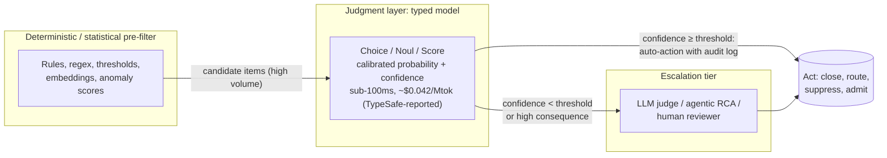

## 3. Engineering Usages I: Software Engineering and Systems Infrastructure

Software engineering and systems infrastructure form the densest concentration of evidence-backed usages in this catalog: thirty decision points, each anchored in a published system, benchmark, or production deployment. The reason is structural: engineering organizations already operate high-frequency decision loops — triage queues, CI gates, alert streams, optimizer hooks — where the decision is intrinsically *typed* (a verdict, a severity, a route), rules are too brittle, and a generative-model call is too slow, too expensive, and too hard to parse. TypeSafe AI's published specifications — 70–500 ms end-to-end latency, $0.042 per million input tokens with output free, a 32K-token state, and three primitives (Choice, Noul, Score) returning calibrated probabilities with confidence — sit precisely in this gap; TypeSafe's own workflow evaluations report $0.0004 per case at Sonnet-tier accuracy versus $0.176 per case for an Opus-class model, figures that remain vendor-reported pending independent replication [^50^].

Two cross-cutting findings frame the chapter. First, classical machine learning already occupies many of these slots, validating the decision interfaces but also setting accuracy bars the judgment model has not yet been benchmarked against; its delta concentrates where decisive evidence lives in text that numeric feature pipelines discard: SQL, log lines, configuration diffs, ticket language, rule manuals. Second, the recurring production topology is a three-layer stack — a deterministic or statistical pre-filter generates candidate signals; the judgment layer renders a calibrated semantic verdict on each; a thresholded escalation tier routes low-confidence or high-consequence items to expensive reasoning. This is the cascade economics of Chapter 2 instantiated as infrastructure, documented independently in guardrails, security operations, and root-cause analysis.

The sections below catalog fifteen usages per domain, each with its current practice and bottleneck, primitive design, and confidence: High where the judgment task is published and often deployed; Medium where the task is proven but accuracy against trained incumbents is unmeasured; exploratory items are labeled design syntheses.

### 3.1 Software Engineering Workflows

#### 3.1.1 Alert and finding triage: SAST, secrets, and log anomalies

The strongest software-engineering cluster is verdict triage over analyzer output, because the incumbent is human attention and the published task shape is already a typed judgment. Static application security testing (SAST) tools generate notoriously false-positive-heavy findings; the ZeroFalse study (2025) evaluated LLMs as triage judge and concluded automated verdicts "can substantially reduce false positives in static analysis… easing developer workload by suppressing spurious reports" [^51^]. A Jev design maps this directly: state carries the flagged code hunk, CWE/rule identifier, and dataflow summary; one call issues a Noul on genuine exploitability, a Choice verdict over {true_positive, false_positive, needs_human}, and a four-level severity Score. Code applies policy — auto-dismiss above 0.95 false-positive confidence with an audit log, hold low-confidence items for humans. At TypeSafe-reported pricing, triaging a 10,000-finding scan costs cents; per-finding frontier-model calls make whole-repo scans uneconomical [^51^]. Confidence: High.

Secret scanning provides a deployed-at-scale precedent for exactly this judgment. Pattern- and entropy-based scanners are noisy: a 2023 benchmark of nine tools found top precision of only 75% (GitHub's scanner), 46% (Gitleaks), and 25% for a commercial tool [^52^]. GitHub's production answer inserts an LLM contextual-verification stage reading "variable names, surrounding code, comments, and file paths," cutting customer-confirmed false positives by 75.76% — across a workload of 39 million secret leaks detected in public repositories in 2024 [^53^]. A Noul on live-credential status plus a Choice over context type {documentation, test-fixture, example-code, real-config, source-code} reproduces the stage at roughly the vendor-reported $0.0004 per case, a 100–400× saving on a workload already proven to be judgment, not generation [^50^]. Confidence: High.

Log-anomaly triage extends the pattern to operations. The established pipeline pairs Drain-style template parsing with sequence models such as LogBERT, but detection is not triage: an anomaly score says neither what kind of problem fired nor who should care, so humans read flagged sequences [^54^]. Documented practice suggests a judgment layer reading raw template instances rather than collapsed log-key IDs: a Choice over anomaly class {resource_exhaustion, dependency_failure, config_error, deploy_regression, security_relevant, benign_noise}, a five-level severity Score, and two Nouls — deploy-consistency and page-worthiness — mapping typed output directly onto routing tables at log-stream volumes where per-anomaly LLM summarization is untenable [^54^]. Confidence: Medium — detection is well evidenced; the semantic triage layer is an unbenchmarked extension.

#### 3.1.2 Test and CI/CD intelligence

Continuous integration concentrates three decision points where calibrated abstention is the product. Flaky-test judgment fires on every red build: naive retries "mask symptoms rather than addressing root causes" [^55^]. Research predictors are mature — FlakeFlagger (ICSE 2021) predicts flakiness without rerunning; the CodeBERT-based Flakify added ten points of precision and eighteen of recall [^56^][^57^]. The decisive caution is Lampel et al.'s Chromium study (ESEC/FSE 2023): a state-of-the-art predictor reached 99.2% precision flagging flaky tests yet misclassified 76.2% of genuine fault-triggering failures as flaky [^57^]. The primitive design encodes this asymmetry: one Noul on known-flaky consistency, a second on whether the failing assertion plausibly relates to the triggering commit's diff (the exact Lampel failure mode), and a Choice over {rerun, quarantine, block_merge, human_review}; auto-dismissal requires high confidence on both Nouls. Confidence: High.

Test selection and prioritization is the second slot. The machine-learning test-prioritization literature (a systematic review of 29 primary studies, 2006–2020) predicts per-test failure probability with reinforcement learning, clustering, and ranking models [^58^]; Zhao et al. (2023) found pretrained rankers produce the optimal sequence on 80% of subjects versus 50% for the prior best, and commit-aware work shows removing diff features causes "a systematic collapse of classification performance" [^59^][^60^]. A judgment design Scores each test's failure likelihood on a five-level rubric and asks a Noul on change coverage, batching tests per 32K-token state — scoring a 5,000-test suite for well under a cent within the seconds between push and first test start [^58^]. The caveat is competitive: trained rankers set a hard accuracy bar, and zero-shot ranking quality is the open experiment. Confidence: Medium–High.

The third slot, just-in-time defect and merge-risk scoring, fires on every commit and dependency bump. DeepJIT and CC2Vec established learned defect-probability estimation over commit messages and diffs [^61^][^62^], while Dependabot's crowd-sourced compatibility score requires at least five observed updates and is frequently "unknown" for less-common packages [^63^]. A five-level risk Score plus a breaking-change Noul — reading changelogs and the repository's usage sites — fills the unknown-score gap without per-project training, though accuracy against trained JIT models is unverified. Confidence: Medium.

#### 3.1.3 Incident and security operations

Security operations supply the hardest numbers in this chapter. Analysts face thousands of alerts daily, most benign, at five to fifteen minutes of triage each [^64^]. The production benchmark is AACT (Sophos/Flare, 2025), which learns from analyst dispositions and, in live deployment, reduced alerts shown to analysts by 61% over six months at a 1.36% false-negative rate across millions of alerts [^65^]. Calibration research warns that triage outputs "are frequently miscalibrated" and thresholds must reflect asymmetric costs [^66^]. The primitive design mirrors AACT's guardrails in typed form: a Noul on genuine maliciousness, a Choice disposition over {auto_close_benign, close_benign_true_positive, investigate, escalate_incident}, a P1–P5 severity Score, and an ATT&CK-tactic Choice within the 255-option bound; auto-closure requires a strict benign threshold plus mandatory sampling of auto-closed alerts [^65^]. Sub-100-millisecond verdicts at TypeSafe-reported pricing make 100% alert coverage — rather than sampled review — economical, targeting the field's stated goal of near-zero mean time to triage for non-genuine alerts [^64^]. Confidence: High, on the deployed precedent.

Phishing classification adds an explicit latency bar: a production-grade ensemble (287-dimensional features; 2.8 million URLs) reports 99.6% accuracy with real-time latency averaging 89 milliseconds per sample, framed as the requirement for inline deployment [^67^]; deep models alone are "unsuitable for real-time browser-side deployment" [^68^]. One judgment call can return the phishing Noul, a category Choice {legit, phishing, spam, BEC, malware-lure}, an urgency Score, and a credential-request Noul — provided measured latency sits at the favorable end of TypeSafe's 70–500 ms range, a condition the cross-verification analysis insists must be verified at p50/p99 rather than assumed from marketing figures. Confidence: Medium–High.

Two further usages complete incident operations. Alert correlation asks whether two alerts share a root cause — fingerprint dedup "doesn't link different alerts from one root cause," time-window clustering is "prone to false grouping" — while Forrester-cited ML-assisted triage cuts mean-time-to-triage 25–40% [^69^]. A pairwise Noul with a tunable merge threshold addresses the documented over-merging failure directly; confidence Medium. Runbook routing sits in front of agentic root-cause analysis: RCAgent reports 72.67%/69.25% win rates over ReAct, but the latency contrast is stark — 79 seconds per case agentically versus 8 milliseconds lightweight, a 9,700× difference [^70^][^71^]. A Choice over the runbook catalog plus a novelty Noul converts the routing decision into a sub-100-millisecond gate; confidence Medium as a design proposal composed of documented components.

#### 3.1.4 Code workflow routing

The remaining software-engineering usages are routing and ranking judgments. Duplicate bug detection is a documented two-stage bottleneck: retrieval shortlists candidates, but the final "same underlying defect?" call is semantic, and triage engineers disengage when faced with long unranked lists [^72^][^73^]. A pairwise Noul with auto-linking above 0.9 and ranked display between 0.5 and 0.9 gives triage teams a precision/recall dial at cents per thousand judgments; confidence High. Reviewer routing replaces path-similarity heuristics (RevFinder, CORMS) with a Choice over the team roster — within the 255-option limit for most organizations — plus a rigor Score and sensitivity Nouls, with round-robin fallback on low confidence; the task is established but semantic routing quality is untested, confidence Medium [^74^]. LLM request routing recasts RouteLLM's framework — whose matrix-factorization router held 95% of GPT-4 quality while sending only 14% of queries to GPT-4, an ~85% cost reduction — as a zero-shot difficulty Score and cheap-model-sufficiency Noul, eliminating per-model-pair retraining at the price of unmeasured win-rates; confidence Medium–High [^22^]. Guardrail classification inserts an injection/policy Noul battery as the always-on tier in the documented two-tier topology, with the explicit caveat that published evasion studies achieved up to 100% bypass on some guardrail systems — adversarial evaluation is a deployment prerequisite; confidence Medium [^75^][^76^]. Finally, code-search reranking occupies the "recall before rerank" slot: a relevance Score over a bi-encoder's top-20 candidates delivers cross-encoder-grade ordering inside a ~100 ms IDE budget; confidence Medium, pending comparison with fine-tuned cross-encoders [^77^].

Table 3.1 summarizes the fifteen software-engineering usages.

| Usage | Current practice / bottleneck | Primitive design | Confidence |
|---|---|---|---|
| SAST false-positive suppression | Noisy analyzers; human triage or ignored findings (ZeroFalse 2025) | Noul exploitability + Choice verdict + Score severity; auto-dismiss >0.95 | High |
| Secret-scanning verification | Scanner precision 25–75%; GitHub's LLM stage cut FPs 75.76% | Noul live-credential + Choice context type; verdicts composed in code | High |
| Flaky-test judgment | Chromium: 99.2% precision yet 76.2% of real faults misclassified | Two Nouls (flaky-consistent, change-relevant) + Choice action; conservative thresholds | High |
| Test prioritization | 29-study ML literature; trained rankers optimal on 80% of subjects | Score failure-risk + Noul change-coverage, batched per suite | Medium–High |
| JIT defect / merge-risk | DeepJIT/CC2Vec need training pipelines; Dependabot score often "unknown" | Score risk + Noul breaking-change; changelog semantics | Medium |
| Reviewer routing | Path-similarity heuristics; manual triage | Choice reviewer + Score rigor + Noul sensitive-code | Medium |
| Duplicate bug detection | Retrieval shortlists unranked; triager disengagement | Pairwise Noul same-defect + Choice relation; auto-link ≥0.9 | High |
| SOC alert triage | AACT: 61% alert reduction at 1.36% FNR in live deployment | Noul malicious + Choice disposition + Score severity + ATT&CK Choice | High |
| Phishing classification | 89 ms published real-time bar; 99.6% ensemble accuracy | Noul phishing + Choice category + Score urgency; one call | Medium–High |
| Log-anomaly triage | Detection ≠ triage; humans read flagged sequences | Choice anomaly class + Score severity + Noul page-worthy | Medium |
| Incident correlation | Fingerprint/window/cluster methods over- or under-merge | Pairwise Noul same-incident + Choice relation; tunable merge τ | Medium |
| Runbook / RCA routing | Agentic RCA: 79 s/case vs 8 ms lightweight | Choice runbook + Choice cause class + Noul warrants-agentic-RCA | Medium |
| LLM request routing | RouteLLM: 85% cost cut at 95% quality; trained routers need retraining | Score difficulty + Noul cheap-model-sufficiency | Medium–High |
| Guardrail / injection screening | Classifier tier bounded by training data; up to 100% published evasion | Noul injection + Choice threat type + Score risk; escalate mid-band | Medium |
| Code-search reranking | Bi-encoder recall; cross-encoders don't scale | Score relevance 0–4 + Noul implements-intent, parallel over top-20 | Medium |

**Interpretation.** The matrix reveals a confidence gradient that tracks the incumbent baseline rather than task importance. The High-confidence usages — SAST triage, secret verification, flaky-test judgment, duplicate detection, SOC triage — are exactly those where the alternative is human reading or brittle pattern matching, and where a deployed system (GitHub's verification stage, AACT) has already proven the judgment automatable with hard numbers. The Medium band clusters where a trained per-task model is the incumbent — test prioritization, JIT defect prediction, phishing ensembles, reranking — and zero-shot accuracy against them is the catalog's key open experiment. The primitive mix is also diagnostic: all fifteen usages include a Noul, and nearly all wire its calibrated probability into an asymmetric threshold — the probability itself is the product, encoding error-cost asymmetries (missed regression, missed attack) that hard classifiers cannot express. The outliers are the two routing usages (reviewer, LLM), whose value rests on Choice semantics and instant taxonomy edits, and the guardrail usage, the only entry whose confidence is capped by adversarial robustness rather than accuracy evidence.

### 3.2 Systems and Infrastructure

Systems components already make thousands of cheap, local, typed decisions per second — classify this flow, admit this object, inline this call site, route this query — and classical machine learning is deployed at many of these points [^78^][^79^]. The classical incumbents, however, consume only hand-built numeric feature vectors; the judgment model's differentiator is semantic reading of SQL, logs, configs, tickets, and rule prose, cheaply enough to sit near hot paths. Fifteen usages follow.

#### 3.2.1 Networking and cloud

Traffic classification and DDoS adjudication are the two networking slots. nPrint/nPrintML provide a standard packet representation with AutoML that matches or beats state-of-the-art tools for OS detection, device fingerprinting, and application identification — but the paper itself concedes open problems in semantic, multi-flow classification [^78^]. Classifiers see packet statistics, not the semantics of DNS names, TLS SNI, or certificate strings. The design composes rather than replaces: the classical classifier decides high-confidence flows, while a Choice over application families, an SNI-consistency Noul, and a deeper-inspection Score adjudicate the low-confidence tail off the data path, in the style of Cloudflare's out-of-path sampling architecture [^80^]. Confidence: High. For DDoS, Cloudflare's automated systems (Gatebot, dosd, flowtrackd) propagate mitigation rules "at the optimal location in 10 seconds or less," but the hard residual call is semantic — a flash crowd versus an L7 attack mimicking one — and false mitigation punishes real customers [^80^]. A maliciousness Noul plus a mitigation-posture Choice {observe, rate-limit, JS-challenge, drop-at-L4, propagate-global} gates rule propagation. Confidence: High.

Configuration verification supplies the intent-versus-mechanism slot. Batfish (NSDI 2015) "can find errors proactively, before the configuration is applied," and CI/CD pre-change validation is established practice [^81^]. But verifiers check formal properties, not intent: a change that breaks reachability to a decommissioned subnet is formally an alarm and operationally fine, and intent lives in tickets and commit messages that formal tools cannot read. Documented practice suggests a judgment layer asking whether a diff implements the ticket's intent (Noul), whether each finding is a real violation (Noul), the blast radius (Score), and the gate decision {auto-approve, canary, human-review, block} (Choice) — run in bulk inside minutes-long pre-change windows. Confidence: High as a judgment point; the intent-reading layer is a well-motivated extension.

Cloud resource control contributes two usages. Autoscalers today are reactive thresholds [^82^]; Google's production Autopilot cut slack from 46% (manual) to 23% and reduced jobs severely impacted by out-of-memory events tenfold [^83^]. The documented weak point is interpretation: numeric forecasters cannot see *why* metrics moved — a deploy, a retry storm, a marketing event. A sustained-demand Noul, an artifact Noul, an action Choice {scale-out-fast, scale-out-slow, hold, scale-in}, and an oscillation-risk Score vet the signal inside 15–60-second control loops. Confidence: High. VM placement follows the same composition: Azure's Protean rule-based allocator achieves few-millisecond turnaround at 85–90% on a key utilization metric [^84^], and Resource Central established workload prediction for oversubscription [^85^]; a top-k server Choice, oversubscription-safety Noul, and noisy-neighbor Noul add signals (SKU family, tenant hints) that rule-based packers ignore. The semantic per-VM judgment is a design synthesis beyond published practice — confidence Medium–High, exploratory at the margin.

#### 3.2.2 Data and compiler systems

Database systems provide the most latency-disciplined evidence in the catalog. Query routing is governed by Amazon Redshift's explicit production constraint: most queries execute in under 100 ms, and models with ~100 ms inference are ruled out because that exceeds "the total query latency for 40% of the queries!"; Redshift's Stage predictor answers with a hierarchy — cache, local XGBoost, then a fleet-wide GNN only when uncertain and the query is long — improving average latency by 20% [^86^]. This is the three-layer topology of the diagram above, built by a database vendor. A judgment design maps an engine/queue Choice, an execution-time-band Score (an ordinal judgment is often all a workload manager needs), and a cold-start Noul deciding when to pay for the heavier model [^86^]. Confidence: High on the slot, conditional on measured latency per the cross-verification caveat. Optimizer hint steering follows Bao (SIGMOD 2021), which steers a commodity optimizer with per-query hint sets [^87^]; a hint-set Choice, cardinality-plausibility Noul, and deviation-risk Score add SQL-text semantics that numeric plan featurization drops. Index advisory attacks two documented bottlenecks — what-if calls "constitute a major bottleneck of index tuning," and estimated improvements regress "in a significant fraction of cases"; Microsoft's own fix is a pairwise classifier cutting plan-comparison errors up to 5× [^88^][^89^]. A pairwise Noul pre-filters multi-second what-if calls across thousands of (query, index) pairs. Confidence: High for both. Cache admission completes the set: learned admission is proven (Berger's LFO; RL-Cache), but the literature's own blocker is prediction cost — MAT reduced ML predictions per eviction from 63 to 2 across eight production workloads [^90^][^91^]. A single re-request Noul per shortlisted candidate, plus sequential-pattern and tier-placement judgments using URI and content-type semantics, lands exactly in that minimal-overhead regime. Confidence: High.

Compilers and EDA close the catalog with production-integrated learned-decision slots. MLGO is the landmark: LLVM's inlining-for-size heuristic was replaced by a learned model achieving up to 7% size reduction at ~1% compile-time overhead, shipped upstream alongside a learned register-allocation eviction model [^79^][^92^]. The bottleneck is hand-picked numeric features and RL infrastructure most teams cannot operate; an inline/no-inline Noul with confidence-gated fallback to the stock heuristic reproduces the deployment shape without the training stack. Confidence: High. Phase ordering and vectorization show proven headroom without a deployment path: NeuroVectorizer reports 1.29–4.73× speedups, within 3% of brute-force search, while CompilerGym documents poor cross-domain generalization [^93^][^94^]; composing atomic pass-selection Choices and vectorization-band Scores trades peak RL performance for zero-training deployment — a design hypothesis de-risked by MLGO's precedent, confidence Medium–High. In EDA, Chan et al. (ISPD 2017, industrial sub-14nm) predicted 74% of detailed-route DRC violations at under 0.2% false positives and cut violations up to 5× [^95^]; a region-risk Score, waiver-intent Noul, and synthesis-recipe Choice add rule-manual semantics that geometric predictors cannot read — a design synthesis atop industrially validated prediction slots, confidence Medium–High [^95^][^96^]. Incident triage (DeCaf, deployed on services at O(100B) requests/day; Microsoft's IcM BRAIN) and log-window semantic triage (DeepLog, modeling "a system log as a natural language sequence") round out the fifteen, both High-confidence judgment points where the decisive evidence is text [^97^][^98^][^99^].

#### 3.2.3 The thirty-usage map: primitives and confidence

Table 3.2 summarizes the fifteen systems-infrastructure usages; together with Table 3.1, the chapter catalogs thirty usages whose primitive mappings and confidence ratings are grounded in the dimension reports.

| Usage | Current practice / bottleneck | Primitive design | Confidence |
|---|---|---|---|
| Flow / application classification | nPrint AutoML strong; semantic tail is the paper's open problem | Choice app family + Noul SNI-consistency + Score inspect-deeper | High |
| DDoS attack-vs-flash-crowd | Cloudflare auto-mitigates in ≤10 s; false mitigation punishes customers | Noul malicious + Choice posture + Score rule-generalization | High |
| Config verification triage | Batfish checks properties, not intent; manual finding triage | Noul intent-match + Noul real-violation + Score blast radius + Choice gate | High |
| Autoscaler signal judgment | Reactive thresholds oscillate; Autopilot slack 23% vs 46% manual | Noul sustained-demand + Noul artifact + Choice action + Score oscillation | High |
| VM placement / oversubscription | Protean ms-scale rule-based allocation; fleet-wide oversubscription policy | Choice server top-k + Noul safe-oversubscribe + Noul noisy-neighbor | Medium–High (design synthesis) |
| Incident severity & ownership | DeCaf/IcM BRAIN deployed; novel incidents need semantic reading | Choice owning team + Choice cause class + Score severity + Noul recurrence | High |
| Log-window semantic triage | DeepLog retraining on new templates; benign-novel false alarms | Noul real-fault + Noul normal-deploy + Score urgency + Choice signature | High |
| Query routing / queue assignment | Redshift: 100 ms models exceed 40% of queries' total latency | Choice engine/queue + Score exec-time band + Noul cold-start | High (latency-conditional) |
| Optimizer hint steering | Bao learned steering; numeric featurization drops SQL semantics | Choice hint set + Noul cardinality-plausible + Score deviation risk | High |
| Index advisory benefit verdicts | What-if calls dominate tuning hours; cost-estimate regressions | Pairwise Noul improvement + Choice worth-what-if + Score workload value | High |
| Cache admission / eviction | MAT: 63→2 predictions per eviction; semantics-free features | Noul re-request + Choice evict-candidate + Noul sequential + Score tier | High |
| Compiler inlining / regalloc | MLGO shipped upstream: 7% size cut at ~1% compile-time overhead | Noul inline + Choice spill candidate + confidence-gated fallback | High |
| Phase ordering / vectorization | NeuroVectorizer 1.29–4.73×; no RL deployment path | Choice next pass + Score VF band + Noul early-exit | Medium–High |
| EDA DRC / QoR triage | ISPD'17: 74% of DRCs predicted, ≤0.2% FP, 5× violation cut | Score region risk + Noul waiver-intent + Choice synthesis recipe | Medium–High |
| Query cost / cold-start adjudication | Lightweight models inaccurate on novel queries; heavy ones too slow | Noul escalate-to-heavy + Score confidence band per template | Medium–High |

**Interpretation.** Three patterns distinguish the infrastructure matrix from its software-engineering counterpart. First, the confidence distribution is higher — eleven of fifteen slots rate High, one of them conditional on measured in-path latency — because classical ML is already deployed at nearly every judgment point, validating the decision interfaces as typed, confidence-gated, and latency-constrained; this cuts both ways, since the same incumbents set accuracy bars the judgment model has not been benchmarked against, the tension the cross-verification file flags as the catalog's central unresolved question. Second, latency discipline is stricter: Redshift's 100 ms rule-out, MAT's prediction-count ceiling, and Protean's few-millisecond allocation path mean several usages are viable only at the favorable end of TypeSafe's reported 70–500 ms range, and the sub-10 ms roadmap would convert the entire marginal tier — in-path query routing, per-call-site compiler advice — into comfortable fits. Third, the semantic delta is unusually well-localized: the sources themselves name the gaps — DeCaf's future work requests NLP on unstructured logs, SQL-featurization research reports that TF-IDF semantics improve generalization, and Batfish-class verifiers structurally cannot read intent [^97^][^100^][^81^]. The outliers are the three design syntheses (per-VM oversubscription, EDA rule-text adjudication, and partially phase-ordering composition), where the judgment point is production-proven but the semantic layer is extrapolation — the chapter's priority candidates for prototype benchmarking rather than deployment claims.
